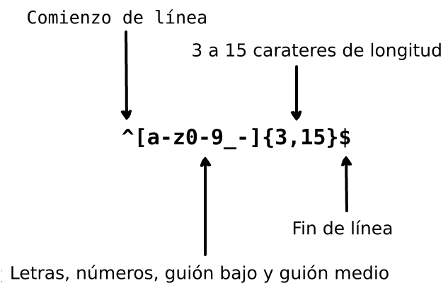

     
    
      
    

        
        
    

## Traducciones:

* [English](../README.md)
* [German](../translations/README-de.md)
* [Español](../translations/README-es.md)
* [Français](../translations/README-fr.md)
* [Português do Brasil](../translations/README-pt_BR.md)
* [中文版](../translations/README-cn.md)
* [日本語](../translations/README-ja.md)
* [한국어](../translations/README-ko.md)
* [Turkish](../translations/README-tr.md)
* [Greek](../translations/README-gr.md)
* [Magyar](../translations/README-hu.md)
* [Polish](../translations/README-pl.md)
* [Русский](../translations/README-ru.md)
* [Tiếng Việt](../translations/README-vn.md)
* [فارسی](../translations/README-fa.md)
* [עברית](../translations/README-he.md)

## Qué es una expresión regular?

> Una expresión regular es un grupo de caracteres o símbolos, los cuales son usados para buscar un patrón específico dentro de un texto.

Una expresión regular es un patrón que que se compara con una cadena de caracteres de izquierda a derecha. La palabra "expresión regular" puede también ser escrita como "Regex" o "Regexp". Las expresiones regulares se utilizan para reemplazar un texto dentro de una cadena de caracteres (*string*), validar formularios, extraer una porción de una cadena de caracteres (*substring*) basado en la coincidencia de un patrón, y muchas cosas más.

Imagina que estás escribiendo una aplicación y quieres agregar reglas para cuando el usuario elija su nombre de usuario. Nosotros queremos permitir que el nombre de usuario contenga letras, números, guion bajo (raya), y guion medio. También queremos limitar el número de caracteres en el nombre de usuario para que no se vea feo. Para ello, usamos la siguiente expresión regular para validar el nombre de usuario.

  

  

La expresión regular anterior puede aceptar las cadenas `john_doe`, `jo-hn_doe` y `john12_as`. Sin embargo, la expresión no coincide con el nombre de usuario `Jo` porque es una cadena de caracteres que contiene letras mayúsculas y es demasiado corta.

## Tabla de contenido

- [Introducción](#1-introducción)
- [Meta-caracteres](#2-meta-caracteres)
  - [Full stop](#21-full-stop)
  - [Conjunto de caracteres](#22-conjunto-de-caracteres)
    - [Conjunto de caracteres negados](#221-conjunto-de-caracteres-negado)
  - [Repeticiones](#23-repeticiones)
    - [Asterisco](#231-asterisco)
    - [Signo más](#232-signo-de-más)
    - [Signo de interrogación](#233-signo-de-interrogación)
  - [Llaves](#24-llaves)
  - [Grupos de caracteres](#25-grupos-de-caracteres)
  - [Alternancia](#26-alternancia)
  - [Caracteres especiales de escape](#27-caracteres-especiales-de-escape)
  - [Anclas](#28-anclas)
    - [Símbolo de intercalación](#281-símbolo-de-intercalación)
    - [Símbolo del dólar](#282-símbolo-del-dólar)
- [Conjunto de caracteres abreviados](#3-conjunto-de-caracteres-abreviados)
- [Mirar alrededor](#4-mirar-alrededor)
  - [Mirar hacia delante positivo](#41-mirar-hacia-adelate-positivo)
  - [Mirar hacia delante negativo](#42-mirar-hacia-delaten-negativo)
  - [Mirar hacia atrás positivo](#43-mirar-hacia-atras-positivo)
  - [Mirar hacia atrás negativo](#44-mirar-hacia-atras-negativo)
- [Indicadores](#5-indicadores)
  - [Mayúsculas y minúsculas](#51-mayúsculas-y-minúsculas)
  - [Búsqueda global](#52-búsqueda-global)
  - [Multilínea](#53-multilínea)

## 1. Introducción

Una expresión regular es sólo un patrón de caracteres que utilizamos para realizar búsquedas en un texto. Por ejemplo, la expresión regular `the` significa: la letra `t`, seguida de la letra `h`, seguida de la letra `e`.

<pre>
"the" => The fat cat sat on <a href="#learn-regex"><strong>the</strong></a> mat.
</pre>

[Prueba la expresión regular](https://regex101.com/r/dmRygT/1)

La expresión regular `123` coincide con la cadena `123`. La expresión regular se compara con una cadena de entrada al comparar cada carácter de la expresión regular con cada carácter de la cadena de entrada, uno tras otro. Las expresiones regulares son normalmente sensibles a mayúsculas y minúsculas, por lo que la expresión regular `The` no coincide con la cadena `the`.

<pre>
"The" => <a href="#learn-regex"><strong>The</strong></a> fat cat sat on the mat.
</pre>

[Prueba la expresión regular](https://regex101.com/r/1paXsy/1)

## 2. Meta-caracteres

Los meta-caracteres son los bloques de construcción de las expresiones regulares. Los meta-caracteres no se trabajan por sí mismos, sino que se interpretan de alguna manera especial. Algunos meta-caracteres tienen un significado especial y se escriben entre corchetes. Los meta-caracteres son los siguientes:

|Meta-carácter|Descripción|
|:----:|----|
|.|Punto: Coincide con cualquier carácter excepto un salto de línea.|
|[ ]|Clase de caracteres: Coincide con cualquier carácter contenido entre corchetes.|
|[^ ]|Clase de caracteres negados: Coincide con cualquier carácter que no está contenido dentro de los corchetes.|
|*|Asterisco: Corresponde con 0 o más repeticiones del símbolo precedente.|
|+|Signo de más: Corresponde con 1 o más repeticiones del símbolo precedente.|
|?|Signo de interrogación: Hace que el símbolo precedente sea opcional.|
|{n,m}|Llaves: Corresponde al menos "n" pero no más de "m" repeticiones del símbolo precedente.|
|(xyz)|Grupo de caracter: Hace coincidir los caracteres xyz en ese orden exacto.|
|&#124;|Alternancia: Corresponde a los caracteres anteriores o los caracteres después del símbolo.|
|&#92;|Escapa el siguiente carácter: Esto le permite hacer coincidir los caracteres reservados <code>[ ] ( ) { } . * + ? ^ $ \ &#124;</code>|
|^|Acento circunflejo: Hace coincidir el principio de la entrada.|
|$|Símbolo de dólar: Corresponde al final de la entrada.|

## 2.1 Full stop

Full stop `.` es el ejemplo más simple del meta-carácter. El meta-carácter `.` coincide con cualquier carácter. No coincidirá con el retorno o nuevos caracteres de línea. Por ejemplo, la expresión regular `.ar` significa: cualquier carácter, seguido del carácter `a`, seguido del carácter `r`.

<pre>
".ar" => The <a href="#learn-regex"><strong>car</strong></a> <a href="#learn-regex"><strong>par</strong></a>ked in the <a href="#learn-regex"><strong>gar</strong></a>age.
</pre>

[Prueba la expresión regular](https://regex101.com/r/xc9GkU/1)

## 2.2 Conjunto de caracteres

Los conjuntos de caracteres también se llaman clase de caracteres. Los corchetes se utilizan para especificar conjuntos de caracteres. Utilice un guion dentro de un conjunto de caracteres para especificar el rango de los caracteres. El orden del rango de caracteres dentro de corchetes no importa. Por ejemplo, la expresión regular `[Tt]he` significa: un carácter en mayúscula `T` o minúscula `t`, seguido del carácter `h`, seguido del carácter `e`.

<pre>
"[Tt]he" => <a href="#learn-regex"><strong>The</strong></a> car parked in <a href="#learn-regex"><strong>the</strong></a> garage.
</pre>

[Prueba la expresión regular](https://regex101.com/r/2ITLQ4/1)

Sin embargo, un período dentro de un conjunto de caracteres significa un período literal. La expresión regular `ar[.]` significa: un carácter en minúscula `a`, seguido del carácter `r`, seguido del carácter `.`.

<pre>
"ar[.]" => A garage is a good place to park a c<a href="#learn-regex"><strong>ar.</strong></a>
</pre>

[Prueba la expresión regular](https://regex101.com/r/wL3xtE/1)

### 2.2.1 Conjunto de caracteres negados

En general, el símbolo de intercalación representa el comienzo de la cadena, pero cuando se escribe después del corchete de apertura niega el conjunto de caracteres. Por ejemplo, la expresión regular `[^c]ar` significa: cualquier carácter, excepto `c`, seguido del carácter `a`, seguido del carácter `r`.

<pre>
"[^c]ar" => The car <a href="#learn-regex"><strong>par</strong></a>ked in the <a href="#learn-regex"><strong>gar</strong></a>age.
</pre>

[Prueba la expresión regular](https://regex101.com/r/nNNlq3/1)

## 2.3 Repeticiones

Los siguientes caracteres meta `+`, `*` o `?`, se utilizan para especificar cuántas veces puede producirse un subpatrón. Estos meta-caracteres actúan de manera diferente en diferentes situaciones.

### 2.3.1 Asterisco

El símbolo `*` coincide con cero o más repeticiones del marcador anterior. La expresión regular `a*` significa: cero o más repeticiones del carácter en minúscula precedente `a`. Pero, si aparece después de un conjunto de caracteres o una clase, entonces encuentra las repeticiones de todo el conjunto de caracteres. Por ejemplo, la expresión regular `[a-z]*` significa: cualquier número de letras minúsculas en una fila.

<pre>
"[a-z]*" => T<a href="#learn-regex"><strong>he</strong></a> <a href="#learn-regex"><strong>car</strong></a> <a href="#learn-regex"><strong>parked</strong></a> <a href="#learn-regex"><strong>in</strong></a> <a href="#learn-regex"><strong>the</strong></a> <a href="#learn-regex"><strong>garage</strong></a> #21.
</pre>

[Prueba la expresión regular](https://regex101.com/r/7m8me5/1)

El símbolo `*` se puede utilizar con el meta-carácter `.` para que coincida con cualquier cadena de caracteres `.*`. El símbolo `*` se puede utilizar con el carácter de espacio en blanco `\s` para que coincida con una cadena de caracteres de espacio en blanco. Por ejemplo, la expresión `\s*cat\s*` significa: cero o más espacios, seguido por el carácter en minúscula `c`, seguido del carácter en minúscula `a`, seguido del carácter en minúscula `t`, seguido de cero o más espacios.

<pre>
"\s*cat\s*" => The fat<a href="#learn-regex"><strong> cat </strong></a>sat on the <a href="#learn-regex">con<strong>cat</strong>enation</a>.
</pre>

[Prueba la expresión regular](https://regex101.com/r/gGrwuz/1)

### 2.3.2 Signo de más

El símbolo `+` coincide con una o más repeticiones del carácter anterior. Por ejemplo, la expresión regular `c.+T` significa: carácter en minúscula `c`, seguido por lo menos de un carácter, luego el carácter en minúscula `t`.

<pre>
"c.+t" => The fat <a href="#learn-regex"><strong>cat sat on the mat</strong></a>.
</pre>

[Prueba la expresión regular](https://regex101.com/r/Dzf9Aa/1)

### 2.3.3 Signo de interrogación

En expresiones regulares el meta-carácter `?` hace que el carácter precedente sea opcional. Este símnbolo coincide con cero o una instancia del carácter precedente. Por ejemplo, la expresión regular  `[T]?he` significa: El carácter opcional `T` seguido por el carácter en minúscula `h`, seguido del carácter en minúscula `e`.

<pre>
"[T]he" => <a href="#learn-regex"><strong>The</strong></a> car is parked in the garage.
</pre>

[Prueba la expresión regular](https://regex101.com/r/cIg9zm/1)

<pre>
"[T]?he" => <a href="#learn-regex"><strong>The</strong></a> car is parked in t<a href="#learn-regex"><strong>he</strong></a> garage.
</pre>

[Prueba la expresión regular](https://regex101.com/r/kPpO2x/1)

## 2.4 Llaves

En la expresión regular, las llaves, que también se denominan cuantificadores, son utilizados para especificar el número de veces que se puede repetir un carácter o un grupo de caracteres. Por ejemplo, la expresión regular `[0-9]{2,3}` significa: Combina al menos 2 dígitos pero no más de 3 (caracteres en el rango de 0 a 9).

<pre>
"[0-9]{2,3}" => The number was 9.<a href="#learn-regex"><strong>999</strong></a>7 but we rounded it off to <a href="#learn-regex"><strong>10</strong></a>.0.
</pre>

[Prueba la expresión regular](https://regex101.com/r/juM86s/1)

Podemos dejar fuera el segundo número. Por ejemplo, la expresión regular `[0-9] {2,}` significa: Combina 2 o más dígitos. Si también eliminamos la coma, la expresión regular `[0-9]{3}` significa: coincidir exactamente con 3 dígitos.

<pre>
"[0-9]{2,}" => The number was 9.<a href="#learn-regex"><strong>9997</strong></a> but we rounded it off to <a href="#learn-regex"><strong>10</strong></a>.0.
</pre>

[Prueba la expresión regular](https://regex101.com/r/Gdy4w5/1)

<pre>
"[0-9]{3}" => The number was 9.<a href="#learn-regex"><strong>999</strong></a>7 but we rounded it off to 10.0.
</pre>

[Prueba la expresión regular](https://regex101.com/r/Sivu30/1)

## 2.5 Grupos de caracteres

Un grupo de caracteres es un grupo de sub-patrones que se escribe dentro de paréntesis `(...)`. Como hemos discutido antes en la expresión regular, si ponemos un cuantificador después de un carácter, repetiremos el carácter anterior. Pero si ponemos un cuantificador después de un grupo de caracteres, entonces repetimos todo el grupo de caracteres. Por ejemplo, la expresión regular `(ab)*` coincide con cero o más repeticiones del caracter `ab`. También podemos usar el carácter de alternancia `|` meta dentro del grupo de caracteres. Por ejemplo, la expresión regular `(c|g|p)ar` significa: carácter en minúscula `c`, `g` o `p`, seguido del carácter `a`, seguido del carácter `r`.
<pre>
"(c|g|p)ar" => The <a href="#learn-regex"><strong>car</strong></a> is <a href="#learn-regex"><strong>par</strong></a>ked in the <a href="#learn-regex"><strong>gar</strong></a>age.
</pre>

[Prueba la expresión regular](https://regex101.com/r/tUxrBG/1)

## 2.6 Alternancia

En la expresión regular, la barra vertical `|` se utiliza para definir la alternancia. La alternancia es como una condición entre múltiples expresiones. Ahora, puedes estar pensando que el conjunto de caracteres y la alternancia funciona de la misma manera. Sin embargo, la gran diferencia entre el conjunto de caracteres y la alternancia es que el conjunto de caracteres funciona a nivel de carácter pero la alternancia funciona a nivel de expresión. Por ejemplo, la expresión regular `(T|t)he|car` significa: el carácter en mayúscula `T` o en minúscula `t`, seguido del carácter en minúscula `h`, seguido del carácter en minúscula `e` o del carácter en minúscula `c`, seguido de un carácter en minúscula `a`, seguido del carácter en minúscula `r`.

<pre>
"(T|t)he|car" => <a href="#learn-regex"><strong>The</strong></a> <a href="#learn-regex"><strong>car</strong></a> is parked in <a href="#learn-regex"><strong>the</strong></a> garage.
</pre>

[Prueba la expresión regular](https://regex101.com/r/fBXyX0/1)

## 2.7 Caracteres especiales de escape

La barra invertida `\` se utiliza en la expresión regular para escapar el carácter siguiente. Esto permite especificar un símbolo como un carácter coincidente incluyendo caracteres reservados `{}[]/\+*.^|?`. Para usar un carácter especial como un carácter coincidente, agrega `\` a su izquierda.

Por ejemplo, la expresión regular `.` se utiliza para coincidir con cualquier carácter, excepto la nueva línea. Ahora, para emparejar `.` en una cadena de entrada, la expresión regular `(f|c|m)at\.?` significa: el carácter en minúscula `f`, `c` o `m`, seguido del carácter en minúscula `a`, seguido del carácter en minúscula `t`, seguido del carácter opcional `.`.

<pre>
"(f|c|m)at\.?" => The <a href="#learn-regex"><strong>fat</strong></a> <a href="#learn-regex"><strong>cat</strong></a> sat on the <a href="#learn-regex"><strong>mat.</strong></a>
</pre>

[Prueba la expresión regular](https://regex101.com/r/DOc5Nu/1)

## 2.8 Anclas

En expresiones regulares, usamos anclas para comprobar si el símbolo coincidente es el símbolo inicial o el símbolo final de la cadena de entrada. Los anclajes son de dos tipos: El primer tipo es el símbolo de intercalación `^` que comprueba si el carácter coincidente es el carácter inicial de la entrada y el segundo tipo es el símbolo del dólar `$` que comprueba si el carácter coincidente es el último carácter de la cadena de entrada.

### 2.8.1 Símbolo de intercalación

El símbolo de intercalación `^` se usa para verificar si el carácter coincidente es el primer carácter de la cadena de entrada. Si aplicamos la siguiente expresión regular `^a` (si `a` es el símbolo inicial) a la cadena de entrada, `abc` coincide con `a`. Pero si aplicamos la expresión regular `^b` en la cadena de entrada anterior, no coincide con nada. Porque en la cadena de entrada `abc`, `b` no es el símbolo inicial. Vamos a echar un vistazo a la expresión regular `^(T|t)he` que significa: carácter en mayúscula `T` o carácter en minúscula `t` es el símbolo inicial de la cadena de entrada, seguido del carácter minúscula `h` y seguido del carácter en minúscula `e`.

<pre>
"(T|t)he" => <a href="#learn-regex"><strong>The</strong></a> car is parked in <a href="#learn-regex"><strong>the</strong></a> garage.
</pre>

[Prueba la expresión regular](https://regex101.com/r/5ljjgB/1)

<pre>
"^(T|t)he" => <a href="#learn-regex"><strong>The</strong></a> car is parked in the garage.
</pre>

[Prueba la expresión regular](https://regex101.com/r/jXrKne/1)

### 2.8.2 Símbolo del dólar

El símbolo del dólar `$` se utiliza para comprobar si el carácter coincidente es el último carácter de la cadena de entrada. Por ejemplo, la expresión regular `(at\.)$` significa: un carácter en minúscula `a`, seguido del carácter en minúscula `t`, seguido de un carácter `.` y el marcador debe ser el final de la cadena.

<pre>
"(at\.)" => The fat c<a href="#learn-regex"><strong>at.</strong></a> s<a href="#learn-regex"><strong>at.</strong></a> on the m<a href="#learn-regex"><strong>at.</strong></a>
</pre>

[Prueba la expresión regular](https://regex101.com/r/y4Au4D/1)

<pre>
"(at\.)$" => The fat cat. sat. on the m<a href="#learn-regex"><strong>at.</strong></a>
</pre>

[Pueba la expresión regular](https://regex101.com/r/t0AkOd/1)

##  3. Conjunto de caracteres abreviados

La expresión regular proporciona abreviaturas para los conjuntos de caracteres
comúnmente utilizados, que ofrecen abreviaturas convenientes para expresiones
regulares de uso común. Los conjuntos de caracteres abreviados son los siguientes:

|Abreviatura|Descripción|
|:----:|----|
|.|Cualquier carácter excepto nueva línea|
|\w|Coincide con los caracteres alfanuméricos: `[a-zA-Z0-9_]`|
|\W|Coincide con los caracteres no alfanuméricos: `[^\w]`|
|\d|Coincide con los dígitos: `[0-9]`|
|\D|Coincide con los no dígitos: `[^\d]`|
|\s|Coincide con los caracteres espaciales: `[\t\n\f\r\p{Z}]`|
|\S|Coincide con los caracteres no espaciales: `[^\s]`|

## 4. Mirar alrededor

Mirar hacia delante (lookahead) y mirar hacia atrás (lookbehind), a veces conocidos
como lookaround, son tipo específico de **grupo que no captura** (Utilizados para
coincidir con el patrón pero no se incluyen en la lista correspondiente). Los
lookaheads se usan cuando tenemos la condición de que este patrón es precedido o
seguido por otro patrón determinado. Por ejemplo, queremos obtener todos los números
que están precedidos por el carácter `$` de la siguiente cadena de entrada
`$4.44 y $10.88`. Usaremos la siguiente expresión regular `(?<=\$)[0-9\.] *`,
esto significa: obtener todos los números que contienen el carácter `.` y
están precedidos del carácter `$`. A continuación se muestran los lookarounds
que se utilizan en expresiones regulares:

|Símbolo|Descripción|
|:----:|----|
|?=|Lookahead Positivo|
|?!|Lookahead Negativo|
|?<=|Lookbehind Positivo|
|?<\!|Lookbehind Negativo|

## 4.1 Mirar hacia adelate positivo

El lookahead positivo afirma que la primera parte de la expresión debe ser
seguida por la expresión lookahead. La coincidencia devuelta sólo contiene el texto que
coincide con la primera parte de la expresión. Para definir un lookahead positivo,
se utilizan paréntesis. Dentro de esos paréntesis, un signo de interrogación con
signo igual se utiliza de esta manera: `(?= ...)`. La expresión de Lookahead se
escribe después del signo igual dentro de los paréntesis. Por ejemplo, la
expresión regular `[T|t]he (?=\Sfat)` significa: opcionalmente emparejar
el carácter en minúscula `t` o el carácter en mayúscula `T`, seguida del carácter `h`, seguida
del carácter `e`. Entre paréntesis definimos el lookahead positivo que indica al motor
de expresión regular que coincida con `The` o `the` seguido de la palabra `fat`.

<pre>
"[T|t]he(?=\sfat)" => <a href="#learn-regex"><strong>The</strong></a> fat cat sat on the mat.
</pre>

[Prueba la expresión regular](https://regex101.com/r/IDDARt/1)

### 4.2 Mirar hacia adelate negativo

El lookahead negativo se usa cuando necesitamos obtener todas las coincidencias
de la cadena de entrada que no son seguidas por un patrón. El aspecto negativo se
define de la misma manera que definimos el aspecto positivo, pero la única diferencia
es que en lugar del carácter igual `=` utilizamos carácter negación  `!` , es decir,
`(?! ...)`. Vamos a echar un vistazo a la siguiente expresión regular `[T|t]he(?!\Sfat)`
que significa: obtener todas las `The` o `the` seguidos por la palabra `fat` precedido por un carácter de espacio.

<pre>
"[T|t]he(?!\sfat)" => The fat cat sat on <a href="#learn-regex"><strong>the</strong></a> mat.
</pre>

[Prueba la expresión](https://regex101.com/r/V32Npg/1)

### 4.3 Mirar hacia atras positivo

Positivo lookbehind se utiliza para obtener todos los caracteres que están precedidos
por un patrón específico. La apariencia positiva se denotar por `(?<=...)`.
Por ejemplo, la expresión regular `(? <= [T|t]he\s)(fat|mat)` significa: obtener todas las palabras
`fat` o `mat` de la cadena de entrada después de la palabra `The` o `the`.

<pre>
"(?<=[T|t]he\s)(fat|mat)" => The <a href="#learn-regex"><strong>fat</strong></a> cat sat on the <a href="#learn-regex"><strong>mat</strong></a>.
</pre>

[Prueba la expresión regular](https://regex101.com/r/avH165/1)

### 4.4 Mirar hacia atras negativo

El lookbehind negativo se utiliza para obtener todas las coincidencias que no
están precedidas por un patrón específico. El lookbehind negativo se denota por
`(? <! ...)`. Por ejemplo, la expresión regular `(?<!(T|t)he(s)(cat)` significa:
obtener todas las palabras `cat` de la cadena de entrada que no están después de
la palabra` The` o `the`.

<pre>
"(?&lt;![T|t]he\s)(cat)" => The cat sat on <a href="#learn-regex"><strong>cat</strong></a>.
</pre>

[Prueba la expresión regular](https://regex101.com/r/8Efx5G/1)

## 5. Indicadores

Los indicadores también se llaman modificadores porque modifican la salida
de una expresión regular. Estos indicadores se pueden utilizar en cualquier orden
o combinación, y son una parte integral de RegExp.

|Indicador|Descripción|
|:----:|----|
|i|Insensible a mayúsculas y minúsculas: Ajusta la coincidencia para que no distinga mayúsculas y minúsculas.|
|g|Búsqueda global: Busca un patrón en toda la cadena de entrada.|
|m|Multilínea: Ancla meta carácter trabaja en cada línea.|

### 5.1 Mayúsculas y minúsculas

El modificador `i` se utiliza para realizar la coincidencia entre mayúsculas y
minúsculas. Por ejemplo, la expresión regular `/The/gi` significa: carácter en mayúscula
`T`, seguido del carácter en minúscula `h`, seguido del carácter `e`. Y al final
de la expresión regular, el indicador `i` indica al motor de expresiones
regulares que ignore el caso. Como puede ver, también proveimos el indicador
`g` porque queremos buscar el patrón en toda la cadena de entrada.

<pre>
"The" => <a href="#learn-regex"><strong>The</strong></a> fat cat sat on the mat.
</pre>

[Prueba la expresión regularn](https://regex101.com/r/dpQyf9/1)

<pre>
"/The/gi" => <a href="#learn-regex"><strong>The</strong></a> fat cat sat on <a href="#learn-regex"><strong>the</strong></a> mat.
</pre>

[Prueba la expresión regular](https://regex101.com/r/ahfiuh/1)

### 5.2 Búsqueda global

El modificador `g` se utiliza para realizar una coincidencia global
(encontrar todos las coincidencias en lugar de detenerse después de la primera coincidencia).
Por ejemplo, la expresión regular `/.(At)/g` significa: cualquier carácter,
excepto la nueva línea, seguido del carácter en minúscula `a`, seguido del carácter
en minúscula `t`. Debido a que proveimos el indicador `g` al final de la expresión
regular, ahora encontrará todas las coincidencias de toda la cadena de entrada, no sólo la
primera instancia (el cual es el comportamiento normal).

<pre>
"/.(at)/" => The <a href="#learn-regex"><strong>fat</strong></a> cat sat on the mat.
</pre>

[Prueba la expresión regular](https://regex101.com/r/jnk6gM/1)

<pre>
"/.(at)/g" => The <a href="#learn-regex"><strong>fat</strong></a> <a href="#learn-regex"><strong>cat</strong></a> <a href="#learn-regex"><strong>sat</strong></a> on the <a href="#learn-regex"><strong>mat</strong></a>.
</pre>

[Prueba la expresión regular](https://regex101.com/r/dO1nef/1)

### 5.3 Multilínea

El modificador `m` se utiliza para realizar una coincidencia de varias líneas.
Como analizamos anteriormente, las anclas `(^,$)` se utilizan para comprobar si
el patrón es el comienzo de la entrada o el final de la cadena de entrada. Pero
si queremos que las anclas funcionen en cada línea usamos el indicador `m`.
Por ejemplo, la expresión regular `/at(.)?$/Gm` significa: carácter en minúscula `a`, seguido del carácter en minúscula `t`,
opcionalmente cualquier cosa menos la nueva línea. Y debido al indicador `m`, ahora
el motor de expresión regular coincide con el patrón al final de cada línea de una cadena.

<pre>
"/.at(.)?$/" => The fat
                cat sat
                on the <a href="#learn-regex"><strong>mat.</strong></a>
</pre>

[Prueba la expresión regular](https://regex101.com/r/hoGMkP/1)

<pre>
"/.at(.)?$/gm" => The <a href="#learn-regex"><strong>fat</strong></a>
                  cat <a href="#learn-regex"><strong>sat</strong></a>
                  on the <a href="#learn-regex"><strong>mat.</strong></a>
</pre>

[Prueba la expresión regular](https://regex101.com/r/E88WE2/1)

## Contribución

* Reporta un problema
* Abre un pull request con mejoras
* Pasa la palabra
* Contáctame directamente a ziishaned@gmail.com o 

## Licencia

MIT &copy; [Zeeshan Ahmad](https://twitter.com/ziishaned)
