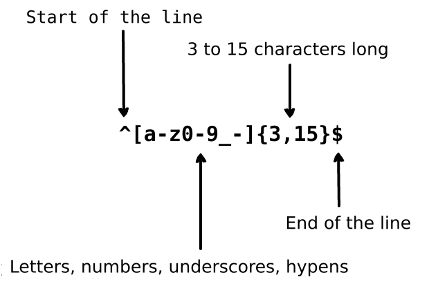

     
    
      
    

        
        
    

## برگردان ها:

* [English](../README.md)
* [German](../translations/README-de.md)
* [Español](../translations/README-es.md)
* [Français](../translations/README-fr.md)
* [Português do Brasil](../translations/README-pt_BR.md)
* [中文版](../translations/README-cn.md)
* [日本語](../translations/README-ja.md)
* [한국어](../translations/README-ko.md)
* [Turkish](../translations/README-tr.md)
* [Greek](../translations/README-gr.md)
* [Magyar](../translations/README-hu.md)
* [Polish](../translations/README-pl.md)
* [Русский](../translations/README-ru.md)
* [Tiếng Việt](../translations/README-vn.md)
* [فارسی](../translations/README-fa.md)
* [עברית](../translations/README-he.md)

## عبارت منظم چیست؟

> عبارت منظم یک گروه از کارکترها یا نمادهاست که برای پیدا کردن یک الگوی مشخص در یک متن به کار گرفته می شود.

یک عبارت منظم یک الگو است که با رشته ای حاص مطابقت دارد. عبارت منظم در اعتبار سنجی داده های ورودی فرم ها، پیدا کردن یک زیر متن در یک متن بزرگتر بر اساس یک الگوی ویژ] و مواردی از این دست به کار گرفته می شود. عبارت "Regular expression" کمی ثقیل است، پس معمولا بیشتر مخفف آن  - "regex" یا "regexp" - را به کار می برند.

فرض کنید یه برنامه نوشته اید و می خواهید قوانینی برای گزینش نام کاربری برا کاربران بگزارید.  می خواهیم اجازه دهی که نام کاربری شامل حروف، اعداد، خط زیر و خط فاصله باشد. همچنین می خواهیم تعداد مشخصه ها یا همان کارکترها در نام کاربری محدود کنیم . ما از چنین عبارت منظمی برای اعتبار سنجی نام کاربری استفاده می کنیم:

  

  

عبارت منظم به کار رفته در اینجا رشته `john_doe` و `jo-hn_doe` و `john12_as` می پذیرد ولی `Jo` را به دلیل کوتاه بودن بیش از حد و همچنین به کار بردن حروف بزرگ نمی پذیرد.

## فهرست

- [پایه ای ترین همخوانی](#1-basic-matchers)
- [Meta character](#2-meta-characters)
  - [Full stop](#21-full-stop)
  - [Character set](#22-character-set)
    - [Negated character set](#221-negated-character-set)
  - [Repetitions](#23-repetitions)
    - [The Star](#231-the-star)
    - [The Plus](#232-the-plus)
    - [The Question Mark](#233-the-question-mark)
  - [Braces](#24-braces)
  - [Character Group](#25-character-group)
  - [Alternation](#26-alternation)
  - [Escaping special character](#27-escaping-special-character)
  - [Anchors](#28-anchors)
    - [Caret](#281-caret)
    - [Dollar](#282-dollar)
- [Shorthand Character Sets](#3-shorthand-character-sets)
- [Lookaround](#4-lookaround)
  - [Positive Lookahead](#41-positive-lookahead)
  - [Negative Lookahead](#42-negative-lookahead)
  - [Positive Lookbehind](#43-positive-lookbehind)
  - [Negative Lookbehind](#44-negative-lookbehind)
- [Flags](#5-flags)
  - [Case Insensitive](#51-case-insensitive)
  - [Global search](#52-global-search)
  - [Multiline](#53-multiline)
- [Greedy vs lazy matching](#6-greedy-vs-lazy-matching)

## 1. پایه ای ترین همخوانی

یک عبارت منظم در واقع یک الگو برای جست و جو در یک متن است. برای مثال عبارت منظم  `the` به معنی : حرف
`t`, پس از آن حرف `h`, پس از آن حرف  `e` است.

<pre>
"the" => The fat cat sat on <a href="#learn-regex"><strong>the</strong></a> mat.
</pre>

[عبارت منظم را در عمل ببینید](https://regex101.com/r/dmRygT/1)

عبارت منظم `123` با رشته `123` مطابقت دارد. عبارت منظم با مقایسه حرف به حرف و کارکتر به کارکترش با متن مورد نظر تطابق را می یابد. همچنین عبارت منظم حساس به اندازه (بزرگی یا کوچکی حروف) هستند. بنابر این واژه ی `The` با  `the` همخوان نیست.

<pre>
"The" => <a href="#learn-regex"><strong>The</strong></a> fat cat sat on the mat.
</pre>

[این عبارت منظم را در عمل ببنیند](https://regex101.com/r/1paXsy/1)

## 2. Meta Characters

Meta characters are the building blocks of the regular expressions.  Meta
characters do not stand for themselves but instead are interpreted in some
special way. Some meta characters have a special meaning and are written inside
square brackets. The meta characters are as follows:

|Meta character|Description|
|:----:|----|
|.|Period matches any single character except a line break.|
|[ ]|Character class. Matches any character contained between the square brackets.|
|[^ ]|Negated character class. Matches any character that is not contained between the square brackets|
|*|Matches 0 or more repetitions of the preceding symbol.|
|+|Matches 1 or more repetitions of the preceding symbol.|
|?|Makes the preceding symbol optional.|
|{n,m}|Braces. Matches at least "n" but not more than "m" repetitions of the preceding symbol.|
|(xyz)|Character group. Matches the characters xyz in that exact order.|
|&#124;|Alternation. Matches either the characters before or the characters after the symbol.|
|&#92;|Escapes the next character. This allows you to match reserved characters <code>[ ] ( ) { } . * + ? ^ $ \ &#124;</code>|
|^|Matches the beginning of the input.|
|$|Matches the end of the input.|

## 2.1 Full stop

Full stop `.` is the simplest example of meta character. The meta character `.`
matches any single character. It will not match return or newline characters.
For example, the regular expression `.ar` means: any character, followed by the
letter `a`, followed by the letter `r`.

<pre>
".ar" => The <a href="#learn-regex"><strong>car</strong></a> <a href="#learn-regex"><strong>par</strong></a>ked in the <a href="#learn-regex"><strong>gar</strong></a>age.
</pre>

[Test the regular expression](https://regex101.com/r/xc9GkU/1)

## 2.2 Character set

Character sets are also called character class. Square brackets are used to
specify character sets. Use a hyphen inside a character set to specify the
characters' range. The order of the character range inside square brackets
doesn't matter. For example, the regular expression `[Tt]he` means: an uppercase
`T` or lowercase `t`, followed by the letter `h`, followed by the letter `e`.

<pre>
"[Tt]he" => <a href="#learn-regex"><strong>The</strong></a> car parked in <a href="#learn-regex"><strong>the</strong></a> garage.
</pre>

[Test the regular expression](https://regex101.com/r/2ITLQ4/1)

A period inside a character set, however, means a literal period. The regular
expression `ar[.]` means: a lowercase character `a`, followed by letter `r`,
followed by a period `.` character.

<pre>
"ar[.]" => A garage is a good place to park a c<a href="#learn-regex"><strong>ar.</strong></a>
</pre>

[Test the regular expression](https://regex101.com/r/wL3xtE/1)

### 2.2.1 Negated character set

In general, the caret symbol represents the start of the string, but when it is
typed after the opening square bracket it negates the character set. For
example, the regular expression `[^c]ar` means: any character except `c`,
followed by the character `a`, followed by the letter `r`.

<pre>
"[^c]ar" => The car <a href="#learn-regex"><strong>par</strong></a>ked in the <a href="#learn-regex"><strong>gar</strong></a>age.
</pre>

[Test the regular expression](https://regex101.com/r/nNNlq3/1)

## 2.3 Repetitions

Following meta characters `+`, `*` or `?` are used to specify how many times a
subpattern can occur. These meta characters act differently in different
situations.

### 2.3.1 The Star

The symbol `*` matches zero or more repetitions of the preceding matcher. The
regular expression `a*` means: zero or more repetitions of preceding lowercase
character `a`. But if it appears after a character set or class then it finds
the repetitions of the whole character set. For example, the regular expression
`[a-z]*` means: any number of lowercase letters in a row.

<pre>
"[a-z]*" => T<a href="#learn-regex"><strong>he</strong></a> <a href="#learn-regex"><strong>car</strong></a> <a href="#learn-regex"><strong>parked</strong></a> <a href="#learn-regex"><strong>in</strong></a> <a href="#learn-regex"><strong>the</strong></a> <a href="#learn-regex"><strong>garage</strong></a> #21.
</pre>

[Test the regular expression](https://regex101.com/r/7m8me5/1)

The `*` symbol can be used with the meta character `.` to match any string of
characters `.*`. The `*` symbol can be used with the whitespace character `\s`
to match a string of whitespace characters. For example, the expression
`\s*cat\s*` means: zero or more spaces, followed by lowercase character `c`,
followed by lowercase character `a`, followed by lowercase character `t`,
followed by zero or more spaces.

<pre>
"\s*cat\s*" => The fat<a href="#learn-regex"><strong> cat </strong></a>sat on the con<a href="#learn-regex"><strong>cat</strong></a>enation.
</pre>

[Test the regular expression](https://regex101.com/r/gGrwuz/1)

### 2.3.2 The Plus

The symbol `+` matches one or more repetitions of the preceding character. For
example, the regular expression `c.+t` means: lowercase letter `c`, followed by
at least one character, followed by the lowercase character `t`. It needs to be
clarified that `t` is the last `t` in the sentence.

<pre>
"c.+t" => The fat <a href="#learn-regex"><strong>cat sat on the mat</strong></a>.
</pre>

[Test the regular expression](https://regex101.com/r/Dzf9Aa/1)

### 2.3.3 The Question Mark

In regular expression the meta character `?` makes the preceding character
optional. This symbol matches zero or one instance of the preceding character.
For example, the regular expression `[T]?he` means: Optional the uppercase
letter `T`, followed by the lowercase character `h`, followed by the lowercase
character `e`.

<pre>
"[T]he" => <a href="#learn-regex"><strong>The</strong></a> car is parked in the garage.
</pre>

[Test the regular expression](https://regex101.com/r/cIg9zm/1)

<pre>
"[T]?he" => <a href="#learn-regex"><strong>The</strong></a> car is parked in t<a href="#learn-regex"><strong>he</strong></a> garage.
</pre>

[Test the regular expression](https://regex101.com/r/kPpO2x/1)

## 2.4 Braces

In regular expression braces that are also called quantifiers are used to
specify the number of times that a character or a group of characters can be
repeated. For example, the regular expression `[0-9]{2,3}` means: Match at least
2 digits but not more than 3 ( characters in the range of 0 to 9).

<pre>
"[0-9]{2,3}" => The number was 9.<a href="#learn-regex"><strong>999</strong></a>7 but we rounded it off to <a href="#learn-regex"><strong>10</strong></a>.0.
</pre>

[Test the regular expression](https://regex101.com/r/juM86s/1)

We can leave out the second number. For example, the regular expression
`[0-9]{2,}` means: Match 2 or more digits. If we also remove the comma the
regular expression `[0-9]{3}` means: Match exactly 3 digits.

<pre>
"[0-9]{2,}" => The number was 9.<a href="#learn-regex"><strong>9997</strong></a> but we rounded it off to <a href="#learn-regex"><strong>10</strong></a>.0.
</pre>

[Test the regular expression](https://regex101.com/r/Gdy4w5/1)

<pre>
"[0-9]{3}" => The number was 9.<a href="#learn-regex"><strong>999</strong></a>7 but we rounded it off to 10.0.
</pre>

[Test the regular expression](https://regex101.com/r/Sivu30/1)

## 2.5 Capturing Group

A capturing group is a group of sub-patterns that is written inside Parentheses 
`(...)`. Like as we discussed before that in regular expression if we put a quantifier 
after a character then it will repeat the preceding character. But if we put quantifier
after a capturing group then it repeats the whole capturing group. For example,
the regular expression `(ab)*` matches zero or more repetitions of the character
"ab". We can also use the alternation `|` meta character inside capturing group.
For example, the regular expression `(c|g|p)ar` means: lowercase character `c`,
`g` or `p`, followed by character `a`, followed by character `r`.

<pre>
"(c|g|p)ar" => The <a href="#learn-regex"><strong>car</strong></a> is <a href="#learn-regex"><strong>par</strong></a>ked in the <a href="#learn-regex"><strong>gar</strong></a>age.
</pre>

[Test the regular expression](https://regex101.com/r/tUxrBG/1)

Note that capturing groups do not only match but also capture the characters for use in 
the parent language. The parent language could be python or javascript or virtually any
language that implements regular expressions in a function definition.

### 2.5.1 Non-capturing group

A non-capturing group is a capturing group that only matches the characters, but 
does not capture the group. A non-capturing group is denoted by a `?` followed by a `:` 
within parenthesis `(...)`. For example, the regular expression `(?:c|g|p)ar` is similar to 
`(c|g|p)ar` in that it matches the same characters but will not create a capture group.

<pre>
"(?:c|g|p)ar" => The <a href="#learn-regex"><strong>car</strong></a> is <a href="#learn-regex"><strong>par</strong></a>ked in the <a href="#learn-regex"><strong>gar</strong></a>age.
</pre>

[Test the regular expression](https://regex101.com/r/Rm7Me8/1)

Non-capturing groups can come in handy when used in find-and-replace functionality or 
when mixed with capturing groups to keep the overview when producing any other kind of output. 
See also [4. Lookaround](#4-lookaround).

## 2.6 Alternation

In a regular expression, the vertical bar `|` is used to define alternation.
Alternation is like an OR statement between multiple expressions. Now, you may be
thinking that character set and alternation works the same way. But the big
difference between character set and alternation is that character set works on
character level but alternation works on expression level. For example, the
regular expression `(T|t)he|car` means: either (uppercase character `T` or lowercase
`t`, followed by lowercase character `h`, followed by lowercase character `e`) OR
(lowercase character `c`, followed by lowercase character `a`, followed by
lowercase character `r`). Note that I put the parentheses for clarity, to show that either expression
in parentheses can be met and it will match.

<pre>
"(T|t)he|car" => <a href="#learn-regex"><strong>The</strong></a> <a href="#learn-regex"><strong>car</strong></a> is parked in <a href="#learn-regex"><strong>the</strong></a> garage.
</pre>

[Test the regular expression](https://regex101.com/r/fBXyX0/1)

## 2.7 Escaping special character

Backslash `\` is used in regular expression to escape the next character. This
allows us to specify a symbol as a matching character including reserved
characters `{ } [ ] / \ + * . $ ^ | ?`. To use a special character as a matching
character prepend `\` before it.

For example, the regular expression `.` is used to match any character except
newline. Now to match `.` in an input string the regular expression
`(f|c|m)at\.?` means: lowercase letter `f`, `c` or `m`, followed by lowercase
character `a`, followed by lowercase letter `t`, followed by optional `.`
character.

<pre>
"(f|c|m)at\.?" => The <a href="#learn-regex"><strong>fat</strong></a> <a href="#learn-regex"><strong>cat</strong></a> sat on the <a href="#learn-regex"><strong>mat.</strong></a>
</pre>

[Test the regular expression](https://regex101.com/r/DOc5Nu/1)

## 2.8 Anchors

In regular expressions, we use anchors to check if the matching symbol is the
starting symbol or ending symbol of the input string. Anchors are of two types:
First type is Caret `^` that check if the matching character is the start
character of the input and the second type is Dollar `$` that checks if matching
character is the last character of the input string.

### 2.8.1 Caret

Caret `^` symbol is used to check if matching character is the first character
of the input string. If we apply the following regular expression `^a` (if a is
the starting symbol) to input string `abc` it matches `a`. But if we apply
regular expression `^b` on above input string it does not match anything.
Because in input string `abc` "b" is not the starting symbol. Let's take a look
at another regular expression `^(T|t)he` which means: uppercase character `T` or
lowercase character `t` is the start symbol of the input string, followed by
lowercase character `h`, followed by lowercase character `e`.

<pre>
"(T|t)he" => <a href="#learn-regex"><strong>The</strong></a> car is parked in <a href="#learn-regex"><strong>the</strong></a> garage.
</pre>

[Test the regular expression](https://regex101.com/r/5ljjgB/1)

<pre>
"^(T|t)he" => <a href="#learn-regex"><strong>The</strong></a> car is parked in the garage.
</pre>

[Test the regular expression](https://regex101.com/r/jXrKne/1)

### 2.8.2 Dollar

Dollar `$` symbol is used to check if matching character is the last character
of the input string. For example, regular expression `(at\.)$` means: a
lowercase character `a`, followed by lowercase character `t`, followed by a `.`
character and the matcher must be end of the string.

<pre>
"(at\.)" => The fat c<a href="#learn-regex"><strong>at.</strong></a> s<a href="#learn-regex"><strong>at.</strong></a> on the m<a href="#learn-regex"><strong>at.</strong></a>
</pre>

[Test the regular expression](https://regex101.com/r/y4Au4D/1)

<pre>
"(at\.)$" => The fat cat. sat. on the m<a href="#learn-regex"><strong>at.</strong></a>
</pre>

[Test the regular expression](https://regex101.com/r/t0AkOd/1)

##  3. Shorthand Character Sets

Regular expression provides shorthands for the commonly used character sets,
which offer convenient shorthands for commonly used regular expressions. The
shorthand character sets are as follows:

|Shorthand|Description|
|:----:|----|
|.|Any character except new line|
|\w|Matches alphanumeric characters: `[a-zA-Z0-9_]`|
|\W|Matches non-alphanumeric characters: `[^\w]`|
|\d|Matches digit: `[0-9]`|
|\D|Matches non-digit: `[^\d]`|
|\s|Matches whitespace character: `[\t\n\f\r\p{Z}]`|
|\S|Matches non-whitespace character: `[^\s]`|

## 4. Lookaround

Lookbehind and lookahead (also called lookaround) are specific types of
***non-capturing groups*** (Used to match the pattern but not included in matching
list). Lookarounds are used when we have the condition that this pattern is
preceded or followed by another certain pattern. For example, we want to get all
numbers that are preceded by `$` character from the following input string
`$4.44 and $10.88`. We will use following regular expression `(?<=\$)[0-9\.]*`
which means: get all the numbers which contain `.` character and  are preceded
by `$` character. Following are the lookarounds that are used in regular
expressions:

|Symbol|Description|
|:----:|----|
|?=|Positive Lookahead|
|?!|Negative Lookahead|
|?<=|Positive Lookbehind|
|?<!|Negative Lookbehind|

### 4.1 Positive Lookahead

The positive lookahead asserts that the first part of the expression must be
followed by the lookahead expression. The returned match only contains the text
that is matched by the first part of the expression. To define a positive
lookahead, parentheses are used. Within those parentheses, a question mark with
equal sign is used like this: `(?=...)`. Lookahead expression is written after
the equal sign inside parentheses. For example, the regular expression
`(T|t)he(?=\sfat)` means: optionally match lowercase letter `t` or uppercase
letter `T`, followed by letter `h`, followed by letter `e`. In parentheses we
define positive lookahead which tells regular expression engine to match `The`
or `the` which are followed by the word `fat`.

<pre>
"(T|t)he(?=\sfat)" => <a href="#learn-regex"><strong>The</strong></a> fat cat sat on the mat.
</pre>

[Test the regular expression](https://regex101.com/r/IDDARt/1)

### 4.2 Negative Lookahead

Negative lookahead is used when we need to get all matches from input string
that are not followed by a pattern. Negative lookahead is defined same as we define
positive lookahead but the only difference is instead of equal `=` character we
use negation `!` character i.e. `(?!...)`. Let's take a look at the following
regular expression `(T|t)he(?!\sfat)` which means: get all `The` or `the` words
from input string that are not followed by the word `fat` precedes by a space
character.

<pre>
"(T|t)he(?!\sfat)" => The fat cat sat on <a href="#learn-regex"><strong>the</strong></a> mat.
</pre>

[Test the regular expression](https://regex101.com/r/V32Npg/1)

### 4.3 Positive Lookbehind

Positive lookbehind is used to get all the matches that are preceded by a
specific pattern. Positive lookbehind is denoted by `(?<=...)`. For example, the
regular expression `(?<=(T|t)he\s)(fat|mat)` means: get all `fat` or `mat` words
from input string that are after the word `The` or `the`.

<pre>
"(?<=(T|t)he\s)(fat|mat)" => The <a href="#learn-regex"><strong>fat</strong></a> cat sat on the <a href="#learn-regex"><strong>mat</strong></a>.
</pre>

[Test the regular expression](https://regex101.com/r/avH165/1)

### 4.4 Negative Lookbehind

Negative lookbehind is used to get all the matches that are not preceded by a
specific pattern. Negative lookbehind is denoted by `(?<!...)`. For example, the
regular expression `(?<!(T|t)he\s)(cat)` means: get all `cat` words from input
string that are not after the word `The` or `the`.

<pre>
"(?&lt;!(T|t)he\s)(cat)" => The cat sat on <a href="#learn-regex"><strong>cat</strong></a>.
</pre>

[Test the regular expression](https://regex101.com/r/8Efx5G/1)

## 5. Flags

Flags are also called modifiers because they modify the output of a regular
expression. These flags can be used in any order or combination, and are an
integral part of the RegExp.

|Flag|Description|
|:----:|----|
|i|Case insensitive: Sets matching to be case-insensitive.|
|g|Global Search: Search for a pattern throughout the input string.|
|m|Multiline: Anchor meta character works on each line.|

### 5.1 Case Insensitive

The `i` modifier is used to perform case-insensitive matching. For example, the
regular expression `/The/gi` means: uppercase letter `T`, followed by lowercase
character `h`, followed by character `e`. And at the end of regular expression
the `i` flag tells the regular expression engine to ignore the case. As you can
see we also provided `g` flag because we want to search for the pattern in the
whole input string.

<pre>
"The" => <a href="#learn-regex"><strong>The</strong></a> fat cat sat on the mat.
</pre>

[Test the regular expression](https://regex101.com/r/dpQyf9/1)

<pre>
"/The/gi" => <a href="#learn-regex"><strong>The</strong></a> fat cat sat on <a href="#learn-regex"><strong>the</strong></a> mat.
</pre>

[Test the regular expression](https://regex101.com/r/ahfiuh/1)

### 5.2 Global search

The `g` modifier is used to perform a global match (find all matches rather than
stopping after the first match). For example, the regular expression`/.(at)/g`
means: any character except new line, followed by lowercase character `a`,
followed by lowercase character `t`. Because we provided `g` flag at the end of
the regular expression now it will find all matches in the input string, not just the first one (which is the default behavior).

<pre>
"/.(at)/" => The <a href="#learn-regex"><strong>fat</strong></a> cat sat on the mat.
</pre>

[Test the regular expression](https://regex101.com/r/jnk6gM/1)

<pre>
"/.(at)/g" => The <a href="#learn-regex"><strong>fat</strong></a> <a href="#learn-regex"><strong>cat</strong></a> <a href="#learn-regex"><strong>sat</strong></a> on the <a href="#learn-regex"><strong>mat</strong></a>.
</pre>

[Test the regular expression](https://regex101.com/r/dO1nef/1)

### 5.3 Multiline

The `m` modifier is used to perform a multi-line match. As we discussed earlier
anchors `(^, $)` are used to check if pattern is the beginning of the input or
end of the input string. But if we want that anchors works on each line we use
`m` flag. For example, the regular expression `/at(.)?$/gm` means: lowercase
character `a`, followed by lowercase character `t`, optionally anything except
new line. And because of `m` flag now regular expression engine matches pattern
at the end of each line in a string.

<pre>
"/.at(.)?$/" => The fat
                cat sat
                on the <a href="#learn-regex"><strong>mat.</strong></a>
</pre>

[Test the regular expression](https://regex101.com/r/hoGMkP/1)

<pre>
"/.at(.)?$/gm" => The <a href="#learn-regex"><strong>fat</strong></a>
                  cat <a href="#learn-regex"><strong>sat</strong></a>
                  on the <a href="#learn-regex"><strong>mat.</strong></a>
</pre>

[Test the regular expression](https://regex101.com/r/E88WE2/1)

## 6. Greedy vs lazy matching
By default regex will do greedy matching , means it will match as long as
possible. we can use `?` to match in lazy way means as short as possible

<pre>
"/(.*at)/" => <a href="#learn-regex"><strong>The fat cat sat on the mat</strong></a>. </pre>

[Test the regular expression](https://regex101.com/r/AyAdgJ/1)

<pre>
"/(.*?at)/" => <a href="#learn-regex"><strong>The fat</strong></a> cat sat on the mat. </pre>

[Test the regular expression](https://regex101.com/r/AyAdgJ/2)

## Contribution

* Open pull request with improvements
* Discuss ideas in issues
* Spread the word
* Reach out with any feedback 

## License

MIT &copy; [Zeeshan Ahmad](https://twitter.com/ziishaned)
