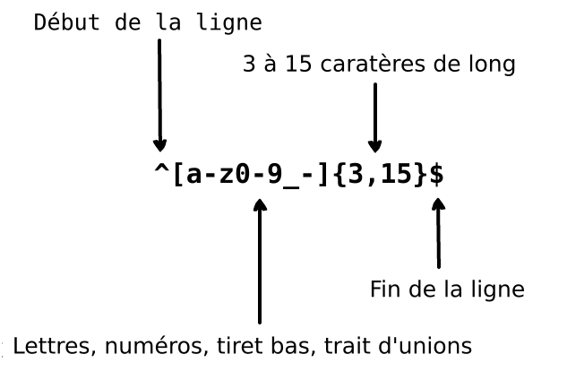

     
    
      
    

        
        
    

## Traductions:

* [English](../README.md)
* [German](../translations/README-de.md)
* [Español](../translations/README-es.md)
* [Français](../translations/README-fr.md)
* [Português do Brasil](../translations/README-pt_BR.md)
* [中文版](../translations/README-cn.md)
* [日本語](../translations/README-ja.md)
* [한국어](../translations/README-ko.md)
* [Turkish](../translations/README-tr.md)
* [Greek](../translations/README-gr.md)
* [Magyar](../translations/README-hu.md)
* [Polish](../translations/README-pl.md)
* [Русский](../translations/README-ru.md)
* [Tiếng Việt](../translations/README-vn.md)
* [فارسی](../translations/README-fa.md)
* [עברית](../translations/README-he.md)

## Qu'est-ce qu'une expression régulière?

> Une expression régulière est un groupement de caractères ou symboles utilisés pour trouver un schéma spécifique dans un texte.

Une expression régulière est un schéma qui est comparé à une chaîne de caractères (string) de gauche à droite. Le mot "Expression régulière"
est un terme entier, souvent abrégé par "regex" ou "regexp". Une expression régulière est utilisée pour remplacer un texte à l'intérieur
d'une chaîne de caractères (string), valider un formulaire, extraire une portion de chaine de caractères (string) basée sur un schéma, et bien plus encore.

Imaginons que nous écrivons une application et que nous voulons définir des règles pour le choix d'un pseudonyme. Nous voulons autoriser
le pseudonyme à contenir des lettres, des nombres, des underscores et des traits d'union. Nous voulons aussi limiter le nombre
de caractères dans le pseudonyme pour qu'il n'ait pas l'air moche. Nous utilisons l'expression régulière suivante pour valider un pseudonyme:
  

  

L'expression régulière ci-dessus peut accepter les chaines de caractères (string) `john_doe`, `jo-hn_doe` et `john12_as`. Ça ne fonctionne pas avec `Jo` car cette chaine de caractères (string) contient une lettre majuscule et elle est trop courte.

## Table des matières

- [Introduction](#1-introduction)
- [Meta-caractères](#2-meta-caractères)
  - [Full stop](#21-full-stop)
  - [Inclusion de caractères](#22-inclusion-de-caractères)
    - [Exclusion de caractères](#221-exclusion-de-caractères)
  - [Répétitions](#23-répétitions)
    - [Astérisque](#231-Asterisque)
    - [Le Plus](#232-le-plus)
    - [Le Point d'Interrogation](#233-le-point-d'interrogation)
  - [Accolades](#24-accolades)
  - [Groupement de caractères](#25-groupement-de-caractères)
  - [Alternation](#26-alternation)
  - [Caractère d'échappement](#27-caractère-d'échappement)
  - [Ancres](#28-ancres)
    - [Circonflexe](#281-circonflexe)
    - [Dollar](#282-dollar)
- [Liste de caractères abrégés](#3-liste-de-caractères-abrégés)
- [Recherche](#4-recherche)
  - [Recherche avant positive](#41-recherche-avant-positive)
  - [Recherche avant négative](#42-recherche-avant-négative)
  - [Recherche arrière positive](#43-recherche-arrière-positive)
  - [Recherche arrière négative](#44-recherche-arrière-négative)
- [Drapeaux](#5-drapeaux)
  - [Insensible à la casse](#51-insensible-à-la-casse)
  - [Correspondance globale](#52-recherche-globale)
  - [Multilignes](#53-multilignes)

## 1. Introduction

Une expression régulière est un schéma de caractères utilisés pour effectuer une recherche dans un texte.
Par exemple, l'expression régulière `the` signifie : la lettre `t`, suivie de la lettre `h`, suivie de la lettre `e`.

<pre>
"the" => The fat cat sat on <a href="#learn-regex"><strong>the</strong></a> mat.
</pre>

[Essayer l'expression régulière](https://regex101.com/r/dmRygT/1)

L'expression régulière `123` coïncide à la chaîne `123`. Chaque caractère de l'expression régulière est comparée à la chaîne passée en entrée, caractère par caractère. Les expressions régulières sont normalement sensibles à la casse, donc l'expression régulière `The` ne va pas coïncider à la chaîne de caractère `the`.

<pre>
"The" => <a href="#learn-regex"><strong>The</strong></a> fat cat sat on the mat.
</pre>

[Essayer l'expression régulière](https://regex101.com/r/1paXsy/1)

## 2. Meta-caractères

Les meta-caractères sont les blocs de construction des expressions régulières. Les meta-caractères sont interprétés de manière particulière. Certains meta-caractères ont des significations spéciales et sont écrits entre crochets.
Significations des meta-caractères:

|Meta-caractère|Description|
|:----:|----|
|.|Un point coïncide avec n'importe quel caractère unique à part le retour à la ligne.|
|[ ]|Classe de caractères. Coïncide avec n'importe quel caractère entre crochets.|
|[^ ]|Négation de classe de caractère. Coïncide avec n'importe quel caractère qui n'est pas entre les crochets.|
|*|Coïncide avec 0 ou plus répétitions du caractère précédent.|
|+|Coïncide avec 1 ou plus répétitions du caractère précédent.|
|?|Rend le caractère précédent optionnel.|
|{n,m}|Accolades. Coïncide avec au moins "n" mais pas plus que "m" répétition(s) du caractère précédent.|
|(xyz)|Groupe de caractères. Coïncide avec les caractères "xyz" dans l'ordre exact.|
|&#124;|Alternation (ou). Coïncide soit avec le caractère avant ou après le symbole.|
|&#92;|Échappe le prochain caractère. Cela permet de faire coïncider des caractères réservés tels que <code>[ ] ( ) { } . * + ? ^ $ \ &#124;</code>|
|^|Coïncide avec le début de la chaîne de caractères (string).|
|$|Coïncide avec la fin de la chaîne de caractères (string).|

## 2.1 Full stop

Le full stop `.` est l'exemple le plus simple d'un meta-caratère. Le `.` coïncide avec n'importe quel caractère unique, mais ne coïncide pas avec les caractères de retour ou de nouvelle ligne. Par exemple, l'expression régulière `.ar` signifie : n'importe quel caractère suivi par la lettre `a`, suivie par la lettre `r`.

<pre>
".ar" => The <a href="#learn-regex"><strong>car</strong></a> <a href="#learn-regex"><strong>par</strong></a>ked in the <a href="#learn-regex"><strong>gar</strong></a>age.
</pre>

[Essayer l'expression régulière](https://regex101.com/r/xc9GkU/1)

## 2.2 Inclusions de caractères

Les inclusions de caractères sont également appelées classes de caractères. Les crochets sont utilisés pour spécifier les inclusions de caractères. Un trait d'union utilisé dans une inclusion de caractères permet de définir une gamme de caractères. L'ordre utilisé dans la gamme de caractère n'a pas d'importance. Par exemple, l'expression régulière `[Tt]he` signifie : un `T` majuscule ou `t` minuscule, suivie par la lettre `h`, suivie par la lettre `e`.

<pre>
"[Tt]he" => <a href="#learn-regex"><strong>The</strong></a> car parked in <a href="#learn-regex"><strong>the</strong></a> garage.
</pre>

[Essayer l'expression régulière](https://regex101.com/r/2ITLQ4/1)

L'utilisation du point dans une inclusion de caractère signifie toutefois un `.` littéral. L'expression régulière `ar[.]` signifie : un `a` minuscule, suivi par la lettre `r` minuscule, suivie par un `.` (point).

<pre>
"ar[.]" => A garage is a good place to park a c<a href="#learn-regex"><strong>ar.</strong></a>
</pre>

[Essayer l'expression régulière](https://regex101.com/r/wL3xtE/1)

### 2.2.1 Exclusion de caractères

En règle générale, le caractère circonflexe représente le début d'une chaîne de caractères (string). Néanmoins, lorsqu'il est utilisé après le crochet ouvrant, il permet d'exclure la gamme de caractères. Par exemple, l'expression régulière `[^c]ar` signifie : n'importe quel caractère sauf `c`, suivi par la lettre `a`, suivie par la lettre `r`.

<pre>
"[^c]ar" => The car <a href="#learn-regex"><strong>par</strong></a>ked in the <a href="#learn-regex"><strong>gar</strong></a>age.
</pre>

[Essayer l'expression régulière](https://regex101.com/r/nNNlq3/1)

## 2.3 Répétitions

Les meta-caractères suivants `+`, `*` ou `?` sont utilisés pour spécifier combien de fois un sous-schéma peut apparaître. Ces meta-caractères agissent différemment selon la situation dans laquelle ils sont utilisés.

### 2.3.1 Astérisque

Le symbole `*` correspond à zéro ou plus de répétitions du schéma précédent. L'expression régulière `a*` signifie : zéro ou plus de répétitions
du précédent `a` minuscule. Mais si il se trouve après une liste de caractères alors il s'agit de la répétition de la liste entière.
Par exemple, l'expression régulière `[a-z]*` signifie : peu importe la chaine tant qu'il s'agit de lettres minuscules.

<pre>
"[a-z]*" => T<a href="#learn-regex"><strong>he</strong></a> <a href="#learn-regex"><strong>car</strong></a> <a href="#learn-regex"><strong>parked</strong></a> <a href="#learn-regex"><strong>in</strong></a> <a href="#learn-regex"><strong>the</strong></a> <a href="#learn-regex"><strong>garage</strong></a> #21.
</pre>

[Essayer l'expression régulière](https://regex101.com/r/7m8me5/1)

Le symbole `*` peut être utilisé avec le meta-caractère `.` pour correspondre à n'importe quelle chaîne de caractères (string) `.*`. Le symbole `*` peut être utilisé avec le
caractère espace vide `\s` pour correspondre à une chaîne d'espaces vides. Par exemple, l'expression `\s*cat\s*` signifie : zéro ou plus
d'espaces, suivis du caractère `c` minuscule, suivi par le caractère `a` minuscule, suivi par le caractère `t` minuscule, suivi par
zéro ou plus d'espaces.

<pre>
"\s*cat\s*" => The fat<a href="#learn-regex"><strong> cat </strong></a>sat on the <a href="#learn-regex">con<strong>cat</strong>enation</a>.
</pre>

[Essayer l'expression régulière](https://regex101.com/r/gGrwuz/1)

### 2.3.2 Le Plus

Le meta-caractère `+` correspond à une ou plusieurs répétitions du caractère précédent. Par exemple, l'expression régulière `c.+t` signifie : la lettre `c` minuscule, suivie par au moins un caractère, suivie par la lettre `t` minuscule. Le `t` coïncide par conséquent avec le dernier `t` de la phrase.

<pre>
"c.+t" => The fat <a href="#learn-regex"><strong>cat sat on the mat</strong></a>.
</pre>

[Essayer l'expression régulière](https://regex101.com/r/Dzf9Aa/1)

### 2.3.3 Le point d'interrogation

Le meta-caractère `?` rend le caractère précédent optionnel. Ce symbole permet de faire coïncider 0 ou une instance du caractère précédent. Par exemple, l'expression régulière `[T]?he` signifie : la lettre `T` majuscule optionnelle, suivie par la lettre `h` minuscule, suivie par la lettre `e` minuscule.

<pre>
"[T]he" => <a href="#learn-regex"><strong>The</strong></a> car is parked in the garage.
</pre>

[Essayer l'expression régulière](https://regex101.com/r/cIg9zm/1)

<pre>
"[T]?he" => <a href="#learn-regex"><strong>The</strong></a> car is parked in t<a href="#learn-regex"><strong>he</strong></a> garage.
</pre>

[Essayer l'expression régulière](https://regex101.com/r/kPpO2x/1)

## 2.4 Accolades

Dans une expression régulière, les accolades, qui sont aussi appelées quantifieurs, sont utilisées pour spécifier le nombre de fois qu'un
caractère ou un groupe de caractères peut être répété. Par exemple, l'expression régulière `[0-9]{2,3}` signifie : trouve au moins 2 chiffres mais pas plus de 3
(caractères dans la gamme de 0 à 9).

<pre>
"[0-9]{2,3}" => The number was 9.<a href="#learn-regex"><strong>999</strong></a>7 but we rounded it off to <a href="#learn-regex"><strong>10</strong></a>.0.
</pre>

[Essayer l'expression régulière](https://regex101.com/r/juM86s/1)

Nous pouvons omettre le second nombre. Par exemple, l'expression régulière `[0-9]{2,}` signifie : trouve 2 chiffres ou plus. Si nous supprimons aussi
la virgule l'expression régulière `[0-9]{3}` signifie : trouve exactement 3 chiffres.

<pre>
"[0-9]{2,}" => The number was 9.<a href="#learn-regex"><strong>9997</strong></a> but we rounded it off to <a href="#learn-regex"><strong>10</strong></a>.0.
</pre>

[Essayer l'expression régulière](https://regex101.com/r/Gdy4w5/1)

<pre>
"[0-9]{3}" => The number was 9.<a href="#learn-regex"><strong>999</strong></a>7 but we rounded it off to 10.0.
</pre>

[Essayer l'expression régulière](https://regex101.com/r/Sivu30/1)

## 2.5 Groupement de caractères

Un groupement de caractères est un groupe de sous-schémas qui sont écrits entre parenthèses `(...)`. Nous avions mentionné plus tôt que, dans une expression régulière,
si nous mettons un quantifieur après un caractère alors le caractère précédent sera répété. Mais si nous mettons un quantifieur après un groupement de caractères alors
il répète le groupement de caractères en entier. Par exemple, l'expression régulière `(ab)*` trouve zéro ou plus de répétitions des caractères "ab".
Nous pouvons aussi utiliser le meta-caractère d'alternation `|` à l'intérieur d'un groupement. Par exemple, l'expression régulière `(c|g|p)ar` signifie : caractère `c` minuscule,
`g` ou `p`, suivi par le caractère `a`, suivi par le caractère `r`.

<pre>
"(c|g|p)ar" => The <a href="#learn-regex"><strong>car</strong></a> is <a href="#learn-regex"><strong>par</strong></a>ked in the <a href="#learn-regex"><strong>gar</strong></a>age.
</pre>

[Essayer l'expression régulière](https://regex101.com/r/tUxrBG/1)

## 2.6 Alternation

Dans une expression régulière, la barre verticale `|` est utilisée pour définir une alternation. L'alternation est comme une condition entre plusieurs expressions. Maintenant,
nous pourrions penser que la liste de caractères et l'alternation sont la même chose. Mais la grande différence entre une liste de caractères et l'alternation
est que la liste de caractères fonctionne au niveau des caractères mais l'alternation fonctionne au niveau de l'expression. Par exemple, l'expression régulière
`(T|t)he|car` signifie : le caractère `T` majuscule ou `t` minuscule, suivi par le caractère `h` minuscule, suivi par le caractère `e` minuscule
ou le caractère `c` minuscule, suivi par le caractère `a` minuscule, suivit par le caractère `r` minuscule.

<pre>
"(T|t)he|car" => <a href="#learn-regex"><strong>The</strong></a> <a href="#learn-regex"><strong>car</strong></a> is parked in <a href="#learn-regex"><strong>the</strong></a> garage.
</pre>

[Essayer l'expression régulière](https://regex101.com/r/fBXyX0/1)

## 2.7 Caractère d'échappement

L'antislash `\` est utilisé dans les expressions régulières pour échapper (ignorer) le caractère suivant. Cela permet de spécifier un symbole comme caractère à trouver
y compris les caractères réservés `{ } [ ] / \ + * . $ ^ | ?`. Pour utiliser un caractère spécial comme caractère à trouver, préfixer `\` avant celui-ci.
Par exemple, l'expression régulière `.` est utilisée pour trouver n'importe quel caractère sauf le retour de ligne. Donc pour trouver `.` dans une chaine de caractères (string)
l'expression régulière `(f|c|m)at\.?` signifie : la lettre minuscule `f`, `c` ou `m`, suivie par le caractère `a` minuscule, suivi par la lettre
`t` minuscule, suivie par le caractère optionnel `.`.

<pre>
"(f|c|m)at\.?" => The <a href="#learn-regex"><strong>fat</strong></a> <a href="#learn-regex"><strong>cat</strong></a> sat on the <a href="#learn-regex"><strong>mat.</strong></a>
</pre>

[Essayer l'expression régulière](https://regex101.com/r/DOc5Nu/1)

## 2.8 Ancres

Dans les expressions régulières, nous utilisons des ancres pour vérifier si le symbole trouvé est le premier ou dernier symbole de la
chaine de caractères (string). Il y a 2 types d'ancres : Le premier type est le circonflexe `^` qui cherche si le caractère est le premier
caractère de la chaine de caractères  (string) et le deuxième type est le Dollar `$` qui vérifie si le caractère est le dernier caractère de la chaine de caractères (string).

### 2.8.1 Circonflexe

Le symbole circonflexe `^` est utilisé pour vérifier si un caractère est le premier caractère de la chaine de caractères (string). Si nous appliquons l'expression régulière
suivante `^a` (si a est le premier symbole) à la chaine de caractères (string) `abc`, ça coïncide. Mais si nous appliquons l'expression régulière `^b` sur cette même chaine de caractères (string),
ça ne coïncide pas. Parce que dans la chaine de caractères  (string) `abc` "b" n'est pas le premier symbole. Regardons une autre expression régulière
`^(T|t)he` qui signifie : le caractère `T` majuscule ou le caractère `t` minuscule est le premier symbole de la chaine de caractères (string),
suivi par le caractère `h` minuscule, suivi par le caractère `e` minuscule.

<pre>
"(T|t)he" => <a href="#learn-regex"><strong>The</strong></a> car is parked in <a href="#learn-regex"><strong>the</strong></a> garage.
</pre>

[Essayer l'expression régulière](https://regex101.com/r/5ljjgB/1)

<pre>
"^(T|t)he" => <a href="#learn-regex"><strong>The</strong></a> car is parked in the garage.
</pre>

[Essayer l'expression régulière](https://regex101.com/r/jXrKne/1)

### 2.8.2 Dollar

Le symbole Dollar `$` est utilisé pour vérifier si un caractère est le dernier caractère d'une chaine de caractères (string). Par exemple, l'expression régulière
`(at\.)$` signifie : un caractère `a` minuscule, suivi par un caractère `t` minuscule, suivi par un caractère `.` et tout cela doit être
à la fin de la chaine de caractères (string).

<pre>
"(at\.)" => The fat c<a href="#learn-regex"><strong>at.</strong></a> s<a href="#learn-regex"><strong>at.</strong></a> on the m<a href="#learn-regex"><strong>at.</strong></a>
</pre>

[Essayer l'expression régulière](https://regex101.com/r/y4Au4D/1)

<pre>
"(at\.)$" => The fat cat. sat. on the m<a href="#learn-regex"><strong>at.</strong></a>
</pre>

[Essayer l'expression régulière](https://regex101.com/r/t0AkOd/1)

##  3. Liste de caractères abrégés

Les expressions régulières fournissent des abréviations pour les listes de caractères, ce qui offres des raccourcis pratiques pour
les expressions régulières souvent utilisées. Ces abréviations sont les suivantes :

|Abréviation|Description|
|:----:|----|
|.|N'importe quel caractère à part le retour de ligne|
|\w|Caractères alphanumériques : `[a-zA-Z0-9_]`|
|\W|Caractères non-alphanumériques : `[^\w]`|
|\d|Chiffres : `[0-9]`|
|\D|Non-numériques : `[^\d]`|
|\s|Espace vide : `[\t\n\f\r\p{Z}]`|
|\S|Tout sauf espace vide : `[^\s]`|

## 4. Recherche

La recherche en avant et en arrière sont un type spécifique appelé ***groupe non-capturant*** (utilisés pour trouver un schéma mais pas
pour l'inclure dans la liste de correspondance). Les recherches positives sont utilisées quand nous avons la condition qu'un schéma doit être précédé ou suivi
par un autre schéma. Par exemple, nous voulons tous les chiffres qui sont précédés par le caractère `$` dans la chaine de caractères suivante `$4.44 and $10.88`.
Nous allons utiliser l'expression régulière suivante `(?<=\$)[0-9\.]*` qui signifie : trouver tous les nombres qui contiennent le caractère `.` et sont précédés
par le caractère `$`. Les recherches que nous trouvons dans les expressions régulières sont les suivantes:

|Symbole|Description|
|:----:|----|
|?=|Recherche en avant positive|
|?!|Recherche en avant négative|
|?<=|Recherche en arrière positive|
|?<!|Recherche en arrière négative|

### 4.1 Recherche en avant positive

La recherche en avant assure que la première partie de l'expression soit suivie par l'expression recherchée. La valeur retournée
contient uniquement le texte qui correspond à la première partie de l'expression. Pour définir une recherche en avant positive, on utilise
des parenthèses. Entre ces parenthèses, un point d'interrogation avec un signe égal est utilisé comme cela : `(?=...)`. L'expression de recherche
est écrite après le signe égal dans les parenthèses. Par exemple, l'expression régulière `[T|t]he(?=\sfat)` signifie : trouve optionnellement
la lettre `t` minuscule ou la lettre `T` majuscule, suivie par la lettre `h` minuscule, suivie par la lettre `e`. Entre parenthèses nous définissons
la recherche en avant positive qui dit quelle est l'expression à chercher. `The` ou `the` qui sont suivies par le mot `fat` précédé d'un espace.

<pre>
"[T|t]he(?=\sfat)" => <a href="#learn-regex"><strong>The</strong></a> fat cat sat on the mat.
</pre>

[Essayer l'expression régulière](https://regex101.com/r/IDDARt/1)

### 4.2 Recherche en avant négative

La recherche en avant négative est utilisée quand nous avons besoin de trouver une chaine de caractères (string) qui n'est pas suivie d'un schéma. La recherche en avant négative
est définie de la même manière que la recherche en avant positive mais la seule différence est qu'à la place du signe égal `=` nous utilisons le caractère de négation `!`
i.e. `(?!...)`. Regardons l'expression régulière suivante `[T|t]he(?!\sfat)` qui signifie : trouve tous les mots `The` ou `the` de la chaine de caractères (string)
qui ne sont pas suivis du mot `fat` précédé d'un espace.

<pre>
"[T|t]he(?!\sfat)" => The fat cat sat on <a href="#learn-regex"><strong>the</strong></a> mat.
</pre>

[Essayer l'expression régulière](https://regex101.com/r/V32Npg/1)

### 4.3 Recherche en arrière positive

La recherche en arrière positive est utilisée pour trouver une chaine de caractères (string) précédée d'un schéma. La recherche en arrière positive se note
`(?<=...)`. Par exemple, l'expression régulière `(?<=[T|t]he\s)(fat|mat)` signifie : trouve tous les mots `fat` ou `mat` de la chaine de caractères (string) qui
se trouve après le mot `The` ou `the`.

<pre>
"(?<=[T|t]he\s)(fat|mat)" => The <a href="#learn-regex"><strong>fat</strong></a> cat sat on the <a href="#learn-regex"><strong>mat</strong></a>.
</pre>

[Essayer l'expression régulière](https://regex101.com/r/avH165/1)

### 4.4 Recherche en arrière négative

La recherche en arrière négative est utilisée pour trouver une chaine de caractères (string) qui n'est pas précédée d'un schéma. La recherche en arrière négative se note
`(?<!...)`. Par exemple, l'expression régulière `(?<!(T|t)he\s)(cat)` signifie : trouve tous les mots `cat` de la chaine de caractères (string) qui
ne se trouvent pas après le mot `The` ou `the`.

<pre>
"(?&lt;![T|t]he\s)(cat)" => The cat sat on <a href="#learn-regex"><strong>cat</strong></a>.
</pre>

[Essayer l'expression régulière](https://regex101.com/r/8Efx5G/1)

## 5. Drapeaux

Les drapeaux sont aussi appelés modifieurs car ils modifient la sortie d'une expression régulière. Ces drapeaux peuvent être utilisés
dans n'importe quel ordre et combinaison et font partie intégrante de la RegExp.

|Drapeau|Description|
|:----:|----|
|i|Insensible à la casse : Définit que la correspondance sera insensible à la casse.|
|g|Recherche globale : Recherche la correspondance dans la chaine de caractères (string) entière.|
|m|Multiligne : Meta-caractère ancre qui agit sur toutes les lignes.|

### 5.1 Insensible à la casse

Le modifieur `i` est utilisé pour faire une correspondance insensible à la casse. Par exemple, l'expression régulière `/The/gi` signifie : la lettre
`T` majuscule, suivie par le caractère `h` minuscule, suivi par le caractère `e` minuscule. Et à la fin de l'expression régulière, le drapeau `i` dit au
moteur d'expression régulière d'ignorer la casse. Comme vous pouvez le voir, nous mettons aussi un drapeau `g` parce que nous voulons chercher le schéma dans
la chaine de caractères (string) entière.

<pre>
"The" => <a href="#learn-regex"><strong>The</strong></a> fat cat sat on the mat.
</pre>

[Essayer l'expression régulière](https://regex101.com/r/dpQyf9/1)

<pre>
"/The/gi" => <a href="#learn-regex"><strong>The</strong></a> fat cat sat on <a href="#learn-regex"><strong>the</strong></a> mat.
</pre>

[Essayer l'expression régulière](https://regex101.com/r/ahfiuh/1)

### 5.2 Correspondance globale

Le modifieur `g` est utilisé pour faire une recherche globale (trouver toutes les chaines de caractères (string) plutôt que de s'arrêter à la première correspondance ). Par exemple,
l'expression régulière `/.(at)/g` signifie : n'importe quel caractère sauf le retour de ligne, suivi par le caractère `a` minuscule, suivi par le caractère
`t` minuscule. Grâce au drapeau `g` à la fin de l'expression régulière maintenant il trouvera toutes les correspondances de toute la chaine de caractères (string).

<pre>
"/.(at)/" => The <a href="#learn-regex"><strong>fat</strong></a> cat sat on the mat.
</pre>

[Essayer l'expression régulière](https://regex101.com/r/jnk6gM/1)

<pre>
"/.(at)/g" => The <a href="#learn-regex"><strong>fat</strong></a> <a href="#learn-regex"><strong>cat</strong></a> <a href="#learn-regex"><strong>sat</strong></a> on the <a href="#learn-regex"><strong>mat</strong></a>.
</pre>

[Essayer l'expression régulière](https://regex101.com/r/dO1nef/1)

### 5.3 Multilignes

Le modifieur `m` est utilisé pour trouver une correspondance multiligne. Comme mentionné plus tôt, les ancres `(^, $)` sont utilisés pour vérifier si le schéma
se trouve au début ou à la fin de la chaine de caractères (string). Mais si nous voulons que l'ancre soit sur chaque ligne nous utilisons le drapeau `m`. Par exemple, l'expression régulière
`/at(.)?$/gm` signifie : le caractère `a` minuscule, suivi par le caractère `t` minuscule, suivi par optionnellement n'importe quel caractère à part le retour de ligne.
Grâce au drapeau `m` maintenant le moteur d'expression régulière trouve le schéma à chaque début de ligne dans la chaine de caractères (string).

<pre>
"/.at(.)?$/" => The fat
                cat sat
                on the <a href="#learn-regex"><strong>mat.</strong></a>
</pre>

[Essayer l'expression régulière](https://regex101.com/r/hoGMkP/1)

<pre>
"/.at(.)?$/gm" => The <a href="#learn-regex"><strong>fat</strong></a>
                  cat <a href="#learn-regex"><strong>sat</strong></a>
                  on the <a href="#learn-regex"><strong>mat.</strong></a>
</pre>

[Essayer l'expression régulière](https://regex101.com/r/E88WE2/1)

## Contribution

* Signaler les problèmes (issues)
* Ouvrir des "pull requests" pour les améliorations
* Parlez-en autour de vous !
* Contactez moi en anglais à ziishaned@gmail.com ou 

## License

MIT &copy; [Zeeshan Ahmad](https://twitter.com/ziishaned)
