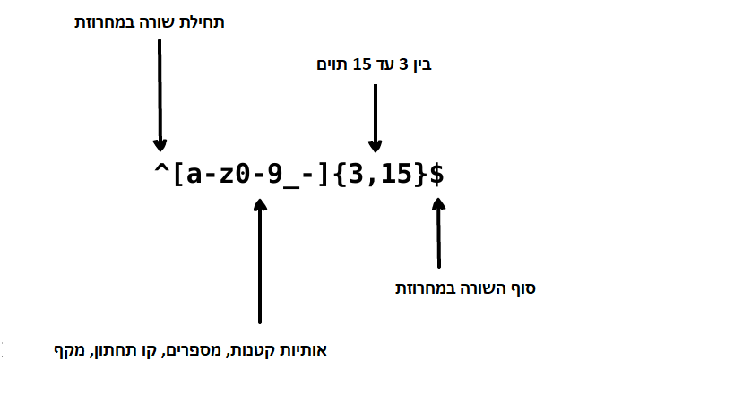

     
    

## תרגומים:

* [English](../README.md)
* [German](../translations/README-de.md)
* [Español](../translations/README-es.md)
* [Français](../translations/README-fr.md)
* [Português do Brasil](../translations/README-pt_BR.md)
* [中文版](../translations/README-cn.md)
* [日本語](../translations/README-ja.md)
* [한국어](../translations/README-ko.md)
* [Turkish](../translations/README-tr.md)
* [Greek](../translations/README-gr.md)
* [Magyar](../translations/README-hu.md)
* [Polish](../translations/README-pl.md)
* [Русский](../translations/README-ru.md)
* [Tiếng Việt](../translations/README-vn.md)
* [فارسی](../translations/README-fa.md)
* [עברית](../translations/README-he.md)

## מה זה ביטוי רגולרי?

    

> ביטוי רגולרי (regular expression) הוא קבוצת תוים או סימנים אשר משמשים למציאת תבנית ספציפית בתוך טקסט. 

ביטוי רגולרי הוא תבנית המתאימה את עצמה לנושא במחרוזת משמאל לימין.
ביטויים רגולרים משמשים להחלפת טקסט בתוך מחרוזת, אימות טפסים,
חילוץ מחרוזת משנית ממחרוזת ראשית על בסיס התבנית המתאימה, ועוד.
המונח "Regular expression" (ביטוי רגולרי) הוא יחסית ארוך ולכן בדרך כלל
נמצא את המונח מקוצר ל-"regex" או "regexp".

תדמיין.י שאת.ה כותב.ת אפליקציה ואת.ה רוצה להציב חוקים למצב בו המשתמש בוחר את
שם המשתמש. אנחנו רוצים לאפשר לשם המשתמש להכיל אותיות, מספרים, קוים תחתונים ומקפים.
בנוסף נרצה גם להגביל את מספר התוים בשם המשתמש בכדי שלא יראה מכוער.
נוכל להשתמש בביטוי הרגולרי הבא בכדי לאמת את שם המשתמש:

  

  

הביטוי הרגולרי למעלה יכול לאשר את המחרוזות  `john_doe`, `jo-hn_doe`
ו-`john12_as`. אך הוא לא יתאים למחרוזת `Jo` בגלל שמחרוזת זו מכילה אות גדולה
 ובנוסף לכך היא קצרה מדי (פחות משלושה תוים).

## תוכן עניינים

- [התאמות בסיסיות](#1-התאמות-בסיסיות)
- [תווי-מטא](#2-תווי-מטא)
  - [עצירה מלאה](#21-עצירה-מלאה)
  - [מערכות תוים](#22-מערכות-תוים)
    - [מערכות תוים שליליות](#221-מערכות-תוים-שליליות)
  - [חזרות](#23-חזרות)
    - [הכוכבית](#231-הכוכבית)
    - [הפלוס](#232-הפלוס)
    - [סימן השאלה](#233-סימן-השאלה)
  - [סוגרים מסולסלים](#24-סוגרים-מסולסלים)
  - [קבוצות לכידה](#25-קבוצות-לכידה)
      - [קבוצות שאינן לוכדות](#251-קבוצות-שאינן-לוכדות)
  - [חלופה](#26-חלופה)
  - [התעלמות מתווים מיוחדים](#27-התעלמות-מתווים-מיוחדים)
  - [עוגנים](#28-עוגנים)
    - [ה-"קרט"](#281-ה-"קרט")
    - [סימן הדולר](#282-סימן-הדולר)
- [קיצורי מערכות תווים](#3-קיצורי-מערכות-תווים)
- [הסתכלויות](#4-הסתכלויות)
  - [מבט קדימה חיובי](#41-מבט-קדימה-חיובי)
  - [מבט קדימה שלילי](#42-מבט-קדימה-שלילי)
  - [מבט אחורה חיובי](#43-מבט-אחורה-חיובי)
  - [מבט אחורה שלילי](#44-מבט-אחורה-שלילי)
- [דגלים](#5-דגלים)
  - [חוסר רגישות לאותיות](#51-חוסר-רגישות-לאותיות)
  - [חיפוש גלובלי](#52-חיפוש-גלובלי)
  - [רב-שורות](#53-רב-שורות)
- [התאמה חמדנית מול עצלה](#6-התאמה-חמדנית-מול-עצלה)

## 1. התאמות בסיסיות

ביטוי רגולרי הוא בסף הכל תבנית של תוים שאנו משתמשים בהם בכדי לבצע חיפוש 
בתוך הטקסט. לדוגמא, הביטוי הרגולרי `the` פירושו: האות `t`, ואחריה האות `h`, ואחריה האות `e`.

<pre dir="ltr">
"the" => The fat cat sat on <a href="#learn-regex"><strong>the</strong></a> mat.
</pre>

[בדוק.י את הביטוי הרגולרי](https://regex101.com/r/dmRygT/1)

הביטוי הרגולרי `123` מתאים למחרוזת `123`. הביטוי הרגולרי מותאם למחרוזת קלט על ידי השוואת כל תו 
בביטוי הרגולרי לכל תו במחרוזת הקלט, אחד אחרי השני. ביטויים רגולרים לרוב יהיו 
תלויי אותיות קטנות או גדולות כך שהביטוי הרגולרי `The` לא יתאים למחרוזת `the`.

<pre dir="ltr">
"The" => <a href="#learn-regex"><strong>The</strong></a> fat cat sat on the mat.
</pre>

[בדוק.י את הביטוי הרגולרי](https://regex101.com/r/1paXsy/1)

## 2. תווי-מטא

תווי-מטא אלו הם אבני הבניין של ביטויים רגולרים. תווי-מטא לא מסמלים את עצמם, אלא מתפרשים באופן מיוחד.
לכמה תווי-מטא יש משמעויות מיוחדות והם נכתבים בתוך סוגריים מרובעים.
תווי-המטא הם כדלקמן: 

|תווי-מטא|תיאור|
|:----:|----|
|.|נקודה תואמת כל תו בודד למעט שבירת שורות.|
|[ ]|מחלקת תווים. תואם כל תו הכלול בין הסוגריים המרובעים.|
|[^ ]|מחלקת תווים שלילית. תואם כל תו שאינו כלול בין הסוגריים המרובעים|
|*|תואם 0 או יותר חזרות של התו הקודם.|
|+|תואם חזרה אחת או יותר של התו הקודם.|
|?|הופך את התו הקודם לאופציונלי.|
|{n,m}|סוגריים מסולסלים. תואם לפחות חזרות "n" אך לא יותר מ- "m" של התו הקודם.|
|(xyz)|קבוצת תווים. תואם את התווים xyz בסדר המדויק הזה.|
|&#124;|חלופה (או). התאמה בין התווים שלפני או לתווים שאחרי הסמל.|
|&#92;|מתעלם מהתו הבא. זה מאפשר לך להתאים תווים שמורים <code>[ ] ( ) { } . * + ? ^ $ \ &#124;</code>|
|^|תואם את תחילת הקלט.|
|$|תואם את סוף הקלט.|

## 2.1 עצירה מלאה

עצירה מלאה `.` היר דוגמא פשוטה לשימוש בתו-מטא. תו-המטא `.` מתאים לכל תו בודד. הוא לא יתאים
לתו return (\r) או לתו newline (\n). למשל, הביטוי הרגולרי `.ar` פירושו: כל תו, שאחריו האות `a`, ואחריה האות `r`.

<pre dir="ltr">
".ar" => The <a href="#learn-regex"><strong>car</strong></a> <a href="#learn-regex"><strong>par</strong></a>ked in the <a href="#learn-regex"><strong>gar</strong></a>age.
</pre>

[בדוק.י את הביטוי הרגולרי](https://regex101.com/r/xc9GkU/1)

## 2.2 מערכות תוים

מערכות תוים נקראים גם מחלקות תוים. סוגריים מרובעים משמשים לציון מערכות תוים.
השתמש במקף בתוך ערכת התוים בכדי לציין את טווח התוים. סדר טווח התוים לא משנה.
לדוגמא, הביטוי הרגולרי `[Tt]he` פירושו: אות גדולה
`T` או אות קטנה `t`, שאחריה מופיעה האות `h`, ואחריה מופיעה האות `e`.

<pre dir="ltr">
"[Tt]he" => <a href="#learn-regex"><strong>The</strong></a> car parked in <a href="#learn-regex"><strong>the</strong></a> garage.
</pre>

[בדוק.י את הביטוי הרגולרי](https://regex101.com/r/2ITLQ4/1)

נקודה בתוך ערכת התוים בשונה מבחוץ תחשב כתו נקודה. הביטוי הרגולרי 
`ar[.]` פירושו: תו האות הקטנה `a`, שאחריו האות `r`,
ואחריה התו נקודה `.`.

<pre dir="ltr">
"ar[.]" => A garage is a good place to park a c<a href="#learn-regex"><strong>ar.</strong></a>
</pre>

[בדוק.י את הביטוי הרגולרי](https://regex101.com/r/wL3xtE/1)

### 2.2.1 מערכות תוים שליליות 

באופן כללי, הסימן "קרט"(גג) מייצג את תחילתה של מחרוזת, אך במידה והוא מוקלד לאחר סוגר מרובע פותח,
הוא שולל את מערכת ההתוים שיהיו תחת אותם סוגרים. לדוגמא, הביטוי הרגולרי `[^c]ar` פירושו: כל תו חוץ מ-`c`,
שלאחריו יופיע התו `a`, שאחריו יופיע התו `r`.

<pre dir="ltr">
"[^c]ar" => The car <a href="#learn-regex"><strong>par</strong></a>ked in the <a href="#learn-regex"><strong>gar</strong></a>age.
</pre>

[בדוק.י את הביטוי הרגולרי](https://regex101.com/r/nNNlq3/1)

## 2.3 חזרות

תווי-המטא `+`, `*` או `?` משמשים לציון כמה פעמים דפוסי משני יכולים להתרחש.
תווי-מטא אלו פועלים אחרת במצבים שונים.

### 2.3.1 הכוכבית

הסימן - `*` תואם אפס או יותר חזרות של המתאם הקודם. הביטוי הרגולרי `a*` פירושו: 
אפס או יותר חזרות של התו הקודם- `a`. אבל אם הכוכבית תופיע לאחר מערכת או מערך תוים אז
הוא ימצא את החזרות של מערכת התוים כולה. לדוגמא, הביטוי הרגולרי `[a-z]*` פירושו: 
כל מספר של אותיות קטנות בשורה.

<pre dir="ltr">
"[a-z]*" => T<a href="#learn-regex"><strong>he</strong></a> <a href="#learn-regex"><strong>car</strong></a> <a href="#learn-regex"><strong>parked</strong></a> <a href="#learn-regex"><strong>in</strong></a> <a href="#learn-regex"><strong>the</strong></a> <a href="#learn-regex"><strong>garage</strong></a> #21.
</pre>

[בדוק.י את הביטוי הרגולרי](https://regex101.com/r/7m8me5/1)

הסימן - `*` יכול לשמש יחד עם התו-מטא `.` בכדי להתאים כל מחרוזת תוים `.*`.
הסימון - `*` יכול לשמש יחד עם התו רווח - `\s` בכדי להתאים מחרוזת של תוי רווח.
לדוגמא, הביטוי `\s*cat\s*` פירושו: אפס או יותר רווחים, שאחריהם תופיעה האות הקטנה `c`,
שאחריה תופיע האות הקטנה `a`, ואחריה האות הקטנה `t`, ולבסוף אחריה יופיעו אפס או יותר תווי רווח.

<pre dir="ltr">
"\s*cat\s*" => The fat<a href="#learn-regex"><strong> cat </strong></a>sat on the con<a href="#learn-regex"><strong>cat</strong></a>enation.
</pre>

[בדוק.י את הביטוי הרגולרי](https://regex101.com/r/gGrwuz/1)

### 2.3.2 הפלוס

הסימן `+` מתאים לאחת או יותר חזרות של התו הקודם לו. לדוגמא, הביטוי הרגולרי
 `c.+t` פירושו: האות הקטנה - `c`, לאחריה לפחות תו אחד או יותר,
  ואחריה האות הקטנה  `t`. חשוב לציין שה - `t` יהיה התו `t` האחרון במשפט.

<pre dir="ltr">
"c.+t" => The fat <a href="#learn-regex"><strong>cat sat on the mat</strong></a>.
</pre>

[בדוק.י את הביטוי הרגולרי](https://regex101.com/r/Dzf9Aa/1)

### 2.3.3 סימן השאלה

בביטוי רגולרי, התו-מטא `?` הופך את התו הקודם לאופציונלי, 
סמל זה יתאים לאפס או יותר הופעות של אותו תו קודם. לדוגמא, הביטוי הרגולרי 
`[T]?he` פירושו: אופציה לאות
`T` גדולה, ולאחריה אות קטנה `h`, ולאחריה תופיע האות - `e`.

<pre dir="ltr">
"[T]he" => <a href="#learn-regex"><strong>The</strong></a> car is parked in the garage.
</pre>

[בדוק.י את הביטוי הרגולרי](https://regex101.com/r/cIg9zm/1)

<pre dir="ltr">
"[T]?he" => <a href="#learn-regex"><strong>The</strong></a> car is parked in t<a href="#learn-regex"><strong>he</strong></a> garage.
</pre>

[בדוק.י את הביטוי הרגולרי](https://regex101.com/r/kPpO2x/1)

## 2.4 סוגרים מסולסלים

בביטויים רגולרים, סוגרים מסולסלים (נקראים גם מכמתים) משמשים לציון
מספר הפעמים שניתן לחזור על תו או קבוצת תוים מסויימת. לדוגמא, הביטור הרגולרי
 `[0-9]{2,3}` פירושו: התאם לפחות שתי ספרות, אבל לא יותר משלוש, בטווח שבין 0 ל-9

<pre dir="ltr">
"[0-9]{2,3}" => The number was 9.<a href="#learn-regex"><strong>999</strong></a>7 but we rounded it off to <a href="#learn-regex"><strong>10</strong></a>.0.
</pre>

[בדוק.י את הביטוי הרגולרי](https://regex101.com/r/juM86s/1)

אנחנו יכולים לוותר על המספר השני בסוגרים המסולסלים. לדוגמא, בביטוי הרגולרי 
`[0-9]{2,}` פירושו: התאמת שתי ספרות או יותר. בנוסף אם 
נוריד את הפסיק, לדוגמא בביטוי הרגולרי `[0-9]{3}` פירושו: 
התאם בדיוק שלוש ספרות.

<pre dir="ltr">
"[0-9]{2,}" => The number was 9.<a href="#learn-regex"><strong>9997</strong></a> but we rounded it off to <a href="#learn-regex"><strong>10</strong></a>.0.
</pre>

[בדוק.י את הביטוי הרגולרי](https://regex101.com/r/Gdy4w5/1)

<pre dir="ltr">
"[0-9]{3}" => The number was 9.<a href="#learn-regex"><strong>999</strong></a>7 but we rounded it off to 10.0.
</pre>

[בדוק.י את הביטוי הרגולרי](https://regex101.com/r/Sivu30/1)

## 2.5 קבוצות לכידה

קבוצה מלכדת היא קבוצה של תת-תבניות שנכתבות בתוך סוגריים רגילים  `(...)` . 
כפי שצויין קודם לכן, בביטוי רגולרי, אם נניח מכמת אחרי תו הוא יחזור על התו הקודם. 
אבל אם נניח מכמת אחרי קבוצה מלכדת אז המכמת יתיחס לכל הקבוצה המלכדת. לדוגמא, הביטוי הרגולרי 
`(ab)*` תואם אפס או יותר חזרות של המחרוזת "ab". אנחנו יכולים גם להשתמש 
בתו-מטא `|` המשמש לבצע את הפעולה 'OR'(או) בתוך קבוצה מלכדת.
לדוגמא, הביטוי הרגולרי `(c|g|p)ar` פירושו: אות קטנה `c`,
`g` או `p`, שאחריהן תופיע האות `a`, ואחריה האות `r`.

<pre dir="ltr">
"(c|g|p)ar" => The <a href="#learn-regex"><strong>car</strong></a> is <a href="#learn-regex"><strong>par</strong></a>ked in the <a href="#learn-regex"><strong>gar</strong></a>age.
</pre>

[בדוק.י את הביטוי הרגולרי](https://regex101.com/r/tUxrBG/1)

יש לשים לב כי קבוצות מלכדות לא רק תואמות, אלא גם תופסות את התוים לשימוש בשפת האם. 
שפת האם יכולה להיות Python או JavaScript או כמעט כל שפה שמיישמת ביטויים רגולרים 
בבגדרת פונקציה.

### 2.5.1 קבוצות שאינן לוכדות

קבוצה שאינה מלכדת זוהי קבוצת לוכדת התואמת את התוים אבל לא תופסת את הקבוצה.
קבוצה שאינה מלכדת מסומנת על ידי התו `?` ואחריו `:` בתוך הסוגריים הרגילים. `(...)`. 
לדוגמא, בביטוי הרגולרי `(?:c|g|p)ar` שדומה ל-`(c|g|p)ar` 
בכך שהוא תואם לאותם תווים אך לא ייצר קבוצת לכידה.

<pre dir="ltr">
"(?:c|g|p)ar" => The <a href="#learn-regex"><strong>car</strong></a> is <a href="#learn-regex"><strong>par</strong></a>ked in the <a href="#learn-regex"><strong>gar</strong></a>age.
</pre>

[בדוק.י את הביטוי הרגולרי](https://regex101.com/r/Rm7Me8/1)

קבוצות שאינן מלכדות יכולות להיות שימושיות כאשר יש צורך בפונקציונליות של חיפוש והחלפה
או כאשר מעורבת גם קבוצת לכידה בכדי לשמור על הסקירה כאשר מפיקים כל סוג אחר של פלט. 
ניתן לראות גם ב [4. Lookaround](#4-lookaround).

## 2.6 חלופה

בביטוי רגולרי, הקו ניצב `|` משמש בכדי להגדיר חלופה. חלופה היא כמו הצהרת OR (או) 
בין ביטויים שונים. כעט את.ה עלול לחשוב שמערכות התווים והתו המשמש להגדרת חלופה יעבדו באותה הדרך. 
אך ההבדל העיקרי בין מערכת תווים לבין חלופה הוא שמערכת תווים פועלת ברמת התו והחלופה
עובדת ברמת הביטוי. לדוגמא, הביטוי הרגולרי `(T|t)he|car` פירושו: או (אות גדולה `T` או אות קטנה
`t`, שלאחריהן אות קטנה `h`, שאחריה אות קטנה `e`) או (אות קטנה `c`, שאחריה תופיע האות `a`, 
ולאחריה תופיע האות `r`). יש לשים לב שהכללתי את הסוגריים לשם ההבהרה, 
בכדי להראות שאפשר להתמודד עם כל ביטוי בסוגריים והוא יתאים. 

<pre dir="ltr">
"(T|t)he|car" => <a href="#learn-regex"><strong>The</strong></a> <a href="#learn-regex"><strong>car</strong></a> is parked in <a href="#learn-regex"><strong>the</strong></a> garage.
</pre>

[בדוק.י את הביטוי הרגולרי](https://regex101.com/r/fBXyX0/1)

## 2.7 התעלמות מתווים מיוחדים

לוכסן שמאלי `\` משמש בביטוי רגולרי בכדי להתעלם מהתו הבא. זה מאפשר לנו לכלול תוים שמורים כמו 
`{ } [ ] / \ + * . $ ^ | ?` כתוים להתאמות. הכדי להשתמש בתוים המיוחדים הללו התו התאמה, 
יש להוסיף אותו מראש עם `\` לפניו. לדוגמא, הביטוי הרגולרי `.` משמש בכדי להתאים כל תו חוץ משורה חדשה. 
כעט בכדי לבצע התאמה עם הסימן `.` במחרוזת קלט, יהיה צורך בהוספת הלוכסן השמאלי. למשל בביטוי הרגולרי 
`(f|c|m)at\.?` פירושו: אות קטנה `f`, `c` או `m`, שאחריהן תופיע האות הקטנה
`a`, ואחריה תופיע האות הקטנה `t`, ולבסוף יופיע באופן אופציונלי התו - `.`.

<pre dir="ltr">
"(f|c|m)at\.?" => The <a href="#learn-regex"><strong>fat</strong></a> <a href="#learn-regex"><strong>cat</strong></a> sat on the <a href="#learn-regex"><strong>mat.</strong></a>
</pre>

[בדוק.י את הביטוי הרגולרי](https://regex101.com/r/DOc5Nu/1)

## 2.8 עוגנים

בביטויים רגולרים, אנחנו משתמשים בעוגנים בכדי לבדוק אם סימן ההתאמה הוא סימן התחלה או 
סימן סיום של מחרוזת הקלט. ישנם שני סוגי עוגנים: 
הסוג הראשון הוא ה"קרט"(גג) `^` שבודק אם תו תואם הוא התו הראשון של הקלט והסוג השני הוא סימן הדולר 
`$` אשר בודק אם תו תואם הוא התו האחרון שבקלט

### 2.8.1 ה-"קרט"

הסימן "קרט" `^` משמש לבדיקה אם תו תואם הוא התו הראשון של מחרוזת הקלט. 
אם ניישם את הביטור הרגולרי הבא `^a` (כלומר 'a' חייב להיות התו ההתחלתי) 
המחרוזת `abc`, תתאים לדרישות `a`. 
אך אם ניישם את הביטוי הרגולרי `^b` על במחרוזת למעלה, היא לא תמצא אף התאמה. 
בגלל שבמחרוזת `abc`, ה-"b" אינו תו התחלתי. בואו נסתכל על ביטוי רגולרי אחר 
`^(T|t)he` שפירושו: אות גדולה `T` או אות קטנה `t` חייבת להיות התו הראשון של המחרוזת, 
ואחריה האות הקטנה `h`, ולאחריה האות הקטנה `e`.

<pre dir="ltr">
"(T|t)he" => <a href="#learn-regex"><strong>The</strong></a> car is parked in <a href="#learn-regex"><strong>the</strong></a> garage.
</pre>

[בדוק.י את הביטוי הרגולרי](https://regex101.com/r/5ljjgB/1)

<pre dir="ltr">
"^(T|t)he" => <a href="#learn-regex"><strong>The</strong></a> car is parked in the garage.
</pre>

[בדוק.י את הביטוי הרגולרי](https://regex101.com/r/jXrKne/1)

### 2.8.2 סימן הדולר

סימן הדולר `$` משמש בכדי לבדוק אם התו התואם הוא התו האחרון במחרוזת. לדוגמא, 
הביטוי הרגולרי `(at\.)$` פירושו: האות הקטנה `a`, שאחריה תיהיה האות הקטנה `t`, ואחריה התו נקודה `.`
וכל ההתאמה חייבת לביות בסופה של המחרוזת.

<pre dir="ltr">
"(at\.)" => The fat c<a href="#learn-regex"><strong>at.</strong></a> s<a href="#learn-regex"><strong>at.</strong></a> on the m<a href="#learn-regex"><strong>at.</strong></a>
</pre>

[בדוק.י את הביטוי הרגולרי](https://regex101.com/r/y4Au4D/1)

<pre dir="ltr">
"(at\.)$" => The fat cat. sat. on the m<a href="#learn-regex"><strong>at.</strong></a>
</pre>

[בדוק.י את הביטוי הרגולרי](https://regex101.com/r/t0AkOd/1)

##  3. קיצורי מערכות תווים

ישנם מספר קיצורים נוחים למערכות תווים נפוצות / ביטויים רגולרים: 

|קיצור|תיאור|
|:----:|----|
|.|תואם כל תו חוץ מתחילת שורה חדשה|
|\w|תואם תוים אלפא-נומריים (אותיות ומספרים): `[a-zA-Z0-9_]`|
|\W|תואם תוים לא אלפא-נומריים: `[^\w]`|
|\d|תואם ספרות: `[0-9]`|
|\D|תואם תוים שאינם ספרות: `[^\d]`|
|\s|תואם תוי רווח: `[\t\n\f\r\p{Z}]`|
|\S|תואם תוים שאינם רווח: `[^\s]`|

## 4. הסתכלויות

מבט לאחור ומבט לפנים (נקראים גם הסתכלויות) אלו הם סוגים ספציפים של קבוצות שאינן לוכדות. 
(משמשות בכדי להתאים תבנית אך ללא הכנסתה לרשימת ההתאמות).
הסתכלויות משמשות כאשר יש להקדים תבנית בכך שזו תלויה בתבנית אחרת בכדי שהראשונה תתאים. 
לדוגמא, תדמיין.י שאנחנו רוצים לקבל את כל המספרים שלפניהם יש את התו `$` מהמחרוזת 
`$4.44 and $10.88`. אנחנו נשתמש בביטוי הרגולרי הבא: 
`(?<=\$)[0-9\.]*` שפירושו: התאם את כל הספרות או התו `.` שלפני ההתאמה 
קיים התו `$`. בטבלה מטה מוצגים סוגי המבטים המשמשים ביטויים רגולרים: 

|סימן|תיאור|
|:----:|----|
|?=|מבט קדימה חיובי|
|?!|מבט קדימה שלילי|
|?<=|מבט אחורה חיובי|
|?<!|מבט אחורה שלילי|

### 4.1 מבט קדימה חיובי

מבט קדימה חיובי דורש שבחלקו הראשון של ביטוי חייב להתקיים הביטוי מבט קדימה חיובי. 
ההתאמה המוחזרת מכילה רק את הטקסט המתאים לחלק הראשון של הביטוי לפני המבט קדימה. 
בכדי להגדיר מבט קדימה חיובי, משתמשים בסוגריים. בתוך הסוגריים, משתמשים בסימן שאלה 
ואחריו סימן השוואה כך: `(?=...)`. ביטויי המבט קדימה נכתבים אחרי סימני סוג 
המבט בתוך הסוגריים. לדוגמא, הביטוי הרגולרי `(T|t)he(?=\sfat)` פירושו: 
התאם או את האות הקטנה `t` או את האות הגדולה `T`, שאחריה תיהיה האות `h`, ואחריה האות `e`. 
בסוגריים אנחנו מגדירים מבט קדימה חיובי שאומר למנוע של הביטוי הרגולרי להתאים `The` או `the` 
רק אם אחרי ההתאמה מופיעה המחרוזתS ` fat`.

<pre dir="ltr">
"(T|t)he(?=\sfat)" => <a href="#learn-regex"><strong>The</strong></a> fat cat sat on the mat.
</pre>

[בדוק.י את הביטוי הרגולרי](https://regex101.com/r/IDDARt/1)

### 4.2 מבט קדימה שלילי

משתמשים במבט קדימה שלילי כשאנחנו צריכים לקבל את כל ההתאמות ממחרוזת קלט שלאחריהן אין תבנית מסויימת. 
מבט קדימה שלילי יכתב באותה הדרך כמו שנכתב המבט קדימה החיובי. ההבדל היחיד הוא שמבקום 
סימן השווה `=`, עלינו להשתמש בסימן קריאה `!` בכדי לציין את השלילה כלומר: `(?!...)`. 
בואו נסתכל על הביטוי הרגולרי הבא `(T|t)he(?!\sfat)` שפירושו: התאם את כל המילים `The` או `the` 
ממחרוזת קלט שאחריהן אין את התו רווח ולאחר מכן את המילה `fat`.

<pre dir="ltr">
"(T|t)he(?!\sfat)" => The fat cat sat on <a href="#learn-regex"><strong>the</strong></a> mat.
</pre>

[בדוק.י את הביטוי הרגולרי](https://regex101.com/r/V32Npg/1)

### 4.3 מבט אחורה חיובי

משתמשים במבט אחורה חיובי בכדי לקבל את כל ההתאמות שלפניהן יש תבנית ספציפית מסויימת. 
מבטים אחורה חיוביים נכתבים כך: `(?<=...)`. לדוגמא, 
הביטוי הרגולרי `(?<=(T|t)he\s)(fat|mat)` פירושו: התאם 
את כל המילים `fat` או `mat` ממחרוזת קלט שנמצאות לפני המילים `The` או `the` ויש רווח 
שמפריד בינהן.

<pre dir="ltr">
"(?<=(T|t)he\s)(fat|mat)" => The <a href="#learn-regex"><strong>fat</strong></a> cat sat on the <a href="#learn-regex"><strong>mat</strong></a>.
</pre>

[בדוק.י את הביטוי הרגולרי](https://regex101.com/r/avH165/1)

### 4.4 מבט אחורה שלילי

משתמשים במבט אחורה שלילי בכדי לקבל את כל ההתאמות שלפניהן אין תבנית ספציפית מסויימת.
מבטים אחורה שליליים יכתבו כך: `(?<!...)`. לדוגמא, הביטוי הרגולרי 
`(?<!(T|t)he\s)(cat)` פירושו: התאם את כל המילים `cat` 
ממחרוזת קלט שלא נמצאות אחרי המילים `The` or `the` כאשר רווח מפריד בינהן.

<pre dir="ltr">
"(?&lt;!(T|t)he\s)(cat)" => The cat sat on <a href="#learn-regex"><strong>cat</strong></a>.
</pre>

[בדוק.י את הביטוי הרגולרי](https://regex101.com/r/8Efx5G/1)

## 5. דגלים

דגלים נקראים גם משנים בגלל שהם משנים את הפלט של הביטוי הרגולרי. 
ניתן להשתמש בדגלים הללו בכל סדר או שילוב והם חלק בלתי נפרד 
מהביטוי הרולרי (RegExp).

|דגל|תיאור|
|:----:|----|
|i|חוסר רגישות לאותיות: ההתאמה לא תהיה רגישה לאותיות קטנות או גדולות.|
|g|חיפוש גלובלי: התאם את כל ההאמות שהופיעו, לא רק את הראשונה.|
|m|רב-שורות: תווי-המטא העוגנים (`$` או `^`) עובדים על כל שורה.|

### 5.1 חוסר רגישות לאותיות

המשנה `i` משמש בכדי לבצע התאמות חסרות רגישות לאותיות קטנות או גדולות.
לדוגמא, בביטוי הרגולרי `/The/gi` פירושו: אות גדולה `T`, ואחריה אות קטנה
`h`, ואחריה אות קטנה `e`. ובסוף הביטוי הרגולרי יש את הדגל `i` שאומר למנוע הביטוי הרגולרי 
להתעלם מהבדלי אותיות גדולות או קטנות. וכפי שאת.ה יכול לראות,
סיפקנו גם דגל `g` בגדלל שאנחנו רוצים לחפש את התבנית בכל מחרוזת הקלט. 

<pre dir="ltr">
"The" => <a href="#learn-regex"><strong>The</strong></a> fat cat sat on the mat.
</pre>

[בדוק.י את הביטוי הרגולרי](https://regex101.com/r/dpQyf9/1)

<pre dir="ltr">
"/The/gi" => <a href="#learn-regex"><strong>The</strong></a> fat cat sat on <a href="#learn-regex"><strong>the</strong></a> mat.
</pre>

[בדוק.י את הביטוי הרגולרי](https://regex101.com/r/ahfiuh/1)

### 5.2 חיפוש גלובלי

המשנה `g` משמש בכדי לבצע התאמות גלובליות (מוצא את כל ההתאמות במקום לעצור בהתאמה הראשונה). 
לדוגמא, בביטוי הרגולרי `/.(at)/g` פירושו: כל תו חות משורה חדשה, שאחריו תיהיה האות הקטנה `a`,
ואחריה תיהיה האות הקטנה `t`. בגלל שסיפקנו את הדגל `g` בסופו של הביטוי הרגולרי, 
הוא עכשיו ימצא את כל ההתאמות במחרוזת הקלט, לא רק את ההתאמה הראשונה (שזו התנהגות ברירת המחדל).

<pre dir="ltr">
"/.(at)/" => The <a href="#learn-regex"><strong>fat</strong></a> cat sat on the mat.
</pre>

[בדוק.י את הביטוי הרגולרי](https://regex101.com/r/jnk6gM/1)

<pre dir="ltr">
"/.(at)/g" => The <a href="#learn-regex"><strong>fat</strong></a> <a href="#learn-regex"><strong>cat</strong></a> <a href="#learn-regex"><strong>sat</strong></a> on the <a href="#learn-regex"><strong>mat</strong></a>.
</pre>

[בדוק.י את הביטוי הרגולרי](https://regex101.com/r/dO1nef/1)

### 5.3 רב-שורות

המשנה `m` משמש בכדי לבצע התאמות במספר רב של שורות. כפי שדנו על כך קודם לכן, 
העוגנים `(^, $)` משמשים לבדיקה אם תבנית היא בהתחלה או בסופו של קלט. 
אבל אם אנחנו רוצים שהעוגנים הללו יעבדו על כל שורה, אנחנו נשתמש בדגל `m`. לדוגמא, 
בביטוי הרגולרי `/at(.)?$/gm` פירושו: אות קטנה
`a`, שלאחריה האות הקטנה `t` וכאופציה, כל תו שאינו שורה חדשה. ובגלל הדגל `m`, 
המנוע של הביטוי הרגולרי יתאים את התבנית בכל סוף שורה במחרוזת. 

<pre dir="ltr">
"/.at(.)?$/" => The fat
                cat sat
                on the <a href="#learn-regex"><strong>mat.</strong></a>
</pre>

[בדוק.י את הביטוי הרגולרי](https://regex101.com/r/hoGMkP/1)

<pre dir="ltr">
"/.at(.)?$/gm" => The <a href="#learn-regex"><strong>fat</strong></a>
                  cat <a href="#learn-regex"><strong>sat</strong></a>
                  on the <a href="#learn-regex"><strong>mat.</strong></a>
</pre>

[בדוק.י את הביטוי הרגולרי](https://regex101.com/r/E88WE2/1)

## 6. התאמה חמדנית מול עצלה

כברירת מחדל, ביטוי רגולרי יבצע התאמה חמדנית, זאת אומרת שביצוע ההתאמה תיהיה ארוכה ככל הניתן. 
אנחנו יכולים להשתמש ב-`?` בכדי לבצע התאמה בצורה עצלה, פירוש הדבר שההתאמה תיהיה קצרה ככל שניתן.

<pre dir="ltr">
"/(.*at)/" => <a href="#learn-regex"><strong>The fat cat sat on the mat</strong></a>. </pre>

[בדוק.י את הביטוי הרגולרי](https://regex101.com/r/AyAdgJ/1)

<pre dir="ltr">
"/(.*?at)/" => <a href="#learn-regex"><strong>The fat</strong></a> cat sat on the mat. </pre>

[בדוק.י את הביטוי הרגולרי](https://regex101.com/r/AyAdgJ/2)

## תרומה

* Open a pull request with improvements
* Discuss ideas in issues
* Spread the word
* Reach out with any feedback 
* 

## רישיון

MIT &copy; [Zeeshan Ahmad](https://twitter.com/ziishaned)

