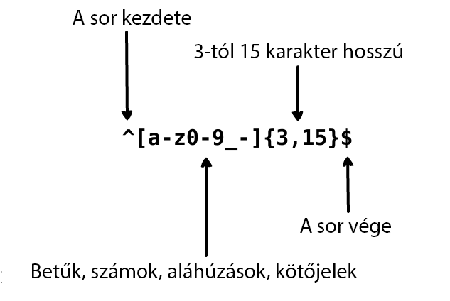

     
    
      
    

        
        
    

## Fordítások:

* [English](../README.md)
* [German](../translations/README-de.md)
* [Español](../translations/README-es.md)
* [Français](../translations/README-fr.md)
* [Português do Brasil](../translations/README-pt_BR.md)
* [中文版](../translations/README-cn.md)
* [日本語](../translations/README-ja.md)
* [한국어](../translations/README-ko.md)
* [Turkish](../translations/README-tr.md)
* [Greek](../translations/README-gr.md)
* [Magyar](../translations/README-hu.md)
* [Polish](../translations/README-pl.md)
* [Русский](../translations/README-ru.md)
* [Tiếng Việt](../translations/README-vn.md)
* [فارسی](../translations/README-fa.md)
* [עברית](../translations/README-he.md)

## Mi az a reguláris kifejezés?

> A reguláris kifejezés karakterek vagy szimbólumok egy csoportja, amelyet egy szövegből adott minták megtalálására használnak.

A reguláris kifejezés egy olyan minta, amely illeszkedik egy adott karakterláncra
balról jobbra. Magát a "Regular expression" kifejezést általában rövidítve lehet
megtalálni, mint "regex" vagy "regexp". A reguláris kifejezést használják szövegrészek
lecserélésére egy szövegben, űrlapok validálására, szövegrészek kiválasztására
mintaegyezés alapján egy hosszabb szövegből és így tovább.

Képzeld el, hogy egy alkalmazást írsz és szeretnél szabályokat állítani a felhasználónév
kiválasztásához. A felhasználónév csak betűket, számokat, aláhúzásjelet és kötőjelet
tartalmazhat. Szeretnénk limitálni a karakterek maximális számát is a felhasználónévben,
hogy ne legyen csúnya. A felhasználónév validálására a következő reguláris kifejezést
használjuk:

  

  

A feljebbi reguláris kifejezés elfogadja a `john_doe`, `jo-hn_doe` és a
`john12_as` karakterláncokat. Nem fog egyezni a `Jo`-ra mert ez nagybetűt
tartalmaz és túl rövid is.

## Tartalomjegyzék

- [Bevezetés](#1-bevezetés)
- [Meta karakterek](#2-meta-karakterek)
  - [Full stop](#21-full-stop)
  - [Karakter osztályok](#22-karakter-osztályok)
    - [Negált karakter osztályok](#221-negált-karakter-osztályok)
  - [Ismétlések](#23-ismétlések)
    - [A csillag](#231-a-csillag)
    - [A plusz](#232-a-plusz)
    - [A kérdőjel](#233-a-kérdőjel)
  - [A kapcsos zárójelek](#24-a-kapcsos-zárójelek)
  - [Karakter csoportok](#25-karakter-csoportok)
  - [Alternálás](#26-alternálás)
  - [Speciális karakter escape-elése](#27-speciális-karakter-escape-elése)
  - [Horgonyok](#28-horgonyok)
    - [Kalap](#281-kalap)
    - [Dollár](#282-dollár)
- [Shorthand Karakter osztályok](#3-shorthand-karakter-osztályok)
- [Lookaround](#4-lookaround)
  - [Positive Lookahead](#41-positive-lookahead)
  - [Negative Lookahead](#42-negative-lookahead)
  - [Positive Lookbehind](#43-positive-lookbehind)
  - [Negative Lookbehind](#44-negative-lookbehind)
- [Flag-ek](#5-flag-ek)
  - [Kis-nagybetű érzéketlen](#51-kis-nagybetű-érzéketlen)
  - [Globális keresés](#52-globális-keresés)
  - [Többsoros](#53-többsoros)

## 1. Bevezetés

A reguláris kifejezés egy karakterminta, amit keresésre használunk egy
szövegben. Például a `the` reguláris kifejezés a következőt jelenti: egy `t` betű,
amit `h` követ, amit egy `e` követ.

<pre>
"the" => The fat cat sat on <a href="#learn-regex"><strong>the</strong></a> mat.
</pre>

[Teszteld a reguláris kifejezést](https://regex101.com/r/dmRygT/1)

Az `123` reguláris kifejezés illeszkedik a `123` karakterláncra. A reguláris kifejezés
minden egyes karaktere össze lesz hasonlítva a bevitt karakterlánc minden elemével
egymás után. A reguláris kifejezések alap esetben kis-nagybetű érzékenyek, tehát a
`The` reguláris kifejezés nem fog illeszkedni a `the` karakterláncra.

<pre>
"The" => <a href="#learn-regex"><strong>The</strong></a> fat cat sat on the mat.
</pre>

[Teszteld a reguláris kifejezést](https://regex101.com/r/1paXsy/1)

## 2. Meta karakterek

A meta karakterek a reguláris kifejezések építőkockái. A meta karakterek speciális
módon értelmezendőek. Némelyik meta karakternek speciális jelentése van és
szögletes zárójelek közé vannak téve. A meta karakterek a következők:

|Meta karakter|Leírás|
|:----:|----|
|.|A pont illeszkedik minden egyes karakterre kivéve a sortörést.|
|[ ]|Karakter osztály. Minden karakterre illeszkedik ami a szögletes zárójelek közt van.|
|[^ ]|Negált karakter osztály. Minden karakterre illeszkedik ami nincs a szögletes zárójelek közt.|
|*|Illeszkedik az őt megelőző szimbólum 0 vagy több ismétlődésére.|
|+|Illeszkedik az őt megelőző szimbólum 1 vagy több ismétlődésére.|
|?|Opcionálissá teszi az őt megelőző szimbólumot.|
|{n,m}|Kapcsos zárójelek. Illeszkedik az őt megelőző szimbólum minimum "n" de nem több mint "m" ismétlődésére.|
|(xyz)|Karakter csoport. Illeszkedik az xyz karakterekre pontosan ilyen sorrendben.|
|&#124;|Alternáció. Illeszkedik a szimbólum előtt és után álló karakterekre is.|
|&#92;|Escape-li a következő karaktert. A segítségével lefoglalt karakterekre is lehet illeszkedni <code>[ ] ( ) { } . * + ? ^ $ \ &#124;</code>|
|^|A karakterlánc elejére illeszkedik.|
|$|A karakterlánc végére illeszkedik.|

## 2.1 Full stop

A full stop `.` a legegyszerűbb meta karakter példa. A `.` meta karakter illeszkedik
minden egyes karakterre. Nem fog illeszkedni a kocsi vissza és a sortörés karakterekre.
Például a `.ar` reguláris kifejezés jelentése: minden karakter, amit `a` aztán `r` követ.

<pre>
".ar" => The <a href="#learn-regex"><strong>car</strong></a> <a href="#learn-regex"><strong>par</strong></a>ked in the <a href="#learn-regex"><strong>gar</strong></a>age.
</pre>

[Teszteld a reguláris kifejezést](https://regex101.com/r/xc9GkU/1)

## 2.2 Karakter osztályok

A szögletes zárójelekkel határozzuk meg a karakter osztályokat. A szögletes
zárójelek közt kötőjel karakterrel határozhatunk meg karakter tartományokat.
A karaktertartomány sorrendje nem számít. Például a `[Tt]he` reguláris kifejezés
jelentése: nagybetűs `T` vagy kisbetűs `t` amit egy `h` majd egy `e` betű követ.

<pre>
"[Tt]he" => <a href="#learn-regex"><strong>The</strong></a> car parked in <a href="#learn-regex"><strong>the</strong></a> garage.
</pre>

[Teszteld a reguláris kifejezést](https://regex101.com/r/2ITLQ4/1)

Egy pont a karakter osztályon belül egyébként szó szerint pont-ot jelent. A
`ar[.]` reguláris kifejezés jelentése: kisbetűs `a` amit egy `r` aztán egy
pont `.` karakter követ.

<pre>
"ar[.]" => A garage is a good place to park a c<a href="#learn-regex"><strong>ar.</strong></a>
</pre>

[Teszteld a reguláris kifejezést](https://regex101.com/r/wL3xtE/1)

### 2.2.1 Negált karakter osztályok

Általában a kalap szimbólum egy karakterlánc elejét jelenti, de ha egy nyitó
szögletes zárójel után áll, akkor negálja a karakter osztályt. Például a 
`[^c]ar` reguláris kifejezés jelentése: minden karakter a `c` kivételével
ami után `a` aztán egy `r` betű áll.

<pre>
"[^c]ar" => The car <a href="#learn-regex"><strong>par</strong></a>ked in the <a href="#learn-regex"><strong>gar</strong></a>age.
</pre>

[Teszteld a reguláris kifejezést](https://regex101.com/r/nNNlq3/1)

## 2.3 Ismétlések

A következő meta karaktereket `+`, `*` vagy `?` arra használjuk, hogy meghatározzuk,
hányszor fordulhat elő az al-minta. Ezek a meta karakterek máshogy viselkednek
adott helyzetekben.

### 2.3.1 A csillag

A `*` szimbólum az őt megelőző karakter nulla vagy több ismétlődésére illeszkedik.
A `a*` reguláris kifejezés jelentése: nulla vagy több ismétlődése az őt megelőző `a`
karakternek. De ha egy karakter osztály után áll akkor az egész karakterosztály
ismétlődését keresi. Például, a `[a-z]*` reguláris kifejezés jelentése: bármennyi
kisbetűs betű egy sorban.

<pre>
"[a-z]*" => T<a href="#learn-regex"><strong>he</strong></a> <a href="#learn-regex"><strong>car</strong></a> <a href="#learn-regex"><strong>parked</strong></a> <a href="#learn-regex"><strong>in</strong></a> <a href="#learn-regex"><strong>the</strong></a> <a href="#learn-regex"><strong>garage</strong></a> #21.
</pre>

[Teszteld a reguláris kifejezést](https://regex101.com/r/7m8me5/1)

A `*` szimbólum használható a `.` meta karakterrel `.*`, ez illeszkedik
bármilyen karakterláncra. A `*` szimbólum használható a whitespace karakterrel `\s`
együtt, hogy illeszkedjen egy whitespace-ekből álló karakterláncra. Például a
`\s*cat\s*`kifejezés jelentése: nulla vagy több szóköz, amit egy kisbetűs `c`,
aztán egy kisbetűs `a`, aztán egy kisbetűs `t`, amit még nulla vagy több szóköz követ.

<pre>
"\s*cat\s*" => The fat<a href="#learn-regex"><strong> cat </strong></a>sat on the <a href="#learn-regex">con<strong>cat</strong>enation</a>.
</pre>

[Teszteld a reguláris kifejezést](https://regex101.com/r/gGrwuz/1)

### 2.3.2 A plusz

A `+` szimbólum illeszkedik az őt megelőző karakter egy vagy több ismétlődésére.
Például a `c.+t` kifejezés jelentése: kisbetűs `c` betű, amit legalább egy vagy
több `t` követ. Itt tisztázni kell hogy a `t` az utolsó `t` a mondatban.

<pre>
"c.+t" => The fat <a href="#learn-regex"><strong>cat sat on the mat</strong></a>.
</pre>

[Teszteld a reguláris kifejezést](https://regex101.com/r/Dzf9Aa/1)

### 2.3.3 A kérdőjel

A reguláris kifejezésben a `?` meta karakter opcionálissá teszi az őt
megelőző karaktert. Ez a szimbólum az őt megelőző karakter nulla vagy egy
példányára illeszkedik. Például a `[T]?he` kifejezés jelentése: opcionális a
nagybetűs `T`, amit egy kisbetűs `h`, majd egy kisbetűs `e` követ.

<pre>
"[T]he" => <a href="#learn-regex"><strong>The</strong></a> car is parked in the garage.
</pre>

[Teszteld a reguláris kifejezést](https://regex101.com/r/cIg9zm/1)

<pre>
"[T]?he" => <a href="#learn-regex"><strong>The</strong></a> car is parked in t<a href="#learn-regex"><strong>he</strong></a> garage.
</pre>

[Teszteld a reguláris kifejezést](https://regex101.com/r/kPpO2x/1)

## 2.4 A kapcsos zárójelek

A reguláris kifejezésben a kapcsos zárójeleket annak meghatározására használjuk,
hogy egy karakter vagy egy karakter csoport hányszor ismétlődhet. Például a
`[0-9]{2,3}` kifejezés jelentése: minimum 2 de nem több mint 3 karakter a `[0-9]`
karaktertartományon belül.

<pre>
"[0-9]{2,3}" => The number was 9.<a href="#learn-regex"><strong>999</strong></a>7 but we rounded it off to <a href="#learn-regex"><strong>10</strong></a>.0.
</pre>

[Teszteld a reguláris kifejezést](https://regex101.com/r/juM86s/1)

Kihagyhatjuk a második számot. Például a `[0-9]{2,}` kifejezés jelentése:
2 vagy több számra illeszkedik. Ha a vesszőt is kitöröljük `[0-9]{3}`: Pontosan
3 számra illeszkedik.

<pre>
"[0-9]{2,}" => The number was 9.<a href="#learn-regex"><strong>9997</strong></a> but we rounded it off to <a href="#learn-regex"><strong>10</strong></a>.0.
</pre>

[Teszteld a reguláris kifejezést](https://regex101.com/r/Gdy4w5/1)

<pre>
"[0-9]{3}" => The number was 9.<a href="#learn-regex"><strong>999</strong></a>7 but we rounded it off to 10.0.
</pre>

[Teszteld a reguláris kifejezést](https://regex101.com/r/Sivu30/1)

## 2.5 Karakter csoportok

A karakter csoport al-minták csoportja amik zárójelek közé `(...)` vannak írva.
Ahogy előbb már megbeszéltük, ha egy karakter után ismétlő karaktert rakunk, az
ismételni fogja az előtte lévő karaktert. De ha egy ismétlő karaktert egy karakter
csoport után rakunk, az ismételni fogja az egész csoportot. Például a `(ab)*`
kifejezés illeszkedik nulla vagy több ismétlődésére az `ab` karaktereknek.
Használhatunk alternáló meta karaktert `|` is a csoporton belül. Például a `(c|g|p)ar`
kifejezés jelentése: kisbetűs `c`, `g` vagy `p` karakter, amit egy `a` aztán
egy `r` karakter követ.

<pre>
"(c|g|p)ar" => The <a href="#learn-regex"><strong>car</strong></a> is <a href="#learn-regex"><strong>par</strong></a>ked in the <a href="#learn-regex"><strong>gar</strong></a>age.
</pre>

[Teszteld a reguláris kifejezést](https://regex101.com/r/tUxrBG/1)

## 2.6 Alternálás

A reguláris kifejezésben a függőleges vonalat `|` alternálásra (választásra)
használjuk. Az alternálás olyan, mint egy feltétel több kifejezés közt. Most
azt gondolhatod, hogy a karakter osztály és az alternáció ugyan úgy működik.
De a fő különbség köztük, hogy a karakter osztály a karakterek szintjén működik,
az alternáció viszont a kifejezés szintjén. Például a `(T|t)he|car` kifejezés
jelentése: nagybetűs `T` karakter vagy kisbetűs `t` karakter, amit egy `h` és
egy `e` követ, VAGY kisbetűs `c` aztán `a` aztán `r` karakter.

<pre>
"(T|t)he|car" => <a href="#learn-regex"><strong>The</strong></a> <a href="#learn-regex"><strong>car</strong></a> is parked in <a href="#learn-regex"><strong>the</strong></a> garage.
</pre>

[Teszteld a reguláris kifejezést](https://regex101.com/r/fBXyX0/1)

## 2.7 Speciális karakter escape-elése

A visszaper `\` a reguláris kifejezésekben a következő karakter escape-elésére
való. Ez enged nekünk szimbólumokat vagy lefoglalt karaktereket `{ } [ ] / \ + * . $ ^ | ?`
megadni. Egy speciális karakter egyező karakterként való megadásához tedd elé
a `\` karaktert.

Például a `.` kifejezést az összes karakter, kivéve a sortörés illeszkedéséhez
használjuk. A `(f|c|m)at\.?` kifejezés jelentése: kisbetűs `f`, `c` vagy `m`, amit
egy kisbetűs `a` aztán egy kisbetűs `t`, amit egy opcionális `.` karakter követ.

<pre>
"(f|c|m)at\.?" => The <a href="#learn-regex"><strong>fat</strong></a> <a href="#learn-regex"><strong>cat</strong></a> sat on the <a href="#learn-regex"><strong>mat.</strong></a>
</pre>

[Teszteld a reguláris kifejezést](https://regex101.com/r/fBXyX0/1)

## 2.8 Horgonyok

A reguláris kifejezésekben horgonyokat használunk, hogy megnézzük, az illeszkedő
szimbólum a kezdő vagy a záró szimbóluma-e a karakterláncnak. A horgonyoknak két
fajtájuk van: Az első a Kalap `^`, ami megnézi, hogy az egyező karakter a karakterlánc
kezdő kerektere-e és a második a Dollár `$`, ami azt vizsgálja, hogy az egyező
karakter a karakterlánc utolsó karaktere-e.

### 2.8.1 Kalap

A kalap `^` szimbólumot arra használjuk, hogy megnézzük, hogy az egyező karakter
a karakterlánc kezdő kerektere-e. Ha megadjuk a következő kifejezést: `^a`,
akkor illeszkedik a `abc` karakterlánc `a` karakterére, mert az za első. De ha
megadjuk, hogy: `^b`, ez nem fog illeszkedni az `abc` egyik részére sem, mert
nem `b` a kezdő karakter. Nézzünk meg egy másik kifejezést. `^(T|t)he` jelentése:
nagybetűs `T` vagy kisbetűs `t` a kezdő karaktere a karakterláncnak, amit kisbetűs
`h`, majd kisbetűs `e` követ.

<pre>
"(T|t)he" => <a href="#learn-regex"><strong>The</strong></a> car is parked in <a href="#learn-regex"><strong>the</strong></a> garage.
</pre>

[Teszteld a reguláris kifejezést](https://regex101.com/r/5ljjgB/1)

<pre>
"^(T|t)he" => <a href="#learn-regex"><strong>The</strong></a> car is parked in the garage.
</pre>

[Teszteld a reguláris kifejezést](https://regex101.com/r/jXrKne/1)

### 2.8.2 Dollár

A dollár `$` szimbólumot arra használjuk, hogy megnézzük, hogy az egyező
karakter a karakterlánc utolsó karaktere-e. Például a `(at\.)$` kifejezés
jelentése: egy kisbetűs `a`, amit egy kisbetűs `t`, amit egy `.` követ. És
ennek az egésznek a karakterlánc végén kell lennie.

<pre>
"(at\.)" => The fat c<a href="#learn-regex"><strong>at.</strong></a> s<a href="#learn-regex"><strong>at.</strong></a> on the m<a href="#learn-regex"><strong>at.</strong></a>
</pre>

[Teszteld a reguláris kifejezést](https://regex101.com/r/y4Au4D/1)

<pre>
"(at\.)$" => The fat cat. sat. on the m<a href="#learn-regex"><strong>at.</strong></a>
</pre>

[Teszteld a reguláris kifejezést](https://regex101.com/r/t0AkOd/1)

## 3. Shorthand Karakter osztályok

A gyakran használt karakter osztályokra a reguláris kifejezésnek vannak
rövidítései, amikkel kényelmesebben tudunk használni általános kifejezéseket.
A shorthand karakter osztályok a következők:

|Rövidítés|Leírás|
|:----:|----|
|.|Minden karakter a sortörésen kívül.|
|\w|Az alfanumerikus karakterekre illeszkedik: `[a-zA-Z0-9_]`|
|\W|A nem alfanumerikus karakterekre illeszkedik: `[^\w]`|
|\d|Számra illeszkedik: `[0-9]`|
|\D|Nem számra illeszkedik: `[^\d]`|
|\s|Whitespace karakterre illeszkedik: `[\t\n\f\r\p{Z}]`|
|\S|Nem whitespace karakterre illeszkedik: `[^\s]`|

## 4. Lookaround

A lookbehind (hátranézés) és a lookahead (előrenézés) speciális típusai a
***nem tárolt csoport*** oknak, amiket illeszkedésre használnak, de nincsenek
benne az illeszkedési listában. Az előrenézést akkor használjuk, ha feltételezzük,
hogy ezt a mintát egy másik minta előzi meg, vagy követi. Például kell nekünk
az összes szám ami előtt `$` karakter áll a következő karakterláncból: `$4.44 and $10.88`.
Ezt a mintát fogjuk használni: `(?<=\$)[0-9\.]*`, aminek a jelentése: Szedd ki az
összes számot ami `.` karaktert tartalmaz és megelőzi egy `$` karakter. A
következő lookaround-okat használhatjuk:

|Szimbólum|Leírás|
|:----:|----|
|?=|Positive Lookahead|
|?!|Negative Lookahead|
|?<=|Positive Lookbehind|
|?<!|Negative Lookbehind|

### 4.1 Positive Lookahead

A pozitív előrenézés azt mondja, hogy a kifejezés első részét az előrenézés
kifejezésnek kell követnie. Az illeszkedés csak azt a szöveget tartalmazza, amire
a kifejezés első része illeszkedett. Pozitív előrenézést zárójelekkel definiálunk.
A zárójelek közt van a kérdőjel egy egyenlőségjellel, így: `(?=...)`. Az előrenézés
kifejezést az egyenlőségjel után írjuk a zárójelek közé. Például a `(T|t)he(?=\sfat)`
jelentése: opcionális kisbetűs `t` vagy nagybetűs `T`, amit egy `h` aztán egy `e`
követ. A zárójelek közt definiáljuk a pozitív előrenézést ami megmondja a reguláris
kifejezés motornak, hogy illeszkedjen a `The` vagy `the` karakterláncokra, amelyeket
a `fat` karakterlánc követ.

<pre>
"(T|t)he(?=\sfat)" => <a href="#learn-regex"><strong>The</strong></a> fat cat sat on the mat.
</pre>

[Teszteld a reguláris kifejezést](https://regex101.com/r/IDDARt/1)

### 4.2 Negative Lookahead

A negatív előrenézést akkor használjuk, ha az olyan illeszkedések kellenek,
amelyeket nem követ egy bizonyos minta. A negatív előrenézést ugyanúgy
definiáljuk mint a pozitív előrenézést, az egyetlen különbség, hogy az
egyenlőségjel `=` helyett negálást `!` használunk: `(?!...)`. Nézzük meg
a következő kifejezést: `(T|t)he(?!\sfat)`, jelentése: szedd ki az összes
`The` vagy `the` szót, amelyeket nem követ a `fat` szó (amit még megelőz
egy szóköz).

<pre>
"(T|t)he(?!\sfat)" => The fat cat sat on <a href="#learn-regex"><strong>the</strong></a> mat.
</pre>

[Teszteld a reguláris kifejezést](https://regex101.com/r/V32Npg/1)

### 4.3 Positive Lookbehind

A pozitív hátranézést akkor használjuk, ha kell az összes illeszkedés, amit
egy megadott minta előz meg. A pozitív hátranézés így van jelölve: `(?<=...)`.
A `(?<=(T|t)he\s)(fat|mat)` jelentése: szedd ki az összes `fat` vagy `mat` szót
amelyek a `The` vagy a `the` szavak után vannak.

<pre>
"(?<=(T|t)he\s)(fat|mat)" => The <a href="#learn-regex"><strong>fat</strong></a> cat sat on the <a href="#learn-regex"><strong>mat</strong></a>.
</pre>

[Teszteld a reguláris kifejezést](https://regex101.com/r/avH165/1)

### 4.4 Negative Lookbehind

A negatív hátranézést akkor használjuk, ha kell az összes illeszkedés, amit nem
egy megadott minta előz meg. Jelölése: `(?<!...)`. Például a `(?<!(T|t)he\s)(cat)`
kifejezés jelentése: szedd ki az összes olyan `cat` szót, amelyik nem a `The` vagy
a `the` szavak után van.

<pre>
"(?&lt;!(T|t)he\s)(cat)" => The cat sat on <a href="#learn-regex"><strong>cat</strong></a>.
</pre>

[Teszteld a reguláris kifejezést](https://regex101.com/r/8Efx5G/1)

## 5. Flag-ek

A flag-eket módosítónak hívják, mert módosítják a reguláris kifejezés
kimenetét. Ezeket a flag-eket bármilyen sorban vagy kombinációban lehet
használni, a RegExp szerves részét képezik.

|Flag|Leírás|
|:----:|----|
|i|Kis-nagybetű érzéketlen: Beállítja, hogy az illeszkedés kis-nagybetű érzéketlen legyen.|
|g|Globális keresés: A bemeneti szövegben mindenütt keresi az illeszkedéseket.|
|m|Többsoros: A horgonyok az összes sorra működnek.|

### 5.1 Kis-nagybetű érzéketlen

Az `i` módosító beállítja, hogy az illeszkedés ne legyen kis-nagybetű érzékeny.
Például a `/The/gi` kifejezés jelentése: nagybetűs `T` amit kisbetűs `h`, majd `e`
követ. A kifejezés végén az `i` megmondja a reguláris kifejezés motornak, hogy
hagyja figyelmen kívül a betűk méretét. Ahogy látod, megadtuk a `g` flag-et, mert
az egész bemeneti szövegben akarjuk keresni az illeszkedéseket.

<pre>
"The" => <a href="#learn-regex"><strong>The</strong></a> fat cat sat on the mat.
</pre>

[Teszteld a reguláris kifejezést](https://regex101.com/r/dpQyf9/1)

<pre>
"/The/gi" => <a href="#learn-regex"><strong>The</strong></a> fat cat sat on <a href="#learn-regex"><strong>the</strong></a> mat.
</pre>

[Teszteld a reguláris kifejezést](https://regex101.com/r/ahfiuh/1)

### 5.2 Globális keresés

A `g` módosítót arra használjuk, hogy globálisan keressünk illeszkedéseket.
(Megkeresi az összes előfordulást, nem áll meg az első egyezés után). Például
a `/.(at)/g` kifejezés jelentése: minden karakter, kivéve a sortörést, amelyet
`a` és `t` követ. Mivel megadtuk a `g` flag-et, az összes ilyenre fog illeszkedni,
nem csak az elsőre (ami az alapértelmezett viselkedés). 

<pre>
"/.(at)/" => The <a href="#learn-regex"><strong>fat</strong></a> cat sat on the mat.
</pre>

[Teszteld a reguláris kifejezést](https://regex101.com/r/jnk6gM/1)

<pre>
"/.(at)/g" => The <a href="#learn-regex"><strong>fat</strong></a> <a href="#learn-regex"><strong>cat</strong></a> <a href="#learn-regex"><strong>sat</strong></a> on the <a href="#learn-regex"><strong>mat</strong></a>.
</pre>

[Teszteld a reguláris kifejezést](https://regex101.com/r/dO1nef/1)

### 5.3 Többsoros

Az `m` módosítót a többsoros illeszkedésekhez használjuk. Ahogy előzőleg beszéltük,
a horgonyokat `(^, $)` arra használjuk, hogy megnézzük, a minta az eleje, vagy a vége-e
a vizsgált karakterláncnak. De ha azt szeretnénk, hogy a horgonyok az összes soron
működjenek, használjuk az `m` módosítót. Például a `/at(.)?$/gm` kifejezés jelentése:
kisbetűs `a` karakter, amit egy kisbetűs `t` követ, amit opcionálisan bármi követhet,
kivéve sortörés. És az `m` flag miatt a reguláris kifejezés motor az összes sor
végéig keres illeszkedést.

<pre>
"/.at(.)?$/" => The fat
                cat sat
                on the <a href="#learn-regex"><strong>mat.</strong></a>
</pre>

[Teszteld a reguláris kifejezést](https://regex101.com/r/hoGMkP/1)

<pre>
"/.at(.)?$/gm" => The <a href="#learn-regex"><strong>fat</strong></a>
                  cat <a href="#learn-regex"><strong>sat</strong></a>
                  on the <a href="#learn-regex"><strong>mat.</strong></a>
</pre>

[Teszteld a reguláris kifejezést](https://regex101.com/r/E88WE2/1)

## Hozzájárulás

* Jelents hibákat
* Nyiss pull request-eket fejlesztésekkel
* Hírdesd az igét
* Érj el közvetlenül itt: ziishaned@gmail.com vagy 

## Licenc

MIT &copy; [Zeeshan Ahmad](https://twitter.com/ziishaned)
