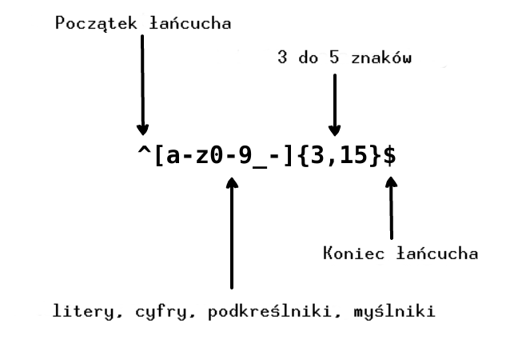

     
    
      
    

        
        
    

## Tłumaczenia:

* [English](../README.md)
* [German](../translations/README-de.md)
* [Español](../translations/README-es.md)
* [Français](../translations/README-fr.md)
* [Português do Brasil](../translations/README-pt_BR.md)
* [中文版](../translations/README-cn.md)
* [日本語](../translations/README-ja.md)
* [한국어](../translations/README-ko.md)
* [Turkish](../translations/README-tr.md)
* [Greek](../translations/README-gr.md)
* [Magyar](../translations/README-hu.md)
* [Polish](../translations/README-pl.md)
* [Русский](../translations/README-ru.md)
* [Tiếng Việt](../translations/README-vn.md)
* [فارسی](../translations/README-fa.md)
* [עברית](../translations/README-he.md)
## Co to jest wyrażenie regularne?

> Wyrażenie regularne to grupa znaków lub symboli, które służą do odnalezienia określonego wzoru w tekście.

Wyrażenie regularne to wzorzec, który jest dopasowywany do tekstu od lewej
do prawej strony. Termin "wyrażenie regularne" (ang. "regular expression")
jest dość długie, więc zazwyczaj używa się skróconej formy "regex" lub "regexp".
Wyrażenie regularne jest używane do zastępowania tekstu w łańcuchu znaków
(ang. string), walidacji formularzy, wyodrębniania wycinka z łańcucha
(ang. substring) według podanego wzorca, i wielu innych.

Wyobraź sobie, że piszesz aplikację i chcesz ustawić reguły dotyczące tego,
jak użytkownik wybiera swoją nazwę. Chcemy, aby nazwa użytkownika zawierała litery,
liczby, podkreślenia i myślniki. Chcemy również ograniczyć liczbę znaków w nazwie
użytkownika, aby nie wyglądała za brzydko. Stosujemy następujące wyrażenie
regularne, aby sprawdzić poprawność nazwy:

  

  

Powyższe wyrażenie akceptuje łańcuchy `john_doe`, `jo-hn_doe`
i `john12_as`. Odrzuca `Jo` ponieważ łańcuch zawiera dużą literę
i jest za krótki.

## Spis treści

- [Najprostsze wyrażenie](#1-najprostsze-wyrażenie)
- [Metaznaki](#2-metaznaki)
  - [Kropka](#21-kropka)
  - [Zestaw znaków](#22-zestaw-znaków)
    - [Odwrócony zestaw znaków](#221-odwrócony-zestaw-znaków)
  - [Powtórzenia](#23-powtórzenia)
    - [Gwiazdka](#231-gwiazdka)
    - [Plus](#232-plus)
    - [Znak zapytania](#233-znak-zapytania)
  - [Klamry](#24-klamry)
  - [Grupa znaków](#25-grupa-znaków)
  - [Alternatywa](#26-alternatywa)
  - [Znak ucieczki](#27-znak-ucieczki)
  - [Kotwice](#28-kotwice)
    - [Kareta](#281-kareta)
    - [Dolar](#282-dolar)
- [Skróty](#3-skróty)
- [Lookaround](#4-lookaround)
  - [Lookahead](#41-lookahead)
  - [Odwrócony lookahead](#42-odwrócony-lookahead)
  - [Lookbehind](#43-lookbehind)
  - [Odwrócony lookbehind](#44-odwrócony-lookbehind)
- [Flagi](#5-flagi)
  - [Wielkość znaków](#51-wielkość-znaków)
  - [Przeszukiwanie globalne](#52-przeszukiwanie-globalne)
  - [Multilinia](#53-multilinia)

## 1. Najprostsze wyrażenie

Wyrażenie regularne to ciąg znaków, których używamy do przeszukania tekstu.
Na przykład, wyrażenie `the` oznacza: literę `t`, następującą
po niej literę `h`, następującą po niej literę `e`.

<pre>
"the" => The fat cat sat on <a href="#learn-regex"><strong>the</strong></a> mat.
</pre>

[Przetestuj wyrażenie](https://regex101.com/r/dmRygT/1)

Wyrażenie regularne `123` pasuje do łańcucha `123`. Wyrażenie regularne
jest dopasowywane do danego łańcucha poprzez porównanie każdego znaku,
jeden po drugim, w wyrażeniu i łańcuchu. Wyrażenia są zwykle wrażliwe
na wielkość znaków, więc wyrażenie `The` nie pasuje do łańcucha `the`.

<pre>
"The" => <a href="#learn-regex"><strong>The</strong></a> fat cat sat on the mat.
</pre>

[Przetestuj wyrażenie](https://regex101.com/r/1paXsy/1)

## 2. Metaznaki

Metaznaki to składowe elementy wyrażeń regularnych. Znaki te, nie oznaczają
siebie samych, są natomiast interpretowane w specjalny sposób.
Niektóre znaki mają specjalne znaczenie i są zapisywane w kwadratowych nawiasach.
Metaznaki to:

|Metaznaki|Opis|
|:----:|----|
|.|Dowolny znak z wyjątkiem nowej linii.|
|[ ]|Zakres. Każdy znak zapisany w kwadratowym nawiasie.|
|[^ ]|Odwrócony zakres. Każdy znak, który nie znajduje się w kwadratowym nawiasie.|
|*|0 lub więcej poprzedzających znaków.|
|+|1 lub więcej poprzedzających znaków.|
|?|0 lub 1 poprzedzających znaków.|
|{n,m}|Minimum "n" ale nie więcej niż "m" poprzedzających znaków.|
|(xyz)|Grupowanie znaków. Znaki xyz dokładnie w tej kolejności.|
|&#124;|Alternatywa. Znaki przed symbolem lub za symbolem.|
|&#92;|Znak ucieczki. Umożliwia używanie zarezerwowanych znaków <code>[ ] ( ) { } . * + ? ^ $ \ &#124;</code>.|
|^|Oznacza początek wzorca.|
|$|Oznacza koniec wzorca.|

## 2.1 Kropka

Kropka `.` jest najprostszym przykładem metaznaku. Oznacza dowolny znak z wyłączeniem entera
i znaków nowej linii. Na przykład, wyrażenie regularne `.ar` oznacza: dowolny znak, następującą
po niej literę `a`, następującą po niej literę `r`.

<pre>
".ar" => The <a href="#learn-regex"><strong>car</strong></a> <a href="#learn-regex"><strong>par</strong></a>ked in the <a href="#learn-regex"><strong>gar</strong></a>age.
</pre>

[Przetestuj wyrażenie](https://regex101.com/r/xc9GkU/1)

## 2.2 Zestaw znaków

Zestawy znaków nazywane też klasami znaków. Nawiasy kwadratowe służą do określenia zestawów znaków.
Użycie myślnika wewnątrz zestawu, określa jego zakres. Kolejność znaków w nawiasach kwadratowych
nie ma znaczenia. Na przykład wyrażenie `[Tt]he` oznacza: dużą literę `T` lub małą `t`,
następującą po niej literę `h`, następującą po niej literę `e`.

<pre>
"[Tt]he" => <a href="#learn-regex"><strong>The</strong></a> car parked in <a href="#learn-regex"><strong>the</strong></a> garage.
</pre>

[Przetestuj wyrażenie](https://regex101.com/r/2ITLQ4/1)

Jednak kropka w zestawie znaków, oznacza dosłownie kropkę. Wyrażenie regularne
`ar[.]` oznacza: małą literę `a`, następującą po niej literę `r`,
następującą po niej `.` kropkę.

<pre>
"ar[.]" => A garage is a good place to park a c<a href="#learn-regex"><strong>ar.</strong></a>
</pre>

[Przetestuj wyrażenie](https://regex101.com/r/wL3xtE/1)

### 2.2.1 Odwrócony zestaw znaków

Generalnie znak karety oznacza początek wyrażenia, ale gdy zostanie użyty zaraz
za otwierającym nawiasem kwadratowym, odwraca zestaw znaków. Na przykład
wyrażenie `[^c]ar` oznacza: każdy znak z wyjątkiem `c`,
następującą po niej literę `a`, następującą po niej literę `r`.

<pre>
"[^c]ar" => The car <a href="#learn-regex"><strong>par</strong></a>ked in the <a href="#learn-regex"><strong>gar</strong></a>age.
</pre>

[Przetestuj wyrażenie](https://regex101.com/r/nNNlq3/1)

## 2.3 Powtórzenia

Następujące metaznaki `+`, `*` czy `?` określają ile razy wzorzec może się powtórzyć.
Te metaznaki zachowują się różnie, w zależności od sytuacji.

### 2.3.1 Gwiazdka

Symbol `*` oznacza zero lub więcej powtórzeń poprzedzających znaków. Wyrażenie
regularne `a*` oznacza: zero lub więcej powtórzeń poprzedzającej małej
litery `a`. Ale jeśli występuje po zestawie znaków lub klasie, to oznacza
powtórzenia całego zestawu lub klasy. Na przykład, wyrażenie regularne
`[a-z]*` oznacza: każdy ciąg znaków pisany małymi literami.

<pre>
"[a-z]*" => T<a href="#learn-regex"><strong>he</strong></a> <a href="#learn-regex"><strong>car</strong></a> <a href="#learn-regex"><strong>parked</strong></a> <a href="#learn-regex"><strong>in</strong></a> <a href="#learn-regex"><strong>the</strong></a> <a href="#learn-regex"><strong>garage</strong></a> #21.
</pre>

[Przetestuj wyrażenie](https://regex101.com/r/7m8me5/1)

Symbol `*` może być użyty z metaznakiem `.` by oznaczyć każdy łańcuch
znaków `.*`. Symbol `*` może być użyty ze znakiem `\s`
by znaleźć łańcuch zawierający spacje. Na przykład, wyrażenie
`\s*cat\s*` oznacza: zero lub więcej spacji, następującą po niej małą literę `c`,
następującą po niej małą literę `a`, następującą po niej małą literę `t`,
następujące po niej zero lub więcej spacji.

<pre>
"\s*cat\s*" => The fat<a href="#learn-regex"><strong> cat </strong></a>sat on the <a href="#learn-regex">con<strong>cat</strong>enation</a>.
</pre>

[Przetestuj wyrażenie](https://regex101.com/r/gGrwuz/1)

### 2.3.2 Plus

Symbol `+` oznacza jeden lub więcej powtórzeń poprzedzających znaków. Na przykład,
wyrażenie `c.+t` oznacza: małą literę `c`, następujący po niej przynajmniej jeden
dowolny znak, następującą po nim małą literę `t`. W tym wypadku `t` jest ostatnim
`t` w zdaniu.

<pre>
"c.+t" => The fat <a href="#learn-regex"><strong>cat sat on the mat</strong></a>.
</pre>

[Przetestuj wyrażenie](https://regex101.com/r/Dzf9Aa/1)

### 2.3.3 Znak zapytania

W wyrażeniach regularnych znak `?` sprawia, że poprzedzający znak jest opcjonalny.
Ten symbol oznacza zero lub jedno wystąpienie poprzedzającego znaku. Na przykład,
wyrażenie regularne `[T]?he` oznacza: opcjonalną dużą literę `T`, następującą
po niej małą literę `h`, następującą po niej małą literę `e`.

<pre>
"[T]he" => <a href="#learn-regex"><strong>The</strong></a> car is parked in the garage.
</pre>

[Przetestuj wyrażenie](https://regex101.com/r/cIg9zm/1)

<pre>
"[T]?he" => <a href="#learn-regex"><strong>The</strong></a> car is parked in t<a href="#learn-regex"><strong>he</strong></a> garage.
</pre>

[Przetestuj wyrażenie](https://regex101.com/r/kPpO2x/1)

## 2.4 Klamry

W wyrażeniach regularnych, klamry zwane również kwantyfikatorami, używane są
do określenia, ile razy znak lub grupa znaków może się powtórzyć.
Na przykład wyrażenie regularne `[0-9]{2,3}` oznacza: przynajmniej
2 znaki, ale nie więcej niż 3 (znaki z zakresu od 0 do 9).

<pre>
"[0-9]{2,3}" => The number was 9.<a href="#learn-regex"><strong>999</strong></a>7 but we rounded it off to <a href="#learn-regex"><strong>10</strong></a>.0.
</pre>

[Przetestuj wyrażenie](https://regex101.com/r/juM86s/1)

Możemy opuścić drugą liczbę. Na przykład regularne wyrażenie `[0-9]{2,}`
oznacza: 2 lub więcej znaków. Jeżeli dodatkowo usuniemy przecinek,
to wyrażenie `[0-9]{3}` oznacza: dokładnie 3 znaki z zakresu 0 do 9.

<pre>
"[0-9]{2,}" => The number was 9.<a href="#learn-regex"><strong>9997</strong></a> but we rounded it off to <a href="#learn-regex"><strong>10</strong></a>.0.
</pre>

[Przetestuj wyrażenie](https://regex101.com/r/Gdy4w5/1)

<pre>
"[0-9]{3}" => The number was 9.<a href="#learn-regex"><strong>999</strong></a>7 but we rounded it off to 10.0.
</pre>

[Przetestuj wyrażenie](https://regex101.com/r/Sivu30/1)

## 2.5 Grupa znaków

Grupa znaków to grupa podwzorców, które zapisywane są w nawiasach `(...)`.
Jak wspominaliśmy wyżej, jeśli w wyrażeniu regularnym wstawimy kwantyfikator po
znaku, wtedy powtórzy on ten znak. Ale gdy wstawimy kwantyfikator po grupie znaków,
wtedy cała grupa zostanie powtórzona. Na przykład wyrażenie regularne `(ab)*`
oznacza zero lub więcej powtórzeń grupy "ab". Możemy także użyć metaznaku
alternatywy `|` wewnątrz grupy. Na przykład wyrażenie `(c|g|p)ar` oznacza: małą literę `c`,
`g` lub `p`, następującą po niej literę `a`, następującą po niej literę `r`.

<pre>
"(c|g|p)ar" => The <a href="#learn-regex"><strong>car</strong></a> is <a href="#learn-regex"><strong>par</strong></a>ked in the <a href="#learn-regex"><strong>gar</strong></a>age.
</pre>

[Przetestuj wyrażenie](https://regex101.com/r/tUxrBG/1)

## 2.6 Alternatywa

W wyrażeniach regularnych pionowa kreska `|` oznacza alternatywę.
Działa jak warunek pomiędzy różnymi wyrażeniami. Teraz możesz pomyśleć, że
to działa tak samo jak zestaw znaków. Różnica polega na tym, że zestaw znaków
działa na poziomie znaków, natomiast alternatywa na poziomie wyrażenia. Na przykład
wyrażenie regularne `(T|t)he|car` oznacza: dużą literę `T` lub małą `t`,
następującą po niej literę `h`, następującą po niej literę `e` lub `c`, następującą
po niej literę `a`, następującą po niej literę `r`.

<pre>
"(T|t)he|car" => <a href="#learn-regex"><strong>The</strong></a> <a href="#learn-regex"><strong>car</strong></a> is parked in <a href="#learn-regex"><strong>the</strong></a> garage.
</pre>

[Przetestuj wyrażenie](https://regex101.com/r/fBXyX0/1)

## 2.7 Znak ucieczki

Ukośnik `\` w wyrażeniach regularnych jest znakiem ucieczki. Pozwala on
używać w wyrażeniu zarezerwowanych znaków takich jak `{ } [ ] / \ + * . $ ^ | ?`.
Aby użyć znaku specjalnego w wyrażeniu, postaw `\` przed nim.

Na przykład wyrażenie `.` dopasowuje każdy znak z wyjątkiem nowej linii.
Żeby dopasować kropkę `.` w wyrażeniu regularnym, trzeba wstawić przed nią ukośnik.
Wyrażenie `(f|c|m)at\.?` oznacza: małe litery `f` lub `c` lub `m`, następującą po niej
literę `a`, następującą po niej literę `t`, następującą kropkę `.`, która jest opcjonalna.

<pre>
"(f|c|m)at\.?" => The <a href="#learn-regex"><strong>fat</strong></a> <a href="#learn-regex"><strong>cat</strong></a> sat on the <a href="#learn-regex"><strong>mat.</strong></a>
</pre>

[Przetestuj wyrażenie](https://regex101.com/r/DOc5Nu/1)

## 2.8 Kotwice

W wyrażeniach regularnych używamy kotwic aby sprawdzić czy dopasowywany symbol
jest pierwszym lub ostatnim symbolem w łańcuchu. Są dwa typy: pierwszy to
kareta `^`, która sprawdza czy znak jest początkiem łańcucha, drugi to dolar `$`,
który sprawdza czy znak jest ostatnim elementem łańcucha.

### 2.8.1 Kareta

Kareta `^` sprawdza czy znak jest początkiem łańcucha. Jeżeli użyjemy takiego
wyrażenia `^a` (jeśli a jest pierwszym znakiem) na łańcuchu `abc` to dopasuje
nam `a`. Ale jeśli użyjemy takiego wyrażenia `^b` na tym samym łańcuchu, to nie
zwróci nam nic. Ponieważ w łańcuchu `abc` "b" nie jest pierwszym symbolem.
Spójrzmy teraz na wyrażenie `^(T|t)he` które oznacza: dużą literę `T` lub małą
`t`, która jest początkiem łańcucha, następującą po niej literę `h`, następującą
po niej literę `e`.

<pre>
"(T|t)he" => <a href="#learn-regex"><strong>The</strong></a> car is parked in <a href="#learn-regex"><strong>the</strong></a> garage.
</pre>

[Przetestuj wyrażenie](https://regex101.com/r/5ljjgB/1)

<pre>
"^(T|t)he" => <a href="#learn-regex"><strong>The</strong></a> car is parked in the garage.
</pre>

[Przetestuj wyrażenie](https://regex101.com/r/jXrKne/1)

### 2.8.2 Dolar

Symbol dolara `$` używany jest do sprawdzenia czy dopasowywany znak jest ostatni
w łańcuchu. Na przykład, wyrażenie regularne `(at\.)$` oznacza: małą literę `a`,
następującą po niej literę `t`, następującą po niej kropkę `.` i na dodatek
dopasowanie musi być końcem łańcucha.

<pre>
"(at\.)" => The fat c<a href="#learn-regex"><strong>at.</strong></a> s<a href="#learn-regex"><strong>at.</strong></a> on the m<a href="#learn-regex"><strong>at.</strong></a>
</pre>

[Przetestuj wyrażenie](https://regex101.com/r/y4Au4D/1)

<pre>
"(at\.)$" => The fat cat. sat. on the m<a href="#learn-regex"><strong>at.</strong></a>
</pre>

[Przetestuj wyrażenie](https://regex101.com/r/t0AkOd/1)

##  3. Skróty

W wyrażeniach regularnych znajdziemy także skróty dla popularnych zestawów znaków,
które ułatwiają pracę z wyrażeniami regularnymi. Skróty wyglądają następująco:

|Skrót|Opis|
|:----:|----|
|.|Każdy znak z wyjątkiem nowej linii|
|\w|Znaki alfanumeryczne: `[a-zA-Z0-9_]`|
|\W|Znaki nie alfanumeryczne: `[^\w]`|
|\d|Cyfry: `[0-9]`|
|\D|Nie cyfry: `[^\d]`|
|\s|Dowolny biały znak: `[\t\n\f\r\p{Z}]`|
|\S|Każdy znak oprócz białych: `[^\s]`|

## 4. Lookaround

Lookbehind i lookahead (nazywane również lookaround) to specyficzne typy
***niezwracających grup*** (dopasowują wzorzec, ale nie zwracają wartości).
Lookaround używane są w sytuacji, gdy mamy wzorzec i jest on poprzedzony innym wzorcem,
lub następuje po nim kolejny wzorzec. Na przykład, chcemy mieć wszystkie
numery, które są poprzedzone znakiem `$` w takim łańcuchu `$4.44 and $10.88`.
Użyjemy takiego wyrażenia regularnego `(?<=\$)[0-9\.]*` które oznacza: znajdź
wszystkie liczby ze znakiem `.` poprzedzone znakiem `$`. W wyrażeniach regularnych
wyróżniamy:

|Symbol|Opis|
|:----:|----|
|?=|Lookahead|
|?!|Odwrócony lookahead|
|?<=|Lookbehind|
|?<!|Odwrócony lookbehind|

### 4.1 Lookahead

Lookahead stwierdza, że po pierwszej części wyrażenia musi następować
następne wyrażenie. Zwracane dopasowanie zawiera tylko tekst, który został
dopasowany przez pierwszą część wyrażenia. Stosuje się je w nawiasach wraz
ze znakami zapytania i równości: `(?=...)`. Wyrażenie lookahead
wpisuje się po znaku równości. Na przykład wyrażenie `(T|t)he(?=\sfat)`
oznacza: opcjonalną małą literę `t` lub dużą `T`, następującą po niej
literę `h`, następującą po niej literę `e`. W nawiasach definiujemy
wyrażenie lookahead, które mówi aby dopasować `The` lub `the` i następujące
po nich `fat`.

<pre>
"(T|t)he(?=\sfat)" => <a href="#learn-regex"><strong>The</strong></a> fat cat sat on the mat.
</pre>

[Przetestuj wyrażenie](https://regex101.com/r/IDDARt/1)

### 4.2 Odwrócony lookahead

Używany jest, gdy potrzebujemy dopasowania z łańcucha, po których nie następują
żadne wzorce. Odwrócony lookahead definiujemy w nawiasach, stosując znak negacji
`!` po znaku zapytania, na przykład: `(?!...)`. Popatrzmy na następujące wyrażenie
`(T|t)he(?!\sfat)` które oznacza: znajdź wszystkie słowa `The` lub `the` w łańcuchu,
po których nie następuje słowo `fat`, poprzedzone spacją.

<pre>
"(T|t)he(?!\sfat)" => The fat cat sat on <a href="#learn-regex"><strong>the</strong></a> mat.
</pre>

[Przetestuj wyrażenie](https://regex101.com/r/V32Npg/1)

### 4.3 Lookbehind

Lookbehind używany jest do odnalezienia wszystkich dopasowań poprzedzonych konkretnym
wzorcem. Wyrażenie lookbehind zapisujemy tak: `(?<=...)`. Na przykład, wyrażenie
`(?<=(T|t)he\s)(fat|mat)` oznacza: znajdź wszystkie słowa `fat` lub `mat` w łańcuchu,
które znajdują się po słowach `The` lub `the`.

<pre>
"(?<=(T|t)he\s)(fat|mat)" => The <a href="#learn-regex"><strong>fat</strong></a> cat sat on the <a href="#learn-regex"><strong>mat</strong></a>.
</pre>

[Przetestuj wyrażenie](https://regex101.com/r/avH165/1)

### 4.4 Odwrócony lookbehind

Odwrócony używany jest do odnalezienia wszystkich dopasowań niepoprzedzonych konkretnym
wzorcem. Odwrócony lookbehind zapisujemy tak: `(?<!...)`. Na przykład, wyrażenie
`(?<!(T|t)he\s)(cat)` oznacza: znajdź wszystkie słowa `cat` w stringu, które nie następują
po słowach `The` lub `the`.

<pre>
"(?&lt;!(T|t)he\s)(cat)" => The cat sat on <a href="#learn-regex"><strong>cat</strong></a>.
</pre>

[Przetestuj wyrażenie](https://regex101.com/r/8Efx5G/1)

## 5. Flagi

Flagi nazywane są także modyfikatorami, ponieważ zmieniają wynik wyrażenia regularnego.
Flagi mogą być używane w każdej kombinacji i są integralną częścią wyrażeń regularnych.

|Flaga|Opis|
|:----:|----|
|i|Wielkość znaków: Sprawia, że dopasowanie nie jest wrażliwe na wielkość znaków.|
|g|Przeszukanie globalne: Wyszukiwanie wzorca w całym łańcuchu.|
|m|Multilinia: Sprawia, że kotwice działają na każdej linii.|

### 5.1 Wielkość znaków

Modyfikator `i` używany jest, gdy wielkość liter nie ma znaczenia. Na przykład
wyrażenie `/The/gi` oznacza: dużą literę `T`, następującą po niej literę `h`,
następującą po niej literę `e`. A na końcu wyrażenia, flaga `i` żeby ignorować
wielkość znaków. Jak widać, została też użyta flaga `g` ponieważ chcemy przeszukać
cały łańcuch.

<pre>
"The" => <a href="#learn-regex"><strong>The</strong></a> fat cat sat on the mat.
</pre>

[Przetestuj wyrażenie](https://regex101.com/r/dpQyf9/1)

<pre>
"/The/gi" => <a href="#learn-regex"><strong>The</strong></a> fat cat sat on <a href="#learn-regex"><strong>the</strong></a> mat.
</pre>

[Przetestuj wyrażenie](https://regex101.com/r/ahfiuh/1)

### 5.2 Przeszukiwanie globalne

Modyfikator `g` używany jest do przeszukiwania całego łańcucha (znajdź wszystko,
a nie tylko zatrzymuj się na pierwszym). Na przykład wyrażenie `/.(at)/g`
oznacza: każdy znak z wyjątkiem nowej linii, następującą po nim literę `a`,
następującą po niej literę `t`. Ponieważ użyliśmy na końcu wyrażenia flagi `g`,
wyszukane zostaną wszystkie dopasowania w łańcuchu, a nie tylko pierwszy (domyślne zachowanie).

<pre>
"/.(at)/" => The <a href="#learn-regex"><strong>fat</strong></a> cat sat on the mat.
</pre>

[Przetestuj wyrażenie](https://regex101.com/r/jnk6gM/1)

<pre>
"/.(at)/g" => The <a href="#learn-regex"><strong>fat</strong></a> <a href="#learn-regex"><strong>cat</strong></a> <a href="#learn-regex"><strong>sat</strong></a> on the <a href="#learn-regex"><strong>mat</strong></a>.
</pre>

[Przetestuj wyrażenie](https://regex101.com/r/dO1nef/1)

### 5.3 Multilinia

Modyfikator `m` używany jest do dopasowywania w wielu liniach. Jak wspominaliśmy
wcześniej, kotwice `(^, $)` używane są do sprawdzania czy wzorzec jest początkiem
lub końcem łańcucha. Jeśli chcemy, żeby kotwice zadziałały w każdej linii, używamy
wtedy flagi `m`. Na przykład wyrażenie `/at(.)?$/gm` oznacza: małą literę `a`,
następującą po niej małą literę `t`, opcjonalnie dowolny znak z wyjątkiem nowej linii.
I ponieważ użyliśmy flagi `m` dopasowywane będą wzorce na końcu każdej linii w łańcuchu.

<pre>
"/.at(.)?$/" => The fat
                cat sat
                on the <a href="#learn-regex"><strong>mat.</strong></a>
</pre>

[Przetestuj wyrażenie](https://regex101.com/r/hoGMkP/1)

<pre>
"/.at(.)?$/gm" => The <a href="#learn-regex"><strong>fat</strong></a>
                  cat <a href="#learn-regex"><strong>sat</strong></a>
                  on the <a href="#learn-regex"><strong>mat.</strong></a>
</pre>

[Przetestuj wyrażenie](https://regex101.com/r/E88WE2/1)

## Kontrybucja

* Zgłaszanie błędów
* Otwieranie pull request z poprawkami
* Dzielenie się poradnikiem
* Skontaktuj się ze mną ziishaned@gmail.com lub 

## Licencja

MIT &copy; [Zeeshan Ahmad](https://twitter.com/ziishaned)
