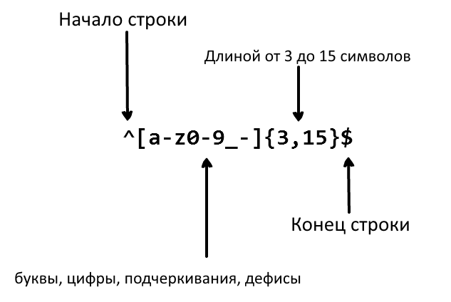

     
    

## Переводы:

* [English](../README.md)
* [German](../translations/README-de.md)
* [Español](../translations/README-es.md)
* [Français](../translations/README-fr.md)
* [Português do Brasil](../translations/README-pt_BR.md)
* [中文版](../translations/README-cn.md)
* [日本語](../translations/README-ja.md)
* [한국어](../translations/README-ko.md)
* [Turkish](../translations/README-tr.md)
* [Greek](../translations/README-gr.md)
* [Magyar](../translations/README-hu.md)
* [Polish](../translations/README-pl.md)
* [Русский](../translations/README-ru.md)
* [Tiếng Việt](../translations/README-vn.md)
* [فارسی](../translations/README-fa.md)
* [עברית](../translations/README-he.md)

## Что такое Регулярное выражение?

> Регулярное выражение — это группа букв или символов, которая используется для поиска определенного шаблона в тексте.

Регулярное выражение — это шаблон, сопоставляемый с искомой строкой слева
направо. Термин "Регулярное выражение" сложно произносить каждый раз, поэтому,
обычно, вы будете сталкиваться с сокращениями "регэкспы" или "регулярки".
Регулярные выражения используются для замен текста внутри строк, валидации форм,
извлечений подстрок по определенным шаблонам и множества других вещей.

Представьте, что вы пишете приложение и хотите установить правила, по которым
пользователь выбирает свой юзернейм. Мы хотим, чтобы имя пользователя содержало
буквы, цифры, подчеркивания и дефисы. Мы также хотим ограничить количество
символов в имени пользователя, чтобы оно не выглядело безобразно. Для этого
используем следующее регулярное выражение:

 

  

Регулярное выражения выше может принимать строки `john_doe`,`jo-hn_doe` и
`john12_as`. Оно не валидирует `Jo`, поскольку эта строка содержит заглавные
буквы, а также она слишком короткая.

## Содержание

- [Совпадения](#1-совпадения)
- [Метасимволы](#2-метасимволы)
  - [Точка](#21-точка)
  - [Набор символов](#22-набор-символов)
    - [Отрицание набора символов](#221-отрицание-набора-символов)
  - [Повторения](#23-повторения)
    - [Звёздочка](#231-звёздочка)
    - [Плюс](#232-плюс)
    - [Знак вопроса](#233-знак-вопроса)
  - [Фигурные скобки](#24-фигурные-скобки)
  - [Скобочные группы](#25-скобочные-группы)
  - [Перечисление](#26-перечисление)
  - [Экранирование спецсимволов](#27-экранирование-спецсимволов)
  - [Якоря](#28-якоря)
    - [Каретка](#281-каретка)
    - [Доллар](#282-доллар)
- [Наборы сокращений и диапазоны](#3-наборы-сокращений-и-диапазоны)
- [Опережающие и ретроспективные проверки](#4-опережающие-и-ретроспективные-проверки)
  - [Положительное опережающее условие](#41-положительное-опережающее-условие)
  - [Отрицательное опережающее условие](#42-отрицательное-опережающее-условие)
  - [Положительное ретроспективное условие](#43-положительное-ретроспективное-условие)
  - [Отрицательное ретроспективное условие](#44-отрицательное-ретроспективное-условие)
- [Флаги](#5-флаги)
  - [Поиск без учета регистра](#51-поиск-без-учета-регистра)
  - [Глобальный поиск](#52-глобальный-поиск)
  - [Мультистроковый поиск](#53-мультистроковый-поиск)
- [Жадная и ленивая квантификация](#6-жадная-и-ленивая-квантификация)

## 1. Совпадения.

В сущности, регулярное выражение — это просто набор символов, который мы
используем для поиска в тексте. Например, регулярное выражение `the` состоит из
буквы `t`, за которой следует буква `h`, за которой следует буква `e`.

<pre>
"the" => The fat cat sat on <a href="#learn-regex"><strong>the</strong></a> mat.
</pre>

[Запустить регулярное выражение](https://regex101.com/r/dmRygT/1)

Регулярное выражение `123` соответствует строке `123`. Регулярное выражение
сопоставляется с входной строкой посимвольно. Каждый символ в регулярном
выражении сравнивается с каждым символом во входной строке, один символ за
другим. Регулярные выражения обычно чувствительны к регистру, поэтому регулярное
выражение `The` не будет соответствовать строке `the`.

<pre>
"The" => <a href="#learn-regex"><strong>The</strong></a> fat cat sat on the mat.
</pre>

[Запустить регулярное выражение](https://regex101.com/r/1paXsy/1)

## 2. Метасимволы

Метасимволы — это строительные блоки для регулярных выражений. Метасимволы не
ищутся в строке как есть, они интерпретируются особым образом. Некоторые
метасимволы имеют особое значение и пишутся в квадратных скобках. Существуют
следующие метасимволы:

|Метасимвол|Описание|
|:----:|----|
|.|Точка соответствует любому отдельному символу, кроме перевода строки.|
|[ ]|Класс символов. Заменяет любой из символов, заключенных в квадратных скобках.|
|[^ ]|Отрицание класа символов. Соответствует любом символу, не содержащемуся в квадратных скобках.|
|\*|Искать 0 или более повторов предыдущего символа.|
|+|Искать 1 или более повторов предыдущего символа.|
|?|Делает предыдущий символ необязательным.|
|{n,m}|Скобки. Искать не менее "n" и не более "m" повторов предыдущего символа.|
|(xyz)|Группа символов. Искать только символы xyz в указанном порядке.|
|&#124;|Чередование. Искать либо знаки до этого символа, либо знаки после символа.|
|&#92;|Экранирование следующего символа. Позволяет искать специальные знаки: <code>[ ] ( ) { } . * + ? ^ $ \ &#124;</code>|
|^|Обозначает начало пользовательского ввода.|
|$|Обозначает конец пользовательского ввода.|

## 2.1 Точка

Точка `.` — это простейший пример метасимвола. Метасимвол `.`
находит любой отдельный символ. Точка не будет находить символы возврата каретки
(CR) или перевода строки (LF). Например, регулярное выражение `.ar` обозначает
"любой символ, за которым следуют буквы `a` и `r`".

<pre>
".ar" => The <a href="#learn-regex"><strong>car</strong></a> <a href="#learn-regex"><strong>par</strong></a>ked in the <a href="#learn-regex"><strong>gar</strong></a>age.
</pre>

[Запустить регулярное выражение](https://regex101.com/r/xc9GkU/1)

## 2.2 Набор символов.

Набор символов, также называется классом символов. Для определения набора
символов используются квадратные скобки. Дефис используется для указания
диапазона символов. Порядок следования символов, заданный в квадратных скобках,
не важен. Например, регулярное выражение `[Tt]he` интерпретируется как
"заглавная `T` или строчная `t`, за которой следуют буквы `h` и `e`".

<pre>
"[Tt]he" => <a href="#learn-regex"><strong>The</strong></a> car parked in <a href="#learn-regex"><strong>the</strong></a> garage.
</pre>

[Запустить регулярное выражение](https://regex101.com/r/2ITLQ4/1)

Точка внутри набора символов, внезапно, обозначает непосредственно точку как
символ. Регулярное выражение `ar[.]` обозначает строчную `a`, за которой следует
`r`, за которой следует `.` (символ точки).

<pre>
"ar[.]" => A garage is a good place to park a c<a href="#learn-regex"><strong>ar.</strong></a>
</pre>

[Запустить регулярное выражение](https://regex101.com/r/wL3xtE/1)

### 2.2.1 Отрицание набора символов

Карет `^` обозначает начало строки, но если вы поставите его после открывающей
квадратной скобки, он инвертирует набор символов. Например, регулярное выражение
`[^c]ar` обозначает "любой символ, кроме `c`, за которым следуют буквы `a` и `r`".

<pre>
"[^c]ar" => The car <a href="#learn-regex"><strong>par</strong></a>ked in the <a href="#learn-regex"><strong>gar</strong></a>age.
</pre>

[Запустить регулярное выражение](https://regex101.com/r/nNNlq3/1)

## 2.3 Повторения

Символы `+`, `*` и `?` используются для обозначения того, сколько раз появляется
символ перед ними. Эти метасимволы ведут себя в разных ситуациях по-разному.

### 2.3.1 Звёздочка

Символ `*` обозначает ноль или более повторений предыдущего символа. Регулярное
выражение `a*` толкуется как "ноль или более повторений предыдущего строчного
символа `a`". Если же символ появляется после набора или класса символов, он
ищет повторения всего набора символов. Например, регулярное выражение `[a-z]*`
означает "любое количество строчных букв".

<pre>
"[a-z]*" => T<a href="#learn-regex"><strong>he</strong></a> <a href="#learn-regex"><strong>car</strong></a> <a href="#learn-regex"><strong>parked</strong></a> <a href="#learn-regex"><strong>in</strong></a> <a href="#learn-regex"><strong>the</strong></a> <a href="#learn-regex"><strong>garage</strong></a> #21.
</pre>

[Запустить регулярное выражение](https://regex101.com/r/7m8me5/1)

Символы можно комбинировать. Например, метасимвол `*` может использоваться с
метасимволом `.` для поиска строки с произвольным содержанием: `.*`. Символ `*`
может использоваться с символом пробела `\s`, чтобы искать строки с символами
пробела. Например, выражение `\s*cat\s*` означает: "ноль или более пробелов, за
которыми следует слово `cat`, за которым следует ноль или более символов
пробела".

<pre>
"\s*cat\s*" => The fat<a href="#learn-regex"><strong> cat </strong></a>sat on the con<a href="#learn-regex"><strong>cat</strong></a>enation.
</pre>

[Запустить регулярное выражение](https://regex101.com/r/gGrwuz/1)

### 2.3.2 Плюс

Символ `+` соответствует одному или более повторению предыдущего символа.
Например, регулярное выражение `c.+t` интерпретируется так: "строчная `c`, за
которой следует по крайней мере один любой символ, следом за которым(и) идёт
символ `t`. Стоит уточнить, что в данном шаблоне, `t` является последним `t` в
строке.

<pre>
"c.+t" => The fat <a href="#learn-regex"><strong>cat sat on the mat</strong></a>.
</pre>

[Запустить регулярное выражение](https://regex101.com/r/Dzf9Aa/1)

### 2.3.3 Знак вопроса

В регулярном выражении метасимвол `?` делает предыдущий символ необязательным.
Этот символ соответствует нулю или одному вхождению предыдущего символа.
Например, регулярное выражение `[T]?he` означает: "необязательная заглавная
буква `T`, за которой следуют символы `h` и `e`".

<pre>
"[T]he" => <a href="#learn-regex"><strong>The</strong></a> car is parked in the garage.
</pre>

[Запустить регулярное выражение](https://regex101.com/r/cIg9zm/1)

<pre>
"[T]?he" => <a href="#learn-regex"><strong>The</strong></a> car is parked in t<a href="#learn-regex"><strong>he</strong></a> garage.
</pre>

[Запустить регулярное выражение](https://regex101.com/r/kPpO2x/1)

## 2.4 Фигурные скобки

В фигурных скобках, которые также называются квантификаторами, указывается,
сколько раз символ или группа символов могут повторяться. Например, регулярное
выражение `[0-9]{2,3}` означает: "от 2 до 3 цифр в диапазоне от 0 до 9.

<pre>
"[0-9]{2,3}" => The number was 9.<a href="#learn-regex"><strong>999</strong></a>7 but we rounded it off to <a href="#learn-regex"><strong>10</strong></a>.0.
</pre>

[Запустить регулярное выражение](https://regex101.com/r/juM86s/1)

Мы можем опустить второе число (цифру 3), тогда регулярное выражение `[0-9]{2,}`
будет значить "2 или более цифр". А если мы удалим запятую, регулярное выражение
`[0-9]{3}` будет искать ровно 3 цифры.

<pre>
"[0-9]{2,}" => The number was 9.<a href="#learn-regex"><strong>9997</strong></a> but we rounded it off to <a href="#learn-regex"><strong>10</strong></a>.0.
</pre>

[Запустить регулярное выражение](https://regex101.com/r/Gdy4w5/1)

<pre>
"[0-9]{3}" => The number was 9.<a href="#learn-regex"><strong>999</strong></a>7 but we rounded it off to 10.0.
</pre>

[Запустить регулярное выражение](https://regex101.com/r/Sivu30/1)

## 2.5 Скобочные группы

Скобочные группы — это группы подшаблонов, которые написаны в круглых скобках
`(...)`. Как мы уже говорили ранее, в регулярном выражении, квантификатор после
символа, ищет повторы символа перед квантификатором. Если мы поставим
квантификатор после скобочной группы, он будет искать повторы всей группы. К
примеру, регулярное выражение `(ab)*` соответствует нулю или более повторений
строки "ab". Мы также можем использовать метасимвол чередования `|` внутри
скобочной группы. Так, регулярное выражение `(c|g|p)ar` означает: "любая из
строчных букв `c`, `g` или `p`, за которой следуют буквы `a` и `r`".

<pre>
"(c|g|p)ar" => The <a href="#learn-regex"><strong>car</strong></a> is <a href="#learn-regex"><strong>par</strong></a>ked in the <a href="#learn-regex"><strong>gar</strong></a>age.
</pre>

[Запустить регулярное выражение](https://regex101.com/r/tUxrBG/1)

Обратите внимание, что скобочные группы не только находят, но и захватывают
символы для использования в языке программирования. Таким языком может быть
Python, JavaScript и практически любой язык, в котором регулярные выражения
можно использовать в параметрах функций.

### 2.5.1 Незахватывающие скобочные группы

Бывает так, что группу определить нужно, а вот захватывать её содержимое в
массив не требуется. Подобный трюк осуществляется при помощи специальной
комбинации `?:` в круглых скобках `(...)`. Так, регулярное выражение
`(?:c|g|p)ar` будет искать те же шаблоны, что и `(c|g|p)ar`, но группа захвата
при этом создана не будет.

<pre>
"(?:c|g|p)ar" => The <a href="#learn-regex"><strong>car</strong></a> is <a href="#learn-regex"><strong>par</strong></a>ked in the <a href="#learn-regex"><strong>gar</strong></a>age.
</pre>

[Запустить регулярное выражение](https://regex101.com/r/Rm7Me8/1)

Незахватывающие группы могут пригодиться, в ситуациях типа найти-и-заменить, или
вместе со скобочными группами, чтобы не засорять массив из захваченных данных
ненужными строками. Смотрите также [4. Опережающие и ретроспективные проверки](#4-опережающие-и-ретроспективные-проверки).

## 2.6 Перечисление

В регулярных выражениях вертикальная черта `|` используется для определения
перечисления (выбора). Перечисление похоже на оператор ИЛИ между выражениями.
Может создаться впечатление, что перечисление — это то же, что и набор символов.
Но набор символов работает на уровне конкретных символов, а перечисление
работает на уровне выражений. К примеру, регулярное выражение `(T|t)he|car`
значит: либо "заглавная `T` ИЛИ строчная `t`, с продолжением из `h` и `e`", либо
"строчная `c`, затем строчная `a`, за которой следует строчная `r`". Во входных
данных будут искаться оба шаблона, для удобства заключённые в кавычки.

<pre>
"(T|t)he|car" => <a href="#learn-regex"><strong>The</strong></a> <a href="#learn-regex"><strong>car</strong></a> is parked in <a href="#learn-regex"><strong>the</strong></a> garage.
</pre>

[Запустить регулярное выражение](https://regex101.com/r/fBXyX0/1)

## 2.7 Экранирование спецсимволов

Обратный слэш `\` используется в регулярных выражениях для экранирования
следующего символа. Это позволяет формировать шаблоны с поиском специальных
символов, таких как `{ } [ ] / \ + * . $ ^ | ?`. Для использования спецсимвола в
шаблоне необходимо указать символ `\` перед ним.

Например: символ `.` является специальным и соответствует любому знаку, кроме
символа новой строки. Чтобы найти точку во входных данных, воспользуется
выражением `(f|c|m)at\.?`: "строчный символ `f`, `c` или `m`, за которым следует
строчные буквы `a` и `t`, с необязательной `.` точкой в конце".

<pre>
"(f|c|m)at\.?" => The <a href="#learn-regex"><strong>fat</strong></a> <a href="#learn-regex"><strong>cat</strong></a> sat on the <a href="#learn-regex"><strong>mat.</strong></a>
</pre>

[Запустить регулярное выражение](https://regex101.com/r/DOc5Nu/1)

## 2.8 Якоря

Якоря в регулярных выражениях используются для проверки, является ли
соответствующий символ первым или последним символом входной строки. Есть два
типа якорей: каретка `^` — проверяет, является ли соответствующий символ первым
символом в тексте, и доллар `$` — проверяет, является ли соответствующий символ
последним символом входной строки.

### 2.8.1 Каретка

Символ каретки `^` используется для проверки, является ли соответствующий символ
первым символом входной строки. Если мы применяем следующее регулярное выражение
`^a` ('a' является первым символом) для строки `abc`, совпадение будет
соответствовать букве `a`. Если же мы используем регулярное выражение `^b` на
той же строке, мы не получим совпадения, поскольку во входящей строке `abc` "b"
не является первым символом. Рассмотрим другое регулярное выражение: `^(T|t)he`,
оно значит "заглавная `T` или строчная `t` как первый символ, за которым следуют
буквы `h` и `e`". Cоответственно:

<pre>
"(T|t)he" => <a href="#learn-regex"><strong>The</strong></a> car is parked in <a href="#learn-regex"><strong>the</strong></a> garage.
</pre>

[Запустить регулярное выражение](https://regex101.com/r/5ljjgB/1)

<pre>
"^(T|t)he" => <a href="#learn-regex"><strong>The</strong></a> car is parked in the garage.
</pre>

[Запустить регулярное выражение](https://regex101.com/r/jXrKne/1)

### 2.8.2 Доллар

Символ доллара `$` используется для проверки, является ли соответствующий символ
последним символом входной строки. Например, регулярное выражение `(at\.)$`
значит: "последовательность из строчной `a`, строчной `t`, точки `.`, находящая
в конце строки". Пример:

<pre>
"(at\.)" => The fat c<a href="#learn-regex"><strong>at.</strong></a> s<a href="#learn-regex"><strong>at.</strong></a> on the m<a href="#learn-regex"><strong>at.</strong></a>
</pre>

[Запустить регулярное выражение](https://regex101.com/r/y4Au4D/1)

<pre>
"(at\.)$" => The fat cat. sat. on the m<a href="#learn-regex"><strong>at.</strong></a>
</pre>

[Запустить регулярное выражение](https://regex101.com/r/t0AkOd/1)

## 3. Наборы сокращений и диапазоны

В регулярных выражениях есть сокращения для часто используемых наборов символов:

|Сокращение|Описание|
|:----:|----|
|.|Любой символ, кроме символа перевода строки|
|\w|Английская буква либо цифра: `[a-zA-Z0-9_]`|
|\W|Любой символ, кроме английских букв и цифр: `[^\w]`|
|\d|Цифра: `[0-9]`|
|\D|Поиск всего, что не является цифрой: `[^\d]`|
|\s|Пробел либо символ начала строки: `[\t\n\f\r\p{Z}]`|
|\S|Любой символ, кроме пробела и символа начала строки: `[^\s]`|

## 4. Опережающие и ретроспективные проверки

Опережающие и ретроспективные проверки (lookbehind, lookahead) — это особый вид
***незахватывающих скобочных групп*** (находящих совпадения, но не добавляющих
в массив совпадений). Данные проверки используются, когда мы знаем, что шаблон
предшествует или сопровождается другим шаблоном. Например, мы хотим получить
цену в долларах `$` из следующей входной строки `$4.44 and $10.88`. Для этого
используем следующее регулярное выражение `(?<=\$)[0-9\.]*`, означающее
получение всех дробных (с точкой `.`) цифр, которым предшествует знак доллара
`$`. Существуют следующие виды проверок:

|Символ|Описание|
|:----:|----|
|?=|Положительное опережающее условие|
|?!|Отрицательное опережающее условие|
|?<=|Положительное ретроспективное условие|
|?<!|Отрицательное ретроспективное условие|

### 4.1 Положительное опережающее условие

Положительное опережающее условие требует, чтобы за первой частью выражения
обязательно следовало выражение из условия. Возвращенное совпадение содержит
только текст, который соответствует первой части выражения. Для определения
положительного опережающего условия используются круглые скобки. В этих скобках
используется знак вопроса со знаком равенства: `(?=...)`. Опережающее выражение
записывается внутри скобок после знака равенства. Рассмотрим пример регулярного
выражения: `(T|t)he(?=\sfat)` "заглавная `T` или строчная `t`, следом буквы `h`
и `e`. Всё это должно быть перед пробелом и словом 'fat'". В скобках мы
определяем положительное опережающее условие, которое говорит библиотеке
регулярных выражений о том, что после шаблона `The` или `the` будет следовать
слово `fat`.

<pre>
"(T|t)he(?=\sfat)" => <a href="#learn-regex"><strong>The</strong></a> fat cat sat on the mat.
</pre>

[Запустить регулярное выражение](https://regex101.com/r/IDDARt/1)

### 4.2 Отрицательное опережающее условие

Отрицательное опережающее условие работает по обратному принципу: используется,
когда нам нужно получить все совпадения из входной строки, за которыми НЕ
следует определенный шаблон. Отрицательное опережающее условие определяется
таким же образом, как и положительное, с той лишь разницей, что вместо равенства
`=` мы ставим восклицательный знак `!` (логическое отрицание): `(?!...)`.
Пример: `(T|t)he(?!\sfat)` — ищем слова `The` или `the`, за которыми не следует
пробел и слово `fat`.

<pre>
"(T|t)he(?!\sfat)" => The fat cat sat on <a href="#learn-regex"><strong>the</strong></a> mat.
</pre>

[Запустить регулярное выражение](https://regex101.com/r/V32Npg/1)

### 4.3 Положительное ретроспективное условие

Положительное ретроспективное условие используется чтобы найти все совпадения,
которым предшествует определенный шаблон. Условие определяется как `(?<=...)`.
Например, выражение `(?<=(T|t)he\s)(fat|mat)` означает: "найти все слова `fat`
или `mat` из входной строки, которым предшествует слово `The` или `the`".

<pre>
"(?<=(T|t)he\s)(fat|mat)" => The <a href="#learn-regex"><strong>fat</strong></a> cat sat on the <a href="#learn-regex"><strong>mat</strong></a>.
</pre>

[Запустить регулярное выражение](https://regex101.com/r/avH165/1)

### 4.4 Отрицательное ретроспективное условие

Отрицательное ретроспективное условие используется, чтобы найти все совпадения,
которым НЕ предшествует определенный шаблон. Условие определяется так:
`(?<!...)`. Выражение `(?<!(T|t)he\s)(cat)` означает "найти все слова `cat` из
входной строки, которым не предшествует определенный артикль `The` или `the`".

<pre>
"(?&lt;!(T|t)he\s)(cat)" => The cat sat on <a href="#learn-regex"><strong>cat</strong></a>.
</pre>

[Запустить регулярное выражение](https://regex101.com/r/8Efx5G/1)

## 5. Флаги

Флаги, также называемые модификаторами, изменяют принцип работы регулярного
выражения. Эти флаги могут быть использованы в любом порядке или комбинации, и
являются неотъемлемой частью регулярных выражений.

|Флаг|Описание|
|:----:|----|
|i|Поиск без учета регистра.|
|g|Глобальный поиск: искать все вхождения шаблона в тексте, а не только первое совпадение.|
|m|Мультистроковый поиск: якоря применяются к строкам, а не ко всему тексту.|

### 5.1 Поиск без учета регистра

Модификатор `i` используется для поиска без учета регистра. Например, регулярное
выражение `/The/gi` означает заглавную `T` следом строчные `h` и `e`. В конце
регулярного выражения флаг `i`, указывающий библиотеке регулярных выражений
игнорировать регистр символов. Дополнительно для поиска шаблона во всем входном
тексте, использован флаг `g`.

<pre>
"The" => <a href="#learn-regex"><strong>The</strong></a> fat cat sat on the mat.
</pre>

[Запустить регулярное выражение](https://regex101.com/r/dpQyf9/1)

<pre>
"/The/gi" => <a href="#learn-regex"><strong>The</strong></a> fat cat sat on <a href="#learn-regex"><strong>the</strong></a> mat.
</pre>

[Запустить регулярное выражение](https://regex101.com/r/ahfiuh/1)

### 5.2 Глобальный поиск

Модификатор `g` используется для выполнения глобального сопоставления (найти все
совпадения, а не останавливаться после первого). К примеру, регулярное выражение
`/.(at)/g` означает: "любой символ (кроме начала новой строки), следом строчная
`a` и `t`". Благодаря флагу `g`, такое регулярное выражение найдёт все
совпадения во входной строке, а не остановится на первом (что является
поведением по умолчанию).

<pre>
"/.(at)/" => The <a href="#learn-regex"><strong>fat</strong></a> cat sat on the mat.
</pre>

[Запустить регулярное выражение](https://regex101.com/r/jnk6gM/1)

<pre>
"/.(at)/g" => The <a href="#learn-regex"><strong>fat</strong></a> <a href="#learn-regex"><strong>cat</strong></a> <a href="#learn-regex"><strong>sat</strong></a> on the <a href="#learn-regex"><strong>mat</strong></a>.
</pre>

[Запустить регулярное выражение](https://regex101.com/r/dO1nef/1)

### 5.3 Мультистроковый поиск

Модификатор `m` используется для многострочного поиска. Как мы обсуждали ранее,
якоря `(^, $)` используются для проверки, является ли шаблон началом или концом
входных данных. Но если мы хотим, чтобы якоря работали в каждой строке, мы
используем флаг `m`. Например, регулярное выражение `/at(.)?$/gm` означает:
"строчная `a`, следом строчная `t` и необязательный любой символ (кроме начала
новой строки)". Благодаря флагу `m` библиотека регулярных выражений будет искать
данный шаблон в конце каждой строки в тексте.

<pre>
"/.at(.)?$/" => The fat
                cat sat
                on the <a href="#learn-regex"><strong>mat.</strong></a>
</pre>

[Запустить регулярное выражение](https://regex101.com/r/hoGMkP/1)

<pre>
"/.at(.)?$/gm" => The <a href="#learn-regex"><strong>fat</strong></a>
                  cat <a href="#learn-regex"><strong>sat</strong></a>
                  on the <a href="#learn-regex"><strong>mat.</strong></a>
</pre>

[Запустить регулярное выражение](https://regex101.com/r/E88WE2/1)

## 6. Жадная и ленивая квантификация
По умолчанию регулярное выражение выполняет жадное сопоставление, то есть оно
будет искать самые длинные возможные совпадения. Мы можем использовать `?` для
ленивого поиска, который будет искать наименьшие возможные совпадения во входных
данных.

<pre>
"/(.*at)/" => <a href="#learn-regex"><strong>The fat cat sat on the mat</strong></a>.
</pre>

[Запустить регулярное выражение](https://regex101.com/r/AyAdgJ/1)

<pre>
"/(.*?at)/" => <a href="#learn-regex"><strong>The fat</strong></a> cat sat on the mat.
</pre>

[Запустить регулярное выражение](https://regex101.com/r/AyAdgJ/2)

## Участвуйте в жизни репозитория

* Откройте пулл реквест с исправлением
* Обсуждайте идеи в issues
* Распространяйте знания и ссылку на репозиторий
* Приходите с отзывами к 

## Лицензия

MIT &copy; [Zeeshan Ahmad](https://twitter.com/ziishaned)
