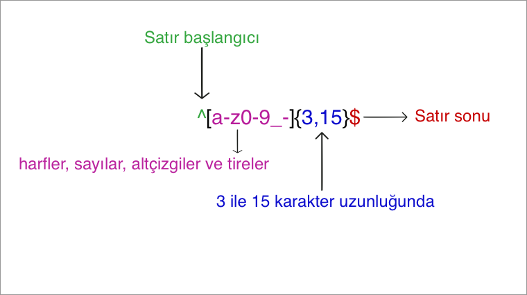

     
    
      
    

        
        
    

## Çeviriler:

* [English](../README.md)
* [German](../translations/README-de.md)
* [Español](../translations/README-es.md)
* [Français](../translations/README-fr.md)
* [Português do Brasil](../translations/README-pt_BR.md)
* [中文版](../translations/README-cn.md)
* [日本語](../translations/README-ja.md)
* [한국어](../translations/README-ko.md)
* [Turkish](../translations/README-tr.md)
* [Greek](../translations/README-gr.md)
* [Magyar](../translations/README-hu.md)
* [Polish](../translations/README-pl.md)
* [Русский](../translations/README-ru.md)
* [Tiếng Việt](../translations/README-vn.md)
* [فارسی](../translations/README-fa.md)
* [עברית](../translations/README-he.md)

## Düzenli İfade Nedir?

> Düzenli ifade, bir metinden belirli bir deseni bulmak için kullanılan bir karakter veya sembol grubudur.

Bir düzenli ifade soldan sağa söz konusu harf öbekleriyle eşleşen bir desendir.
"Regular expression" söylemesi zor bir tabir olduğundan dolayı, genellikle
"regex" ya da "regexp" olarak kısaltılmış olarak bulacaksınız. Düzenli ifade bir
harf öbeğinde ki bir metin değiştirmek, form doğrulamak, bir desen eşleşmesine
dayalı harf öbeğinden bir alt harf öbeği ayıklamak ve çok daha fazlası için
kullanılır.

Bir uygulama yazdığınızı hayal edin ve bir kullanıcı adını seçtiğinde, bu
kullanıcı adı için kurallar belirlemek istiyorsunuz. Kullanıcı adının harfler,
sayılar, altçizgiler ve tireler içermesine izin vermek, ayrıca, kullanıcı
adındaki karakter sayısını sınırlamak istiyorsunuz, böylece çirkin görünmeyecek.
Böyle durumlarda kullanıcı adını doğrulamak için aşağıdaki düzenli ifadeyi
kullanıyoruz:

  

  

Yukardaki düzenli ifade `john_doe`, `jo-hn_doe` ve `john12_as` gibi girişleri kabul edebilir.
`Jo` girişi uyuşmaz, çünkü harf öbeği büyük harf içeriyor ve aynı zamanda uzunluğu 3 karakterden az.

## İçindekiler

- [Temel Eşleştiriciler](#1-temel-eşleştiriciler)
- [Meta Karakterler](#2-meta-karakterler)
  - [Nokta](#21-nokta)
  - [Karakter Takımı](#22-karakter-takımı)
    - [Negatiflenmiş Karakter Seti](#221-negatiflenmiş-karakter-seti)
  - [Tekrarlar](#23-tekrarlar)
    - [Yıldız İşareti](#231-yıldız-İşareti)
    - [Artı İşareti](#232-artı-İşareti)
    - [Soru İşareti](#233-soru-İşareti)
  - [Süslü Parantez](#24-süslü-parantez)
  - [Karakter Grubu](#25-karakter-grubu)
      - [Karakter Grubu Olmayanlar](#251-karakter-grubu-olmayanlar)
  - [Değişim](#26-değişim)
  - [Özel Karakter Hariç Tutma](#27-Özel-karakter-hariç-tutma)
  - [Sabitleyiciler](#28-sabitleyiciler)
    - [Şapka İşareti](#281-Şapka-İşareti)
    - [Dolar İşareti](#282-dolar-İşareti)
- [Kısaltma Karakter Takımları](#3-kısaltma-karakter-takımları)
- [Bakınmak](#4-bakınmak)
  - [Olumlu Bakınma](#41-positive-lookahead)
  - [Olumsuz Bakınma](#42-negative-lookahead)
  - [Positive Lookbehind](#43-positive-lookbehind)
  - [Negative Lookbehind](#44-negative-lookbehind)
- [İşaretler](#5-İşaretler)
  - [Büyük/Küçük Harf Duyarlılığı](#51-büyükküçük-harf-duyarlılığı)
  - [Bütünsel Arama](#52-genel-arama)
  - [Çok Satırlı](#53-Çok-satırlı)
- [Açgözlü vs Tembel Eşleştirme](#6-açgözlü-vs-tembel-eşleştirme)

## 1. Temel Eşleştiriciler

Bir düzenli ifade bir metin içinde arama yapabilmek için kullandığımız bir karakter desenidir.
Örneğin, `the` düzenli ifadesi şu anlama gelir: `t` harfi ardından `h`, ardından `e` harfi gelir.

<pre>
"the" => The fat cat sat on <a href="#learn-regex"><strong>the</strong></a> mat.
</pre>

[Düzenli ifadeyi test edin](https://regex101.com/r/dmRygT/1)

`123` düzenli ifadesi `123` harf öbeğiyle eşleşir. Düzenli ifade birbiri ardına,
girilen harf öbeğindeki her karakter düzenli ifadenin içindeki her karakterle
karşılaştırılarak eşleştirilir. Düzenli ifadeler normal olarak büyük/küçük harfe
duyarlıdırlar, yani `The` düzenli ifadesi `the` harf öbeğiyle eşleşmez.

<pre>
"The" => <a href="#learn-regex"><strong>The</strong></a> fat cat sat on the mat.
</pre>

[Düzenli ifadeyi test edin](https://regex101.com/r/1paXsy/1)

## 2. Meta Karakterler

Meta karakterler düzenli ifadelerin yapı taşlarıdırlar. Meta karakterler
kendileri için değil bunun yerine bazı özel yollarla yorumlanırlar. Bazı meta
karakterler özel anlamları vardır ve bunlar köşeli parantez içinde yazılırlar.

Meta karakterler aşağıdaki gibidir:

|Meta karakter|Açıklama|
|:----:|----|
|.|Satır başlangıcı hariç herhangi bir karakterle eşleşir.|
|[ ]|Köşeli parantezler arasında bulunan herhangi bir karakterle eşleşir.|
|[^ ]|Köşeli parantez içerisinde yer alan `^` işaretinden sonra girilen karakterler haricindeki karakterlerle eşleşir.|
|*|Kendisinden önce yazılan karakterin sıfır veya daha fazla tekrarı ile eşleşir.|
|+|Kendisinden önce yazılan karakterin bir veya daha fazla olan tekrarı ile eşleşir.|
|?|Kendisinden önce yazılan karakterin varlık durumunu opsiyonel kılar.|
|{n,m}|Kendisinden önce yazılan karakterin en az `n` en fazla `m` değeri kadar olmasını ifade eder.|
|(xyz)|Verilen sırayla `xyz` karakterleriyle eşleşir.|
|&#124;| Karakterden önce veya sonra verilen ifadelerin herhangi biriyle eşleşebilir. İfadeye Yada anlamı katar.|
|&#92;|<code>[ ] ( ) { } . * + ? ^ $ \ &#124;</code> özel karakterin aranmasını sağlar.|
|^|Girilen verinin başlangıcını ifade eder.|
|$|Girilen verinin sonunu ifade eder.|

## 2.1 Nokta

Nokta `.` meta karakterlerin en basit örneğidir. `.` meta karakteri satır
başlangıcı hariç herhangi bir karakterle eşleşir. Örneğin, `.ar` düzenli
ifadesinin anlamı: herhangi bir karakterin ardından `a` harfi ve `r` harfi
gelir.

<pre>
".ar" => The <a href="#learn-regex"><strong>car</strong></a> <a href="#learn-regex"><strong>par</strong></a>ked in the <a href="#learn-regex"><strong>gar</strong></a>age.
</pre>

[Düzenli ifadeyi test edin](https://regex101.com/r/xc9GkU/1)

## 2.2 Karakter Takımı

Karakter takımları ayrıca Karakter sınıfı olarak bilinir. Karakter takımlarını
belirtmek için köşeli ayraçlar kullanılır. Karakterin aralığını belirtmek için
bir karakter takımında tire kullanın. Köşeli parantezlerdeki karakter aralığının
sıralaması önemli değildir.

Örneğin, `[Tt]he` düzenli ifadesinin anlamı: bir büyük `T` veya küçük `t`
harflerinin ardından sırasıyla `h` ve `e` harfi gelir.

<pre>
"[Tt]he" => <a href="#learn-regex"><strong>The</strong></a> car parked in <a href="#learn-regex"><strong>the</strong></a> garage.
</pre>

[Düzenli ifadeyi test edin](https://regex101.com/r/2ITLQ4/1)

Bununla birlikte, bir karakter takımı içerisindeki bir periyot bir tam periyot
demektir.

`ar[.]` düzenli ifadesinin anlamı: Küçük `a` karakteri ardından `r` harfi gelir,
ardından bir `.` karakteri gelir.

<pre>
"ar[.]" => A garage is a good place to park a c<a href="#learn-regex"><strong>ar.</strong></a>
</pre>

[Düzenli ifadeyi test edin](https://regex101.com/r/wL3xtE/1)

### 2.2.1 Dışlanmış Karakter Seti

Genellikle, şapka `^` sembolü harf öbeğinin başlangıcını temsil eder, ama köşeli
parantez içinde kullanıldığında verilen karakter takımını hariç tutar.

Örneğin, `[^c]ar` ifadesinin anlamı: `c` harfinden hariç herhangi bir harfin
ardından `a`, ardından `r` gelir.

<pre>
"[^c]ar" => The car <a href="#learn-regex"><strong>par</strong></a>ked in the <a href="#learn-regex"><strong>gar</strong></a>age.
</pre>

[Düzenli ifadeyi test edin](https://regex101.com/r/nNNlq3/1)

## 2.3 Tekrarlar

`+`, `*` ya da `?` meta karakterlerinden sonra bir alt desenin kaç defa tekrar
edebileceğini belirtmek için kullanılır. Bu meta karakterler farklı durumlarda
farklı davranırlar.

### 2.3.1 Yıldız İşareti

`*` sembolü, kendinden önce girilen eşlemenin sıfır veya daha fazla tekrarıyla
eşleşir. Ama bir karakter seti ya da sınıf sonrasına girildiğinde, tüm karakter
setinin tekrarlarını bulur.

`a*` düzenli ifadesinin anlamı: `a` karakterinin sıfır veya daha fazla
tekrarları, `[a-z]*` düzenli ifadesinin anlamı ise bir satırdaki herhangi bir
sayıdaki küçük harfler anlamına gelir.

<pre>
"[a-z]*" => T<a href="#learn-regex"><strong>he</strong></a> <a href="#learn-regex"><strong>car</strong></a> <a href="#learn-regex"><strong>parked</strong></a> <a href="#learn-regex"><strong>in</strong></a> <a href="#learn-regex"><strong>the</strong></a> <a href="#learn-regex"><strong>garage</strong></a> #21.
</pre>

[Düzenli ifadeyi test edin](https://regex101.com/r/7m8me5/1)

`*` sembolü `.` meta karakteri ile `.*` karakterinin herhangi harf öbeğine
eşleştirmek için kullanılabilir. `*` sembolü boşluk karakteriyle `\s` bir harf
öbeğinde boşluk karakterlerini eşleştirmek için kullanılabilir.

Örneğin, `\s*cat\s*` düzenli ifadesinin anlamı: sıfır veya daha fazla boşluk
ardından küçük `c` karakteri gelir, ardından küçük `a` karakteri gelir, ardından
küçük `t` karakteri gelir, ardından sıfır veya daha fazla boşluk gelir.

<pre>
"\s*cat\s*" => The fat<a href="#learn-regex"><strong> cat </strong></a>sat on the con<a href="#learn-regex"><strong>cat</strong></a>enation.
</pre>

[Düzenli ifadeyi test edin](https://regex101.com/r/gGrwuz/1)

### 2.3.2 Artı İşareti

`+` sembolü, kendinden önce girilen eşlemenin bir veya daha fazla tekrarıyla
eşleşir.

Örneğin, `c.+t` ifadesinin anlamı: küçük `c` harfi, ardından en az bir karakter
gelir, ardından küçük `t` karakteri gelir. Örnekte açıklamak gereken önemli
nokta: `t` harfi cümledeki son `t` harfi olacaktır. `c` ve `t` harfi arasında en
az bir karakter vardır.

<pre>
"c.+t" => The fat <a href="#learn-regex"><strong>cat sat on the mat</strong></a>.
</pre>

[Düzenli ifadeyi test edin](https://regex101.com/r/Dzf9Aa/1)

### 2.3.3 Soru İşareti

Düzenli ifadelerde `?` meta karakterinden önce girilen karakteri opsiyonel
olarak tanımlar. Bu sembol önce gelen karakterin sıfır veya bir örneğiyle
eşleşir.

Örneğin, `[T]?he` ifadesinin anlamı: opsiyonel büyük `T` harfi, ardından küçük
`h` karakteri gelir, ardından küçük `e` karakteri gelir.

<pre>
"[T]he" => <a href="#learn-regex"><strong>The</strong></a> car is parked in the garage.
</pre>

[Düzenli ifadeyi test edin](https://regex101.com/r/cIg9zm/1)

<pre>
"[T]?he" => <a href="#learn-regex"><strong>The</strong></a> car is parked in t<a href="#learn-regex"><strong>he</strong></a> garage.
</pre>

[Düzenli ifadeyi test edin](https://regex101.com/r/kPpO2x/1)

## 2.4 Süslü Parantez

Düzenli ifadelerde miktar belirliyiciler olarakda bilinen süslü parantezler, bir
karakterin veya karakter grubunun kaç defa tekrar edebileceğini belirtmek için
kullanılırlar.

Örneğin, `[0-9]{2,3}` ifadesinin anlamı: 0 ile 9 aralığındaki karakterlerden, en
az 2 en fazla 3 defa ile eşleş.

<pre>
"[0-9]{2,3}" => The number was 9.<a href="#learn-regex"><strong>999</strong></a>7 but we rounded it off to <a href="#learn-regex"><strong>10</strong></a>.0.
</pre>

[Düzenli ifadeyi test edin](https://regex101.com/r/juM86s/1)

İkinci numarayı boş bırakabiliriz.

Örneğin, `[0-9]{2,}` ifadesinin anlamı: En az 2 veya daha fazla defa eşleş.
Düzenli ifadeden virgülü kaldırırsak `[0-9]{3}`: doğrudan 3 defa eşleşir.

<pre>
"[0-9]{2,}" => The number was 9.<a href="#learn-regex"><strong>9997</strong></a> but we rounded it off to <a href="#learn-regex"><strong>10</strong></a>.0.
</pre>

[Düzenli ifadeyi test edin](https://regex101.com/r/Gdy4w5/1)

<pre>
"[0-9]{3}" => The number was 9.<a href="#learn-regex"><strong>999</strong></a>7 but we rounded it off to 10.0.
</pre>

[Düzenli ifadeyi test edin](https://regex101.com/r/Sivu30/1)

## 2.5 Karakter Grubu

Karakter grubu parantezler içine yazılmış alt desenler grubudur. Daha önce
tasarım deseninde değindiğimiz gibi, bir karakterden önce bir miktar belirleyici
koyarsak önceki karakteri tekrar eder. Fakat miktar belirleyiciyi bir karakter
grubundan sonra koyarsak tüm karakter grubunu tekrarlar.

Örneğin: `(ab)*` düzenli ifadesi "ab" karakterinin sıfır veya daha fazla
tekrarıyla eşleşir.

Ayrıca karakter grubu içinde `|` meta karakterini kullanabiliriz.

Örneğin, `(c|g|p)ar` düzenli ifadesinin anlamı: küçük `c`, `g` veya `p`
karakteri, ardından `a` karakteri, ardından `r` karakteri gelir.

<pre>
"(c|g|p)ar" => The <a href="#learn-regex"><strong>car</strong></a> is <a href="#learn-regex"><strong>par</strong></a>ked in the <a href="#learn-regex"><strong>gar</strong></a>age.
</pre>

[Düzenli ifadeyi test edin](https://regex101.com/r/tUxrBG/1)

Not olarak yakalanan gruplar yalnızca eşleşmez, ayrıca yakalanan karakterler ana dil içinde kullanılır.Bu ana dil Python, JavaScript ve neredeyse herhangi bir dilde düzenli ifadelerin fonksiyon tanımlamalarında olabilir.

### 2.5.1 Karakter Grubu Olmayanlar

Karakter grubu olmayan bir grup, karakterlerle eşleşen ancak grubu yakalayamayan bir yakalama grubudur. Karakter grubu olmayan bir grup parantez içinde`(...)` önce `?` ve ardından `:` ile gösterilir. Örneğin, `(?:c|g|p)ar` düzenli ifadesi, aynı karakterlerle eşleştiği ancak bir yakalama grubu oluşturmayacağı için `(c|g|p)ar` ifadesine benzer.

<pre>
"(?:c|g|p)ar" => The <a href="#learn-regex"><strong>car</strong></a> is <a href="#learn-regex"><strong>par</strong></a>ked in the <a href="#learn-regex"><strong>gar</strong></a>age.
</pre>

[Düzenli ifadeyi test edin](https://regex101.com/r/Rm7Me8/1)

Karakter grubu olmayanlar bul-ve-değiştir işlevselliğinde kullanıldığında veya karakter gruplarıyla karıştırıldığında, herhangi bir başka tür çıktı üretirken genel görünümü korumak için kullanışlı olabilir.
Ayrıca bakınız [4. Bakınmak](#4-bakınmak).

## 2.6 Değişim

Düzenli ifadede dik çizgi alternasyon(değişim, dönüşüm) tanımlamak için
kullanılır. Alternasyon birden fazla ifade arasındaki bir koşul gibidir. Şu an,
karakter grubu ve alternasyonun aynı şekilde çalıştığını düşünüyor
olabilirsiniz. Ama, Karakter grubu ve alternasyon arasındaki büyük fark karakter
grubu karakter düzeyinde çalışır ama alternasyon ifade düzeyinde çalışır.

Örneğin, `(T|t)he|car` düzenli ifadesinin anlamı: Büyük `T` ya da küçük `t`
karakteri, ardından küçük `h` karakteri, ardından küçük `e` ya da `c` karakteri,
ardından küçük `a`, ardından küçük `r` karakteri gelir.

<pre>
"(T|t)he|car" => <a href="#learn-regex"><strong>The</strong></a> <a href="#learn-regex"><strong>car</strong></a> is parked in <a href="#learn-regex"><strong>the</strong></a> garage.
</pre>

[Düzenli ifadeyi test edin](https://regex101.com/r/fBXyX0/1)

## 2.7 Özel Karakter Hariç Tutma

`\` işareti sonraki karakteri hariç tutmak için kullanılır. Bu bir semboülü
ayrılmış karakterlerde `{ } [ ] / \ + * . $ ^ | ?` dahil olmak üzere eşleşen bir
karakter olarak belirtmemizi sağlar. Bir özel karakteri eşleşen bir karakter
olarak kullanmak için önüne `\` işareti getirin.

Örneğin, `.` düzenli ifadesi yeni satır hariç herhangi bir karakteri eşleştirmek
için kullanılır. Bir harf öbeği içinde nokta `.` karakterini yakalamak için `.`
ayrılmış karakterini hariç tutmamız gerekir. Bunun için nokta önüne `\`
işaretini koymamız gereklidir.

`(f|c|m)at\.?` düzenli ifadesinin anlamı: küçük `f`, `c`ya da `m` harfi,
ardından küçük `a` harfi, ardından küçük `t` harfi, ardından opsiyonel `.`
karakteri gelir.

<pre>
"(f|c|m)at\.?" => The <a href="#learn-regex"><strong>fat</strong></a> <a href="#learn-regex"><strong>cat</strong></a> sat on the <a href="#learn-regex"><strong>mat.</strong></a>
</pre>

[Düzenli ifadeyi test edin](https://regex101.com/r/DOc5Nu/1)

## 2.8 Sabitleyiciler

Düzenli ifadelerde, eşleşen sembolün girilen harf öbeğinin başlangıç sembolü
veya bitiş sembolü olup olmadığını kontrol etmek için sabitleyicileri
kullanırız. Sabitleyiciler iki çeşittir: İlk çeşit, eşleşen karakterin girişin
ilk karakteri olup olmadığını kontrol eden şapka `^` karakteri, ikinci çeşit ise
eşleşen karakterin girişin son karakteri olup olmadığını kontrol eden dolar `$`
karakteridir.

### 2.8.1 Şapka İşareti

Şapka `^` işareti eşleşen karakterin giriş harf öbeğinin ilk karakteri olup
olmadığını kontrol etmek için kullanılır. Eğer `^a` düzenli ifadesini `abc` harf
öbeğine uygularsak `a` ile eşleşir. Ama `^b` ifadesini uygularsak bir eşleşme
bulamayız. Bunun nedeni `abc` harf öbeğinde `b` karakterinin başlangıç karakteri
olmamasıdır.

Bir başka örnek üzerinden ilerlersek,

`^(T|t)he` düzenli ifadesinin anlamı: büyük `T` ya da `t` karakteri giriş harf
öbeğinin ilk karakteri olmak üzere, ardından küçük `h`, ardından küçük `e`
karakteri gelir.

<pre>
"(T|t)he" => <a href="#learn-regex"><strong>The</strong></a> car is parked in <a href="#learn-regex"><strong>the</strong></a> garage.
</pre>

[Düzenli ifadeyi test edin](https://regex101.com/r/5ljjgB/1)

<pre>
"^(T|t)he" => <a href="#learn-regex"><strong>The</strong></a> car is parked in the garage.
</pre>

[Düzenli ifadeyi test edin](https://regex101.com/r/jXrKne/1)

### 2.8.2 Dolar İşareti

Dolar `$` işareti eşleşen karakterin giriş harf öbeğinin son karakteri olup
olmadığını kontrol etmek için kullanılır.

Örneğin, `(at\.)$` ifadesinin anlamı: küçük bir `a` karakteri, ardından küçük
bir `t` karakteri, ardıdan nokta `.` karakteri gelir ve bu eşleşme harf öbeğinin
sonunda olmalıdır.

<pre>
"(at\.)" => The fat c<a href="#learn-regex"><strong>at.</strong></a> s<a href="#learn-regex"><strong>at.</strong></a> on the m<a href="#learn-regex"><strong>at.</strong></a>
</pre>

[Düzenli ifadeyi test edin](https://regex101.com/r/y4Au4D/1)

<pre>
"(at\.)$" => The fat cat. sat. on the m<a href="#learn-regex"><strong>at.</strong></a>
</pre>

[Düzenli ifadeyi test edin](https://regex101.com/r/t0AkOd/1)

##  3. Kısaltma Karakter Takımları

Regex, sık olarak kullanılan düzenli ifadeler için özel karakter setleri ve
kısaltmalar sağlar.

Kullanılan karakter setlerinin kısaltmaları aşağıdaki gibidir:

|Kısaltma|Açıklama|
|:----:|----|
|.|Satır başı hariç herhangi bir karakter|
|\w|Alfanumerik karakterlerle eşleşir: `[a-zA-Z0-9_]`|
|\W|Alfanumerik olmayan karakterlerle eşleşir: `[^\w]`|
|\d|Rakamlarla eşlelir: `[0-9]`|
|\D|Rakam olmayan karakterlerle eşleşir: `[^\d]`|
|\s|Boşluk karakteri ile eşleşir: `[\t\n\f\r\p{Z}]`|
|\S|Boşluk karakteri olmayan karakterlerle eşleşir: `[^\s]`|

## 4. Bakınmak

Bakınma sembolleri, bir ifade öncesinde veya sonrasında başka bir ifademiz
olduğunda kullanılırlar.

Örneğin, `$4.44 ve $10.88` girişlerinden `$` karakteri önündeki tüm sayıları
almak istiyoruz, bu durumda `(?<=\$)[0-9\.]*` ifadesini kullanırız.

`(?<=\$)[0-9\.]*` ifadesinin anlamı: `.` karakterini içeren ve `$` karakteriyle
devam eden tüm sayıları al demektir.

Düzenli ifadelerde kullanılan bakınma sembolleri aşadaki gibidir:

|Sembol|Açıklama|
|:----:|----|
|?=|Pozitif İleri Bakınma (Verdiğimiz ifade sonrası arar ve `eşleşme varsa` sonuç döndürür.)|
|?!|Negatif İleri Bakınma (Verdiğimiz ifade sonrası arar ve `eşleşme yoksa` sonuç döndürür.)|
|?<=|Pozitif Geri Bakınma (Verdiğimiz ifade öncesini arar ve `eşleşme varsa` sonuç döndürür.)|
|?<!|Negatif Geri Bakınma (Verdiğimiz ifade öncesini arar ve `eşleşme yoksa` sonuç döndürür.)|

### 4.1 Pozitif İleri Bakınma

Pozitif ileri bakınma, ifadenin ilk bölümü bakınma ifadesiyle devam etmesi
gerektiğini savunur. Bulunan eşleşme yalnızca ifadenin ilk bölümüyle eşleşen
metin içerir. Olumlu bir bakınma tanımlamak için, içinde eşittir işareti yer
alan parantezler `(?=...)` şeklinde kullanılır. Bakınma ifadesi parantezler
içinde eşittir işaretinden sonra yazılır.

Örneğin, `[T|t]he(?=\sfat)` ifadesinin anlamı: opsiyonel küçük bir `t` ya da
büyük `T` harfi, ardından `h` harfi gelir, ardından `e` harfi gelir. Parantez
içinde ise bu dizilimin bir boşluk karakterinden sonra `fat` öbeğiyle devam
edeceğini tanımlıyoruz.

<pre>
"[T|t]he(?=\sfat)" => <a href="#learn-regex"><strong>The</strong></a> fat cat sat on the mat.
</pre>

[Düzenli ifadeyi test edin](https://regex101.com/r/IDDARt/1)

### 4.2 Negatif İleri Bakınma

Negatif ileri bakınma sembolü positive lookahead tersine, verdiğimiz desenle devam
etmemesi durumunda eşleşir. Bu sembol pozitif ileri bakınma gibi tanımlanır ama `=`
işareti yerine `!` kullanılır.

`[T|t]he(?!\sfat)` ifadesinin anlamı: opsiyonel küçük bir `t` ya da büyük `T`
harfi, ardından `h` harfi gelir, ardından `e` harfi gelir, ardından öncesinde
boşluk olan bir `fat` öbeği olmamalıdır.

<pre>
"[T|t]he(?!\sfat)" => The fat cat sat on <a href="#learn-regex"><strong>the</strong></a> mat.
</pre>

[Düzenli ifadeyi test edin](https://regex101.com/r/V32Npg/1)

### 4.3 Pozitif Geri Bakınma

Pozitif geri bakınma, belirli bir desenden önceki eşleşmeleri almak için
kullanılır. `(?<=...)` ile gösterilir.

Örneğin, `(?<=[T|t]he\s)(fat|mat)` ifadesinin anlamı: Öncesinde `The` veya `the`
öbekleri olan tüm `fat` veya `mat` öbeklerini getir.

<pre>
"(?<=[T|t]he\s)(fat|mat)" => The <a href="#learn-regex"><strong>fat</strong></a> cat sat on the <a href="#learn-regex"><strong>mat</strong></a>.
</pre>

[Düzenli ifadeyi test edin](https://regex101.com/r/avH165/1)

### 4.4 Negatif Geri Bakınma

Negatif geri bakınma, belirli bir desenden önce olmayan eşleşmeleri almak için
kullanılır. `(?<=!..)` ile gösterilir.

Örneğin, `(?<!(T|t)he\s)(cat)` ifadesinin anlamı: Öncesinde `The` veya `the`
öbekleri yer almayan tüm `cat` öbeklerini getir.

<pre>
"(?&lt;![T|t]he\s)(cat)" => The cat sat on <a href="#learn-regex"><strong>cat</strong></a>.
</pre>

[Düzenli ifadeyi test edin](https://regex101.com/r/8Efx5G/1)

## 5. İşaretler

İşaretler ayrıca düzenleyiciler olarak bilinirler, çünkü bir düzenli
ifadenin çıktısını düzenlerler. Bu işaretler herhangi bir sırada veya
kombinasyonda kullanılabilirler ve Düzenli İfadelerin ayrılmaz bir
parçasıdırlar.

|İşaret|Açıklama|
|:----:|----|
|i|Büyük küçük harf duyarlılık: Eşleştirmeleri küçük/büyük harfe karşı duyarsız yapar.|
|g|Genel Arama: Girilen harf öbeği boyunca bir desen arar.|
|m|Çok satırlı: Sabitleyici meta karakteri her satırda çalışır.|

### 5.1 Büyük/Küçük Harf Duyarlılığı

`i` işaretleyicisi büyük/küçük harfe duyarsız eşleştirme yapmak için kullanılır.

Örneğin, `/The/gi` ifadesi: büyük `T` harfi, ardından küçük `h` harfi, ardından
küçük `e` harfi gelir. ifadenin sonunda yer alan `i` işareti büyük-küçük harfe
karşı duyarsız olması gerektiğini belirtir. Ayrıca `g` işaretinide
kullandığımızı görebilirsiniz, tüm text içinde bu aramayı yapmak istediğimiz
için `g` işaretini ayrıca belirtiyoruz.

<pre>
"The" => <a href="#learn-regex"><strong>The</strong></a> fat cat sat on the mat.
</pre>

[Düzenli ifadeyi test edin](https://regex101.com/r/dpQyf9/1)

<pre>
"/The/gi" => <a href="#learn-regex"><strong>The</strong></a> fat cat sat on <a href="#learn-regex"><strong>the</strong></a> mat.
</pre>

[Düzenli ifadeyi test edin](https://regex101.com/r/ahfiuh/1)

### 5.2 Genel Arama

`g` işareti bir giriş içinde eşleşen tüm varsayonları bulmak için kullanılır.
`g` işareti kullanılmazsa ilk eşleşme bulunduktan sonra arama sona erer.

<pre>
"/.(at)/" => The <a href="#learn-regex"><strong>fat</strong></a> cat sat on the mat.
</pre>

[Düzenli ifadeyi test edin](https://regex101.com/r/jnk6gM/1)

<pre>
"/.(at)/g" => The <a href="#learn-regex"><strong>fat</strong></a> <a href="#learn-regex"><strong>cat</strong></a> <a href="#learn-regex"><strong>sat</strong></a> on the <a href="#learn-regex"><strong>mat</strong></a>.
</pre>

[Düzenli ifadeyi test edin](https://regex101.com/r/dO1nef/1)

### 5.3 Çok Satırlı

`m` işareti çok satırlı bir eşleşme bulmak için kullanılır. Daha önce
sabitleyicilerde gördüğümüz gibi `(^, $)` sembolleri aradığımız desenin harf
öbeğinin başında veya sonunda olup olmadığını kontrol etmemiz için kullanılır.
Bu sabitleyicilerin tüm satırlarda çalışması için `m` işaretini kullanırız.

Örneğin, `/at(.)?$/gm` ifadesinin anlamı: küçük `a` harfi, ardından küçük `t`
harfi gelir, ardından opsiyonel olarak yeni satır hariç herhangi birşey
gelebilir. `m` işaretini kullandığımız için bir girişin her satırının sonunda
eşleştirir.

<pre>
"/.at(.)?$/" => The fat
                cat sat
                on the <a href="#learn-regex"><strong>mat.</strong></a>
</pre>

[Düzenli ifadeyi test edin](https://regex101.com/r/hoGMkP/1)

<pre>
"/.at(.)?$/gm" => The <a href="#learn-regex"><strong>fat</strong></a>
                  cat <a href="#learn-regex"><strong>sat</strong></a>
                  on the <a href="#learn-regex"><strong>mat.</strong></a>
</pre>

[Düzenli ifadeyi test edin](https://regex101.com/r/E88WE2/1)

## 6. Açgözlü vs Tembel Eşleştirme

Varsayılan olarak, bir düzenli ifade açgözlü bir eşleştirme yapacaktır, bu da eşleşmenin mümkün olduğu kadar çok olacağı anlamına gelir. Tembel bir şekilde eşleştirmek için `?` kullanabiliriz, bu da eşleşme olabildiğince kısa olacaktır.
<pre>
"/(.*at)/" => <a href="#learn-regex"><strong>The fat cat sat on the mat</strong></a>. </pre>

[Düzenli ifadeyi test edin](https://regex101.com/r/AyAdgJ/1)

<pre>
"/(.*?at)/" => <a href="#learn-regex"><strong>The fat</strong></a> cat sat on the mat. </pre>

[Düzenli ifadeyi test edin](https://regex101.com/r/AyAdgJ/2)

## Katkı Sağla

* Hataları Raporla
* İyileştirmeler iç Pull Request aç
* Paylaş
* Geri bildirim için 'den eriş

## Lisans

MIT &copy; [Zeeshan Ahmad](https://twitter.com/ziishaned)
